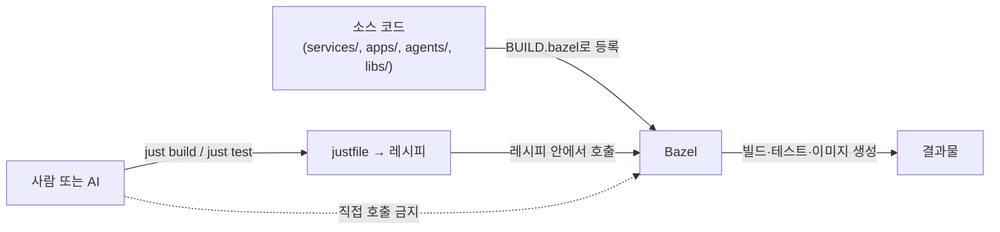

# SceneTrip 구조 가이드

이 저장소를 처음 열어본 사람을 위한 문서입니다. "이 폴더는 뭐고, 저 파일은 뭐고,
이 도구는 왜 쓰는가"를 순서대로 설명합니다. 컴퓨터 다루는 것 자체는 익숙하지만
**Bazel, just, 모노레포 같은 개념을 처음 접한다는 것을 전제**로 씁니다.

이 문서와 다른 문서의 관계는 이렇습니다.

| 문서 | 성격 |
| --- | --- |
| **이 문서 (GUIDE.md)** | 입문자용 설명서 — 개념과 구조를 처음부터 풀어 씀 |
| [README.md](./README.md) | 빠른 시작 — 명령어 요약, 설치 링크 |
| [AGENTS.md](./AGENTS.md) | 규칙 원문 — 무엇이 허용되고 무엇이 금지인지 (영문) |
| [CLAUDE.md](./CLAUDE.md) | AI 도구가 이 규칙을 따르는 절차 (영문) |

즉 이 문서를 읽고 개념을 이해한 다음, 실제 작업 규칙이 궁금하면 AGENTS.md를 찾아보면 됩니다.

---

## 0. 용어부터 정리하기

구조를 설명하기 전에, 뒤에서 계속 나올 단어들을 먼저 정의합니다. 이 단어들의
뜻을 모르고 아래 내용을 읽으면 "그게 뭔데"가 계속 반복됩니다.

### 모노레포 (monorepo)

원래는 프로젝트마다 저장소(repository)를 하나씩 따로 만드는 경우가 많습니다.
백엔드 저장소 따로, 프론트엔드 저장소 따로, 이런 식으로요. **모노레포는 그렇게
나누지 않고, 여러 개의 서비스·앱·문서·인프라 설정을 저장소 하나에 전부 넣어두는
방식**을 말합니다. SceneTrip은 기획 문서부터 실제 코드, 배포 설정까지 전부 이 저장소
하나에 들어 있습니다.

### Bazel

**빌드 시스템**입니다. "빌드"란 소스 코드를 실행 가능한 결과물(실행 파일, 컨테이너
이미지 등)로 바꾸는 작업을 말합니다. 보통 언어마다 빌드 도구가 다릅니다 — Java는
`./gradlew build`, iOS는 `xcodebuild`, Python은 `pytest` 같은 식으로요. 문제는
언어가 여러 개 섞인 저장소에서는 이 도구들이 전부 다르게 동작해서 관리가 힘들어진다는
점입니다. SceneTrip은 언어가 넷(Java·Python·Swift·Kotlin)입니다.

Bazel은 **어떤 언어든 같은 방식으로 빌드하고 테스트하게 해주는 도구**입니다.
이 저장소는 "Bazel만이 빌드와 테스트의 정답"이라는 규칙을 따릅니다. 즉 Java 코드든
Swift 코드든, 실제로 빌드가 되었는지 확인하는 유일한 방법은 Bazel을 통하는 것입니다.
`./gradlew build`가 성공해도 Bazel이 실패하면 그건 실패한 것으로 칩니다.

### 타깃 (target)

Bazel이 "빌드할 수 있는 대상 하나"를 부르는 이름입니다. 예를 들어 "이 폴더의
라이브러리", "이 폴더의 실행 파일", "이 폴더의 테스트"가 각각 하나의 타깃입니다.
타깃은 `//services/scene-api:bin` 같은 형태의 이름(라벨)을 가집니다. 이걸 읽는 법은
"저장소 루트 기준 `services/scene-api` 폴더 안에 있는, 이름이 `bin`인 타깃"입니다.

### BUILD.bazel

**폴더 하나 안에 어떤 타깃들이 있는지 적어두는 파일**입니다. 소스 코드 파일을
새로 만들었다면, 그 파일을 Bazel이 빌드 대상에 포함하도록 이 파일에도 반드시
등록해야 합니다. 등록하지 않으면 파일이 존재해도 Bazel은 그 파일을 모릅니다.

### MODULE.bazel

저장소 전체에서 딱 하나만 존재하는 파일로, **이 저장소가 외부에서 가져다 쓰는
라이브러리(의존성)들을 전부 선언해두는 곳**입니다. 예를 들어 "Go 언어 규칙을 쓴다",
"버전 몇 번을 쓴다" 같은 걸 여기서 정합니다. 이 방식을 **bzlmod**라고 부릅니다
(Bazel의 예전 의존성 관리 방식인 `WORKSPACE`를 대체한 새 방식이라는 뜻). 외부
라이브러리를 새로 추가하고 싶으면 이 파일 하나만 고치면 됩니다.

### just / justfile / 레시피(recipe)

**just는 명령어를 실행해주는 도구**입니다. Bazel을 직접 쓰려면 대상 이름과 여러 플래그를
길게 붙여야 하고, 상황마다 붙일 플래그가 달라 틀리기 쉽습니다. 이 저장소는 그런 긴 명령을
짧은 이름으로 감싸서 씁니다. 예를 들어 `just test`라고만 치면 됩니다.

- **justfile**: 이 짧은 명령들이 정의되어 있는 설정 파일. 저장소 루트에 있습니다.
- **레시피(recipe)**: justfile 안에 정의된 명령 하나하나. `just test`, `just build`
  같은 게 각각 레시피입니다.

규칙: **날것의 `bazel ...` 명령을 문서나 스크립트에 직접 적지 않습니다.** 항상
레시피로 감싼 뒤 그 레시피 이름을 씁니다. 그래야 사람이든 AI든 "이 상황엔 무슨
명령을 써야 하지"를 매번 새로 알아낼 필요가 없습니다.

### 계약 (contracts)

두 개 이상의 모듈(예: 백엔드 서비스와 모바일 앱)이 서로 데이터를 주고받을 때
쓰는 **통신 형식의 정의**입니다. "이 API는 이런 요청을 받으면 이런 응답을 준다"를
코드보다 먼저 글로 정해두는 것입니다. 이 저장소에서는 `contracts/` 폴더에 손으로
작성하며, 실제 코드(클라이언트, 서버 뼈대)는 이 정의로부터 자동 생성됩니다.

### ADR (Architecture Decision Record)

우리말로 "아키텍처 결정 기록"입니다. "왜 이 기술을, 왜 이 방식을 선택했는가"를
남겨두는 문서 한 장입니다. 나중에 합류한 사람이 "왜 굳이 이렇게 했지?"라는 의문이
들 때 찾아볼 수 있도록 결정의 배경, 검토했던 다른 선택지, 그 선택지를 버린 이유까지
적습니다. 번호를 붙여 쌓아가며(`0001`, `0002`, ...), **한번 쓴 ADR은 절대 고쳐 쓰지
않고**, 결정이 바뀌면 새 ADR을 추가해 이전 것을 "대체됨" 상태로 표시합니다. 이
저장소의 첫 번째 결정 기록이 [`docs/architecture/adr/0001-...md`](./docs/architecture/adr/0001-bazel-as-the-single-build-system-and-just-as-the-single-command-surface.md)이고,
내용은 "왜 Bazel과 just를 쓰기로 했는가"입니다 — 방금 위에서 설명한 두 도구를 고른
이유가 이 문서 한 장에 정리되어 있습니다.

### 헤르메틱(hermetic) 빌드

"내 컴퓨터에서는 되는데 다른 컴퓨터에서는 안 되는" 상황을 막기 위한 원칙입니다.
빌드 결과가 **어떤 컴퓨터에서 실행하든, 언제 실행하든 항상 똑같이 나와야 한다**는
뜻입니다. 그러려면 빌드 도중에 인터넷에 접속하거나, 그 컴퓨터에 우연히 설치되어
있는 프로그램에 의존하거나, 현재 시각 같은 값을 결과물에 섞으면 안 됩니다.

### 테스트 레인 (unit / integration / e2e)

테스트를 성격에 따라 나눠서 각각 다른 명령으로 돌리는 것을 말합니다.

| 이름 | 뜻 | 특징 |
| --- | --- | --- |
| unit (단위) | 코드 하나를 그 자체로 검증 | 빠름, 외부 서버나 인터넷 없이 실행 |
| integration (통합) | 여러 모듈이 실제로 맞물려 동작하는지 검증 | 데이터베이스 같은 외부 자원 필요, 느림 |
| e2e (end-to-end) | 사용자가 쓰는 전체 흐름을 처음부터 끝까지 검증 | 가장 느림, 가장 실제에 가까움 |

### 스캐폴드 (scaffold)

"뼈대"라는 뜻으로, 실제 내용은 아직 없지만 어디에 무엇이 들어갈지 미리 잡아둔
구조를 말합니다. **지금 이 저장소가 정확히 이 상태입니다** — `apps/`, `services/`,
`agents/` 같은 폴더 안에는 아직 실제 서비스가 하나도 없고, 각 폴더에 "여기에 이런
게 들어간다"를 설명하는 `README.md`만 있습니다.

---

## 1. 최상위 폴더 지도

```
SceneTrip/
├── README.md, AGENTS.md, CLAUDE.md, GUIDE.md   ← 문서 4종 (역할은 위 표 참고)
├── justfile, MODULE.bazel, .bazelrc            ← 명령/빌드 설정 (위 용어 참고)
│
├── apps/          모바일 앱(iOS·Android)이 들어갈 자리
├── services/      백엔드 서버(Spring)들이 들어갈 자리
├── agents/        AI 에이전트 모듈(Python)들이 들어갈 자리
├── libs/          여러 모듈이 같이 쓰는 공유 코드
├── contracts/     통신 형식 정의 (API·이벤트·스키마)
├── platform/      인프라 설정 (Terraform, Kubernetes, Helm)
├── tests/         모듈 여러 개를 가로지르는 테스트
├── tools/         빌드/개발 도구 (Bazel 매크로, just 레시피, 스크립트, 템플릿)
├── docs/          문서 전체
└── third_party/   외부에서 가져온 코드
```

하나씩 무엇인지 설명합니다.

### `apps/` — 모바일 앱

사용자가 직접 보는 앱입니다. SceneTrip은 **iOS와 Android를 각각 네이티브로** 만듭니다
— Flutter 같은 크로스 플랫폼 도구를 쓰지 않으므로, 두 앱은 코드를 공유하지 않는
별개의 모듈입니다. iOS는 Swift, Android는 Kotlin으로 작성합니다. 지금은 비어 있고,
새로 만들 때는 `just new-app-ios <이름>` / `just new-app-android <이름>`을 씁니다.

### `services/` — 백엔드 서버

데이터를 처리하고 API를 제공하는 서버입니다. Java(Spring Boot)로 작성하며, 서버
하나당 폴더 하나이고 `just new-service <이름>`으로 생성합니다. 서비스끼리는 서로
대등하며, 한 서비스가 다른 서비스의 소스 코드를 직접 들여다보지 않습니다 — 서로
통신할 때는 반드시 `contracts/`에 정의된 API를 통해 네트워크로 호출합니다.

### `agents/` — AI 에이전트

LLM(거대 언어 모델)을 이용해 동작하는 프로그램입니다. Python으로 작성하며, 프롬프트·
도구 정의·동작 흐름(오케스트레이션)을 갖습니다. `just new-agent <이름>`으로 생성합니다.

### `libs/` — 공유 라이브러리

`apps/`, `services/`, `agents/` 중 **두 곳 이상이 똑같이 필요로 하는 코드**를
모아두는 곳입니다. 언어별로 나뉩니다.

| 폴더 | 쓰는 곳 |
| --- | --- |
| `libs/java/` | Spring 백엔드끼리 공유 |
| `libs/python/` | AI 에이전트끼리 공유 |
| `libs/swift/` | iOS 앱끼리 공유 |
| `libs/kotlin/` | Android 앱끼리 공유 |
| `libs/proto/` | `contracts/proto`에서 만든 공용 정의 |

규칙은 간단합니다 — 같은 코드를 복사해서 붙여넣지 말고, 이곳으로 옮겨서 양쪽이
가져다 쓰게 합니다. 단, **iOS와 Android는 서로 코드를 공유하지 않습니다.** 언어가
다르기 때문이며, 두 앱이 같은 규칙을 지켜야 한다면 공유하는 것은 코드가 아니라
`contracts/`의 정의입니다.

### `contracts/` — 인터페이스 정본

위 용어 설명에서 다룬 "계약"이 실제로 저장되는 곳입니다.

| 폴더 | 내용 |
| --- | --- |
| `proto/` | gRPC 통신 형식 (protobuf) |
| `openapi/` | REST API 명세 |
| `asyncapi/` | 이벤트/메시지 큐 명세 |
| `schemas/` | JSON Schema — AI 에이전트가 사용하는 도구의 입출력 형식 포함 |

규칙: 통신 형식이 바뀔 때는 **여기부터 고치고**, 그다음 `just gen`으로 실제 코드를
생성한 뒤, 마지막으로 서비스/앱 코드를 그 생성된 코드에 맞춰 고칩니다. 순서를
거꾸로 하지 않습니다.

### `platform/` — 인프라를 코드로 관리

서버를 어디에, 어떻게 띄울지를 코드로 적어둔 곳입니다. `terraform/`(클라우드
자원 정의), `kubernetes/`·`helm/`(컨테이너 배포 설정), `environments/`(운영/스테이징
같은 환경별 값), `kind/`(로컬 개발용 쿠버네티스 설정), `docker/`가 있습니다.

### `tests/` — 모듈을 가로지르는 테스트

한 서비스나 한 앱 안에서 끝나는 테스트는 그 모듈 폴더 안에 둡니다. 하지만
**서비스 A와 서비스 B가 같이 맞물려 동작하는지** 같은, 여러 모듈에 걸친 테스트는
여기에 둡니다. `contract/`(계약을 지켰는지), `integration/`, `e2e/`, `load/`(부하
테스트)로 나뉩니다.

### `tools/` — 개발 도구

사람이나 AI가 직접 만지는 코드가 아니라, **개발을 도와주는 도구**가 모인 곳입니다.

| 폴더 | 내용 |
| --- | --- |
| `bazel/defs/` | 반복되는 Bazel 설정 패턴을 재사용 가능하게 만든 매크로 |
| `bazel/toolchains/` | 컴파일러 등 빌드 도구 자체를 격리해서 등록한 것 |
| `just/` | justfile이 불러오는 명령 모음 (영역별로 파일이 나뉨) |
| `scripts/` | 레시피가 내부적으로 호출하는 셸 스크립트 |
| `templates/` | `just new-service` 같은 명령이 새 모듈을 만들 때 쓰는 뼈대 양식 |

### `docs/` — 문서 전체

코드가 아닌 모든 글(기획서, 설계 문서, 결정 기록, 운영 매뉴얼 등)이 여기 모입니다.
자세한 내용은 아래 3절에서 다룹니다.

### `third_party/` — 외부 코드

이 팀이 만들지 않았지만 저장소에 함께 넣어둔(vendoring) 외부 코드입니다.

---

## 2. 이 저장소를 지배하는 두 가지 규칙



1. **Bazel이 빌드와 테스트의 유일한 정답이다.** `./gradlew build`나 `xcodebuild`가
   성공했다는 것은 아무 의미가 없습니다. Bazel로 빌드되고, Bazel로 테스트가 통과해야
   "된 것"입니다.
2. **just가 유일한 입구다.** Bazel을 직접 호출하지 않고 항상 `just` 레시피를 통해서만
   호출합니다. 그래서 로컬에서 `just ci`를 실행한 결과와 실제 CI(자동 빌드 파이프라인)
   결과가 항상 같습니다.

이 두 규칙 덕분에 얻는 것: 언어가 몇 개든, 모듈이 몇 개든 **명령어를 외우는 방법이
하나로 통일**됩니다. 새 모듈이 Java로 만들어졌든 Swift로 만들어졌든, 빌드는 똑같이
`just build`, 테스트는 똑같이 `just test`입니다.

> **예외 하나:** iOS 빌드는 정식 Xcode가 설치된 macOS에서만 됩니다. "어떤 컴퓨터에서든
> 똑같이 빌드된다"는 원칙의 유일한 예외이며, 그래서 Apple 관련 Bazel 규칙은 첫 iOS 앱을
> 만들 때까지 `MODULE.bazel`에서 꺼둔 상태입니다.

---

## 3. 모듈(서비스/앱/에이전트) 하나의 내부 구조

`services/`, `apps/`, `agents/` 밑에 새로 생기는 폴더는 전부 같은 모양을 따릅니다.

```
services/scene-api/          (예시 — 아직 실제로 존재하지 않음)
├── BUILD.bazel      필수 — 이 폴더 안의 타깃들을 선언
├── README.md        필수 — 이 모듈이 뭘 하는지, 어떤 포트를 쓰는지, 뭘 의존하는지
├── CLAUDE.md         선택 — 이 모듈에서만 적용되는 추가 규칙 (있으면 루트 CLAUDE.md보다 우선)
├── src/              실제 구현 코드
├── tests/            이 모듈 하나로 끝나는 단위/통합 테스트
└── deploy/           이 모듈 전용 배포 설정 (서비스의 경우)
```

- **BUILD.bazel**: 위에서 설명했듯, 이 폴더에 있는 파일들을 Bazel이 어떻게 빌드할지
  적는 파일입니다. 새 소스 파일을 추가했다면 반드시 이 파일도 같이 고쳐야 합니다.
- **README.md**: 사람이 이 모듈을 처음 볼 때 읽는 설명서. 목적, 포트 번호, 의존하는
  다른 모듈/계약을 적습니다.
- **CLAUDE.md**: AI가 작업할 때 지키는 규칙 파일인데, 이 모듈 전용 규칙이 필요하면
  여기 따로 둡니다. 저장소 루트의 `CLAUDE.md`보다 이 파일이 우선합니다(더 구체적이므로).

모듈 사이의 규칙: **다른 모듈의 소스 코드를 직접 들여다보거나 가져다 쓰지 않습니다.**
공유가 필요하면 `libs/`로 승격하고, 서로 통신이 필요하면 `contracts/`를 통해 네트워크로
호출합니다.

---

## 4. 문서는 어디에 쓰는가

새 문서를 쓸 때 "어디에 놓을지 모르겠다"가 가장 흔한 혼란입니다. 아래 표로 정해져
있습니다.

| 쓰려는 내용 | 위치 |
| --- | --- |
| 제품 기획, 요구사항, 로드맵 | `docs/product/` |
| 시스템 설계, 데이터 모델 | `docs/architecture/` |
| "왜 이걸 선택했는가" 결정 기록 (ADR) | `docs/architecture/adr/` |
| API 사용법 안내 (명세 자체는 `contracts/`) | `docs/api/` |
| 개발 컨벤션, Bazel/just 안내서 | `docs/engineering/` |
| 로컬 개발 환경 설치 방법 | `docs/installs/` |
| 강의/교육 자료 | `docs/education/` |
| 테스트 전략, QA 결과 | `docs/qa/` |
| 운영 매뉴얼, 장애 대응 | `docs/ops/` |
| 에이전트 설계, 프롬프트, 평가 결과 | `docs/ai/` |
| 진행 상황, 회고, 결정 로그 | `docs/project/` |

원칙은 "저장소 루트에 문서를 아무렇게나 흩어놓지 않는다"입니다. 이 문서(`GUIDE.md`)와
`README.md`, `AGENTS.md`, `CLAUDE.md`는 저장소의 대문 역할을 하기 때문에 예외적으로
루트에 있는 것이고, 그 외의 새 글은 위 표를 따라 `docs/` 밑에 자리를 잡습니다.

---

## 5. 자주 쓰는 명령

```bash
just --list           # 지금 쓸 수 있는 모든 명령을 영역별로 보여줌 (가장 먼저 칠 명령)
just setup            # 새 컴퓨터에서 한 번 실행하는 초기 설정
just build            # 전체 빌드
just test             # 빠른 단위 테스트만 실행
just test-integration # 통합 테스트
just test-e2e         # e2e 테스트
just fmt              # 코드 포맷 정리
just lint             # 정적 분석/린트
just gen              # 계약(contracts/)으로부터 생성되는 코드를 다시 생성
just deps-update      # MODULE.bazel을 고친 뒤 잠금 파일 갱신
just check            # 커밋 전에 반드시 통과해야 하는 검문소 (fmt+lint+build+test)
just ci               # 실제 CI가 하는 것과 완전히 동일한 절차를 로컬에서 재현
just new-service     <이름>  # 새 백엔드 서비스(Spring/Java) 뼈대 생성
just new-app-ios     <이름>  # 새 iOS 앱(Swift) 뼈대 생성
just new-app-android <이름>  # 새 Android 앱(Kotlin) 뼈대 생성
just new-agent       <이름>  # 새 AI 에이전트(Python) 뼈대 생성
```

> `BUILD.bazel` 파일은 **손으로 씁니다.** 자동 생성기(Gazelle)를 아직 붙이지 않았기
> 때문입니다 — 언어별 확장이 따로 필요한데 아직 모듈이 하나도 없어서입니다. 자세한
> 사정은 `MODULE.bazel`의 "BUILD 파일 생성" 절에 있습니다.

---

## 6. 처음 뭐부터 하면 되는가

1. `docs/installs/`의 설치 가이드를 순서대로 따라 도구를 설치합니다 (구체 절차는
   [README.md](./README.md#설치-가이드) 참고).
2. `just --list`로 지금 쓸 수 있는 명령을 훑어봅니다.
3. `just build`, `just test`를 한 번 실행해 저장소가 정상 상태인지 확인합니다.
4. 작업하려는 영역의 `README.md`를 읽습니다 — 예를 들어 서비스를 만들 거면
   `services/README.md`.
5. 코드를 고치기 전에 [AGENTS.md](./AGENTS.md)를 한 번 읽습니다. 이 문서에서 다룬
   개념들이 실제 규칙으로 어떻게 적용되는지가 여기 적혀 있습니다.
6. 작업이 끝나면 커밋 전에 `just check`가 통과하는지 확인합니다.
