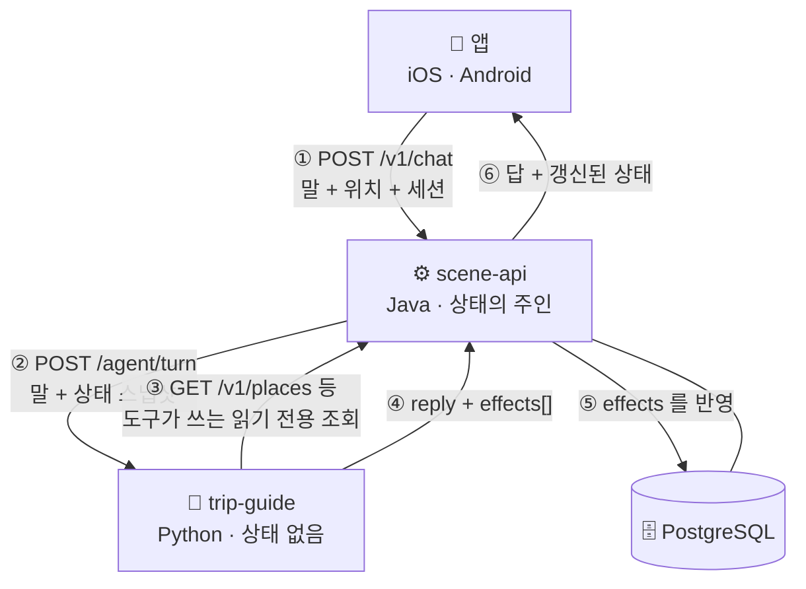
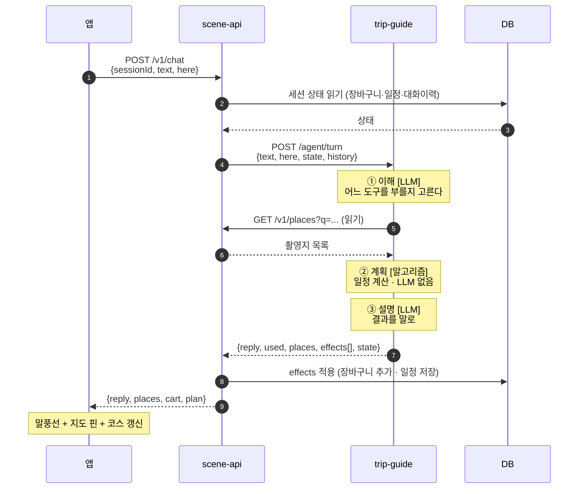

# 백엔드 ↔ 에이전트 통신 구조 (초안)

> MZ2AZ-200 · MZ2AZ-201 · 2026-09-03 작성. 담당: 김태환.
> **제안 문서다.** 계약을 확정하려면 `contracts/openapi` 를 고쳐야 하고 그것은
> **정권호**(백엔드 담당)와 합의할 일이라, 여기에는 **에이전트 쪽이 필요로 하는 것**과
> 그 근거를 적는다.

---

## 1. 원칙 셋

| 원칙 | 왜 |
| --- | --- |
| **앱은 백엔드만 부른다** | 앱이 에이전트를 직접 부르면 주소·인증·버전이 두 벌이 된다. 지금 앱이 `127.0.0.1:8899` 를 하드코딩한 것이 그 문제의 예다 |
| **에이전트는 상태를 갖지 않는다** | 상태의 주인은 DB 하나다. 앱이 보는 장바구니와 챗봇이 보는 장바구니가 갈리면 안 된다 |
| **쓰기는 백엔드만 한다** | 에이전트는 「무엇을 바꿔야 하는지」만 말하고 실제 저장은 백엔드가 한다 (CLAUDE.md §5 — 에이전트는 DB 를 직접 만지지 않는다) |

세 번째가 이 설계의 핵심이다. 에이전트는 **판단하고 말하는 층**이고,
**기록하는 층**이 아니다.

---

## 2. 전체 구조



**③ 이 순환처럼 보이지만 아니다.** 백엔드가 에이전트를 부르는 것은 *쓰기 포함 대화*이고,
에이전트가 백엔드를 부르는 것은 *읽기 전용 조회*다. 방향이 다르고 권한도 다르다.

읽기를 에이전트가 직접 하는 이유는, **어떤 데이터가 필요한지 대화 도중에 정해지기 때문**이다.
"이 근처 뭐 있어" 는 좌표가 나와야 질의를 만들 수 있고, 그 좌표는 모델이 도구를 고른 뒤에야
정해진다. 미리 다 실어 보낼 수 없다.

---

## 3. 대화 한 번의 흐름



**에이전트는 DB 를 모른다.** 상태를 받아서 판단하고, 바꿔야 할 것을 말로 돌려준다.

---

## 4. 에이전트가 필요로 하는 정보

`POST /agent/turn` 의 요청 본문이다. **여섯 갈래**로 나뉜다.

| 갈래 | 필드 | 왜 필요한가 | 없으면 |
| --- | --- | --- | --- |
| **① 말** | `text` | 이번 사용자 발화 | 아무것도 못 한다 |
| | `history[]` | 「그거」·「거기」 가 무엇인지 | 지시어를 못 푼다 |
| **② 사람** | `sessionId` | 대화를 잇는 열쇠 | 매 턴 처음부터 시작 |
| | `userId` | 저장 대상 (익명 가능) | 저장을 못 한다 |
| | `lang` | 답할 언어 | 자동 감지로 대체 가능 |
| **③ 위치** | `here {lat,lng}` | 「이 근처」 의 기준점 | 주변 검색이 거절된다 |
| **④ 지금 상태** | `cart[] {no,name,placeId}` | 「2번 빼줘」 의 번호 | 번호를 못 푼다 |
| | `plan` | **고칠 대상.** 없으면 `revise_plan` 이 아예 불가 | 일정 수정 불가 |
| | `shown[]` | 이번 대화에서 보여 준 장소 | **모델이 이름을 지어낸다** |
| | `picked` | 화면에서 고른 곳 | 「여기 주변」 이 안 걸린다 |
| **⑤ 여행 문맥** | `trip {courseId, day, nextStop, stamped[]}` | 여행 중인지, 몇 일차인지 | 「다음 어디예요」 를 못 답한다 |
| **⑥ 설정** | `pace` | 일정 기본 속도 | `normal` 로 가정 |

### 특히 중요한 셋

**`shown[]`** — 우리 촬영지가 수천 곳인데, 모델이 이름을 지어내면 그것이 우연히 동명
장소에 걸린다. **모델이 지목할 수 있는 범위를 목록으로 못박는 것**이 이 필드의 일이다.

**`plan`** — 오늘 구현하며 배운 것이다. 일정을 아무도 안 들고 있으면, 모델이 기억으로
일정을 다시 그려야 하고 거기가 환각이 들어오는 자리다. **고칠 대상은 반드시 실려 와야 한다.**

**좌표를 어디까지 주나** — `here` 와 `cart[].lat/lng` 는 **백엔드가 에이전트에게** 준다.
그러나 **에이전트는 모델에게 좌표를 주지 않는다.** 숫자를 보면 모델이 거리를 스스로
재려 들고 그 계산은 틀린다. 좌표를 쓰는 것은 코드다.

---

## 5. 에이전트가 돌려주는 것

| 필드 | 무엇 | 백엔드가 할 일 |
| --- | --- | --- |
| `reply` | 사용자에게 보일 문장 | 그대로 앱에 전달 |
| `used[]` | 부른 도구 이름 | 앱이 「무엇을 근거로」 를 보여 준다 |
| `places[]` | 이번 턴에 **도구가 준** 장소 | 지도 핀. 모델이 말한 것이 아니라 도구가 준 것만 |
| **`effects[]`** | **바꿔야 할 것** | **DB 에 반영** |
| `state` | 갱신된 일정 스냅샷 | 다음 턴에 그대로 돌려보낸다 |
| `refused` | 거절 사유 (있으면) | 사용자에게 그대로 보인다 |

### 왜 둘로 나누나 — `effects` 와 `ui`

챗봇은 **떠 있는 시트 안**에 있고, 지도와 코스 편집기는 **그 바깥**에 있다.
「2일차에서 빼 줘」 는 말로 답해서 끝날 일이 아니라 **바깥 화면이 바뀌어야** 끝난다.

그런데 에이전트는 화면도 DB 도 만지지 않는다. 그래서 **무엇을 바꿔야 하는지를 두 목록으로
내보내고**, 상태 변경은 백엔드가, 화면 변경은 앱이 수행한다.

| | 무엇 | 누가 수행 | 실패하면 |
| --- | --- | --- | --- |
| `effects[]` | 상태 변경 (저장) | **백엔드** | 데이터가 안 남는다 — 권한·트랜잭션이 필요 |
| `ui[]` | 화면 지시 | **앱** | 화면만 안 바뀐다 — 데이터는 멀쩡 |

되돌릴 수 없는 것과 그냥 그림인 것을 섞으면 안 되기 때문에 나눴다.

**`ui` 는 의도만 적는다.** 「2일차를 보여 줘」 라고 말하고 *어느 화면을 어떻게 띄울지*는
앱이 정한다. 좌표나 화면 전환 절차를 에이전트가 정하면 iOS 와 Android 가 갈리고, 앱을
고칠 때마다 에이전트를 같이 고쳐야 한다.

계약은 [`schemas/effects.json`](../../schemas/effects.json) 한 벌뿐이다.

### 지시 목록 (구현 완료)

| `effects` | 언제 | 백엔드가 부를 API |
| --- | --- | --- |
| `cart.add` · `cart.remove` | 「담아줘」 | `POST /cart/items` · `DELETE /cart/items/{id}` |
| `plan.save` | 일정을 새로 짰다 | `POST /courses` → `PUT /courses/{id}` |
| `plan.revise` | 한 일차를 고쳤다 | `PUT /courses/{id}` |
| `plan.move` | 일차 간 이동 | `PUT /courses/{id}` |

| `ui` | 언제 | 앱이 할 일 |
| --- | --- | --- |
| `map.focus {placeIds}` | 검색·주변·담기 | 그 핀들이 다 보이게 지도를 맞춘다 |
| `route.draw {placeIds}` | 하루 동선 | 선을 그린다 |
| `place.card {placeId}` | 「거기 무슨 장면이야」 | 장소 카드를 띄운다 |
| `course.open {day}` | 일정을 새로 짰다 | 코스 화면을 연다 |
| `course.focus {day, changed[]}` | 일정을 고쳤다 | 그 일차를 펼치고 **바뀐 줄을 강조** |
| `sheet.collapse` | 코스를 보여줄 때 | 챗봇 시트를 내린다 |

**실패하면 아무것도 내보내지 않는다.** 거절된 수정에 화면만 바뀌면 사용자는 됐다고 믿는다.

### `effects[]` — 이 설계의 심장

에이전트는 저장하지 않는다. **무엇을 저장해야 하는지 말한다.**

```json
"effects": [
  {"op": "cart.add",     "placeId": "1042"},
  {"op": "cart.remove",  "placeId": "1187"},
  {"op": "plan.save",    "plan": { "...일정 전체..." }},
  {"op": "plan.revise",  "day": 2, "remove": ["한미서점"]}
]
```

| 이 구조의 이득 | |
| --- | --- |
| **권한·검증이 한 곳** | 남의 장바구니를 못 건드린다. 백엔드가 `userId` 로 막는다 |
| **트랜잭션** | 여러 변경이 전부 적용되거나 전부 안 되거나 |
| **되돌리기** | 백엔드가 적용 전에 거절할 수 있다 |
| **감사** | 누가 무엇을 언제 바꿨는지 백엔드 로그 한 곳에 남는다 |

---

## 7. 계약 초안

### `POST /agent/turn`

```json
{
  "sessionId": "s-8f21",
  "userId": "u-1042",
  "lang": "ko",
  "text": "2일차에서 한미서점 빼줘",
  "history": [{"role": "user", "content": "..."}, {"role": "assistant", "content": "..."}],
  "here": {"lat": 37.5826, "lng": 126.9910},
  "state": {
    "cart":   [{"no": 1, "placeId": "1042", "name": "서울중앙고", "lat": 37.58, "lng": 126.99}],
    "shown":  [{"placeId": "1042", "name": "서울중앙고"}],
    "picked": {"placeId": "1042"},
    "plan":   {"titles": ["도깨비"], "days": 2, "pace": "normal", "days_detail": [ ... ]},
    "trip":   {"courseId": "c-77", "day": 2, "nextStop": "제물포구락부", "stamped": ["1042"]}
  }
}
```

### 응답

```json
{
  "reply": "2일차에서 한미서점을 뺐어요. 이제 4곳이 되어 12:01에 마칩니다.",
  "used": [{"tool": "revise_plan", "args": {"day": 2, "remove": ["한미서점"]}}],
  "places": [{"placeId": "1187", "name": "순보석", "lat": 37.47, "lng": 126.62}],
  "effects": [{"op": "plan.revise", "day": 2, "add": [], "remove": ["한미서점"],
               "plan": { "...갱신된 일정 전체..." }}],
  "ui": [{"op": "course.focus", "day": 2, "changed": ["한미서점"]}],
  "state": {"plan": { "...갱신된 일정..." }},
  "took_s": 3.3
}
```

---

## 8. 지금과 무엇이 다른가

| | 지금 | 이 설계 |
| --- | --- | --- |
| 앱이 부르는 곳 | 프로토타입 서버를 **주소로 하드코딩** | 백엔드 하나 |
| 에이전트 상태 | **파이썬 메모리** — 서버 내리면 사라짐 | 백엔드 DB |
| 장바구니 | 앱과 챗봇이 **따로 논다** | 하나 |
| 일정 저장 | **안 됨** | `effects` 로 저장 |
| 에이전트 여러 대 | 불가 (상태가 안에 있음) | 가능 (상태가 없음) |

## 9. 옮기는 순서

| 순서 | 할 일 | 누구 | 왜 이 순서 |
| --- | --- | --- | --- |
| 1 | `/agent/turn` 계약 확정 | **정권호와 합의** — `contracts/` | 여기가 안 정해지면 양쪽이 서로 다른 것을 만든다 |
| 2 | 에이전트를 **상태 없게** 고친다 | 김태환 (`agents/`) | 상태를 요청에서 받고 `effects` 로 돌려주게 |
| 3 | 백엔드에 `/v1/chat` 과 `effects` 적용 | **정권호** (`services/`) | 앱이 부를 창구 |
| 4 | 앱이 백엔드를 부르게 | 정승길 (`apps/`) | 하드코딩된 주소를 걷어낸다 |
| 5 | 에이전트 컨테이너·배포 | **팀 결정 필요** | `rules_python` 이 꺼져 있어 Bazel 타깃을 못 만든다 |

**2 번은 지금 바로 할 수 있다.** 1 번 계약이 확정되기 전이라도, 상태를 밖에서 받게
바꾸는 것 자체는 지금 구조를 개선한다.

**5 번이 진짜 관문이다.** `MODULE.bazel` 에서 `rules_python` 이 주석 처리돼 있어
`BUILD.bazel` 을 만들 수 없고, 그래서 컨테이너 이미지도 못 만든다. 켜는 것은 의존성
추가라 팀 결정 사항이다 (CLAUDE.md §9). 초안은 [build-draft.md](build-draft.md) 에 있다.
