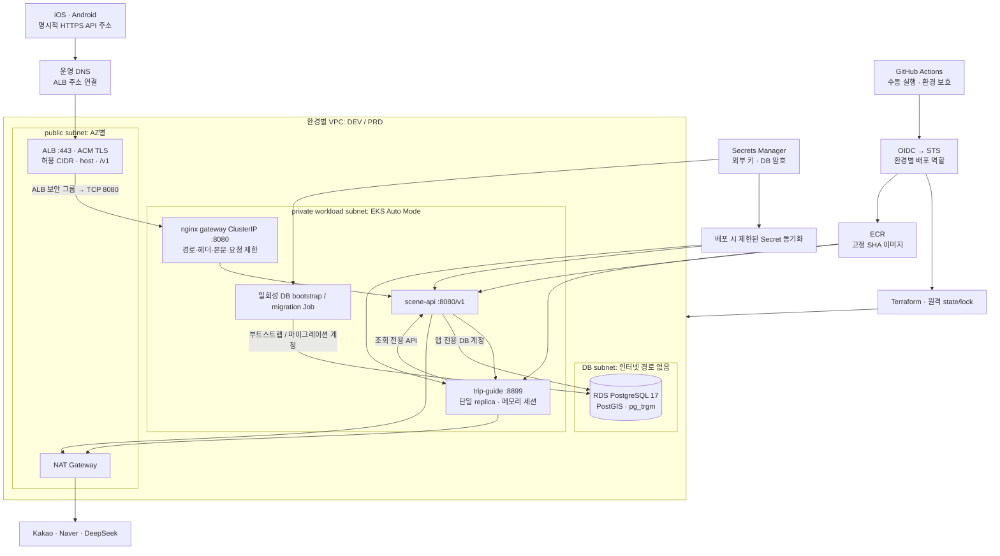

# SceneTrip DEV·PRD 배포 아키텍처

이 문서는 저장소에 구현하는 **배포 형상**이다. AWS 계정의 현재 리소스를 조회한
인벤토리가 아니며, 소스 검증과 실제 AWS 배포 결과를 구분한다.
구현 경로는 [이식 계획](../project/plans/aws-dev-prd-port.md)과
[ALB 전환 계획](../project/plans/alb-deployment.md), 서비스 용어는
[AWS 서비스 해설](aws-services.md), 실행 절차는 [운영 가이드](../ops/aws-deployment.md)를 본다.

## 제품에서 출발한 구성

SceneTrip은 작품의 촬영지를 검색하고 여행 코스를 만들고 여행 중 길을 안내하는
네이티브 모바일 제품이다. 웹 프런트엔드 컨테이너가 없다.

| 배포 단위 | 책임 | 연결 |
| --- | --- | --- |
| `apps/scenetrip-ios` | SwiftUI·Naver Map, 검색·코스·여행 화면 | HTTPS `/v1`, App Store 별도 배포 |
| `apps/scenetrip-android` | Compose·Naver Map, Android 화면 | HTTPS `/v1`, Play Store 별도 배포 |
| `services/scene-api` | Spring Boot 4.1·Java 21, API·데이터 저장·가이드 effects 적용 | PostgreSQL, 내부 agent, Kakao·Naver |
| `agents/trip-guide` | Python 코스 계산·LLM 도구 선택·대화 | scene-api의 조회 API, DeepSeek |
| PostgreSQL 17 | 작품·장소·코스·비회원 식별·POI | PostGIS, pg_trgm, Flyway V1–V14 |

에이전트는 DB나 사용자 설치 식별자를 직접 갖지 않는다. 장소 조회는 scene-api를
통하고, `cart.*` 변경은 scene-api가 사용자 맥락에서 적용한다.
코스 초안은 앱으로 돌아가며 사용자가 편집 완료했을 때 저장한다.
[ADR 0013](adr/0013-guide-chat-is-served-by-the-python-agent.md)의 경계를 유지한다.

## 요청과 배포 경로

위 그림의 ALB는 public subnet에 있고 컨테이너 노드는 private subnet에 있다.
TLS는 ALB에서 끝나며 ALB→gateway는 VPC 내부 HTTP다. 내부 구간까지 TLS가 필요한
환경은 별도 인증서·프록시 설계를 해야 하며 이 구성을 종단 간 TLS라고 부르지 않는다.
DNS와 ACM 인증서는 운영자가 소유권 검증을 완료한 외부 입력이다.

### ALB를 선택한 이유와 nginx의 역할

SceneTrip의 외부 인터페이스는 HTTPS API이며, TCP/UDP 서비스나 고정 IP 요구가 없다.
ALB는 요청의 호스트·경로를 해석하므로 API 도메인의 `/v1`을 명시적으로 라우팅할 수 있다.
AWS도 HTTP/HTTPS에는 [ALB 사용을 권장](https://docs.aws.amazon.com/eks/latest/userguide/auto-configure-alb.html)한다.
채택 근거와 대안은 [ADR 0016](adr/0016-alb-http-ingress.md)에 기록했다.

ALB는 TLS와 HTTP 라우팅을, nginx는 SceneTrip의 세부 경로 허용 목록·본문 1 MiB 제한·
IP별 요청/연결 제한·내부 헤더 제거를 맡는다. ALB만 추가한다고 이 정책들이 자동 제공되지는
않는다. AWS WAF는 현재 배포 범위에 포함하지 않았다.
요청 제한 10r/s·burst 20과 동시 연결 20은 **gateway Pod별**로 적용된다. PRD의 gateway
replica 둘이 카운터를 공유하지 않으므로 서비스 전체에 대한 전역 사용자 할당량은 아니다.

Helm의 `IngressClassParams`는 public subnet을 고정하고, `IngressClass`는
`eks.amazonaws.com/alb` 컨트롤러를 선택한다. `Ingress`가 HTTPS 443과 API 호스트·
`/v1` 경로를 gateway의 Pod IP로 연결한다. gateway Service는 ClusterIP이며 별도의
외부 로드밸런서를 만들지 않는다. ALB의 수명은 Ingress가, 보안 그룹·서브넷은 Terraform이
관리한다. ALB 상태는 Service가 아닌 Ingress와 AWS target health에서 확인한다.

## 환경별 차이

| 항목 | local | DEV (`dev`) | PRD (`prd`) |
| --- | --- | --- | --- |
| 목적 | 노트북 개발·교육 | AWS 통합 검증 | 운영 배포 형상 검증·제한된 서비스 |
| Kubernetes | kind | EKS Auto Mode | EKS Auto Mode |
| AZ | 노트북 한 대 | 2 | 3 |
| NAT | Docker 네트워크 | 1, AZ 장애 시 외부 호출 영향 | AZ별 1 |
| DB | PostGIS StatefulSet | RDS 단일 AZ | RDS Multi-AZ |
| 백업·삭제 보호 | 볼륨 수명과 연결 | 짧은 보존 | 긴 보존·삭제 보호·최종 snapshot |
| API | NodePort 8081 | ALB HTTPS·허용 CIDR | ALB HTTPS·허용 CIDR |
| DB 마이그레이션 | 앱 기동/로컬 recipe | 배포 전 Job | 배포 전 Job |
| 등록 판정 우회 | 로컬 데모 설정 가능 | 허용하지 않음 | 허용하지 않음 |
| agent | 개발용 서버 | 내부 전용 1 replica | 내부 전용 1 replica |
| 텔레메트리 | 로컬 SigNoz | 수집기 별도 설정 | 수집기 별도 설정 |

환경은 같은 코드의 값 차이다. AWS 계정도 DEV와 PRD를 분리하는 것을 권장한다.
별도 계정을 쓰면 IAM의 실수까지 계정 경계가 막아 준다. 같은 계정을 쓰더라도 VPC,
역할, 리소스 이름, state key, Secrets Manager 경로는 분리해야 한다.

**PRD라는 이름은 운영 준비 완료를 뜻하지 않는다.** 현재 API는 `X-Device-Id`로
설치본을 식별한다. 가입 여부 검사와 인증은 다른 문제다. 공개 서비스에는 로그인·
권한 검증과 사용자별 할당량이 필요하다. 지금은 네트워크 허용목록과 gateway 요청
제한을 두고 제한된 사용자로 검증한다. Naver 비공식 카드 조회는
[ADR 0011](adr/0011-naver-place-unofficial-for-demo.md)의 데모 제한도 따른다.

## 세 가지 보안 경계

### AWS 제어 권한

CloudFormation 부트스트랩이 state 버킷과 GitHub OIDC 배포 역할, 고정 EKS cluster/
node 역할을 만든다. 일반 배포 역할은 이 역할들의 신뢰 정책을 바꾸는 권한을 갖지
않는다. 최초 부트스트랩에는 이미 신뢰된 관리자 또는 별도 bootstrap 역할이 필요하다.
새 배포 역할로 자기 자신을 만드는 순환 절차를 구성하지 않는다.

OIDC의 `aud`는 STS, `sub`는 정확한 저장소와 `environment:dev` 또는
`environment:prd`로 제한한다. GitHub Environment의 허용 브랜치·검토자 설정도
필수다. YAML 안의 `if`만으로 신뢰 경계를 만들지 않는다.
입력 revision은 OIDC·Environment 권한이 없는 사전검증 job에서 신뢰된 `main`의
검증기로 검사하고, 후속 배포 job은 검증을 통과한 SHA만 실행한다.

### 네트워크

DB는 public IP가 없고 workload 보안 그룹에서 오는 5432만 받는다.
agent는 ClusterIP이고 외부 로드밸런서가 없다. gateway는 API 경로만 전달하며
Actuator·agent의 디버그 창구는 외부로 전달하지 않는다. EKS 제어 API CIDR과
사용자용 ALB CIDR은 용도가 달라 별도 입력으로 둔다.
배포 runner는 EKS 관리와 외부 HTTPS 검증을 모두 수행하므로 두 허용 목록에 자신의
고정 egress가 필요하다.

ALB 전용 보안 그룹의 443은 사용자 허용 CIDR에서만 받는다. ALB에서 workload 보안
그룹의 8080으로 가는 경로를 별도로 허용하고, gateway NetworkPolicy는 같은 ALB public
subnet CIDR만 받는다. 배포 전 Auto Mode NodeClass가 실제로 사용하는 보안 그룹을
Terraform 출력과 대조하여 노드 설정이 바뀌었는데 기존 보안 규칙을 쓰는 일을 막는다.

ALB가 원격 주소를 대신하므로 클라이언트 IP는 전달 헤더에서 복원한다. ALB는
`X-Forwarded-For`에 실제 접속 IP를 마지막으로 추가하고, nginx는 ALB subnet만
신뢰하여 마지막 항목을 읽는다(`real_ip_recursive off`). 원래 연결자가 ALB 대역인지와
복원한 클라이언트가 허용 CIDR인지도 재검사한다. upstream에는 복원한 주소 하나만
전달하고 `Forwarded`·`X-Service-Token`을 제거한다. 임의로 보낸 앞쪽 헤더 값이
접근 권한이나 IP별 요청 제한 키가 되지 않게 한다.
[ALB 헤더 동작](https://docs.aws.amazon.com/elasticloadbalancing/latest/application/x-forwarded-headers.html)과
[nginx real IP 동작](https://nginx.org/en/docs/http/ngx_http_realip_module.html)을 따른다.

NetworkPolicy는 매니페스트만 만들어서는 충분하지 않다. EKS Auto Mode의
`amazon-vpc-cni` ConfigMap에서 controller를 켜고 허용되지 않은 Pod에서 접속이
실제로 차단되는지 배포 후 확인한다. AWS의
[Auto Mode NetworkPolicy 절차](https://docs.aws.amazon.com/eks/latest/userguide/auto-net-pol.html)를 따른다.

### 데이터베이스 권한

RDS master는 DB와 확장을 준비할 때만 사용하고 scene-api에 주입하지 않는다.
마이그레이션 계정은 DDL, 앱 계정은 필요한 DML 권한을 갖는다. 앱에서는 Flyway를
끄고 같은 버전의 migration 이미지로 먼저 스키마를 올린다. 확장 설치에는
[RDS 권한](https://docs.aws.amazon.com/AmazonRDS/latest/UserGuide/Appendix.PostgreSQL.CommonDBATasks.PostGIS.html)이 필요하다.

Terraform에는 Secret 컨테이너와 참조 ARN만 둔다. 암호를 Terraform 변수로
넘기면 `sensitive` 표시를 해도 state에 남을 수 있다. 런타임 암호는 Secrets Manager에
저장하고 배포기가 표준 입력으로 Kubernetes Secret을 동기화한다.
Kubernetes Secret의 base64는 암호화가 아니므로 RBAC·저장소 암호화도 필요하다.

## SceneTrip 전용 DB 조건

한글 검색은 `pg_trgm`과 `search_normalize()`를 사용한다. DB를 UTF8,
`LC_COLLATE=C`, 문자 분류가 한글을 지원하는 `LC_CTYPE=C.UTF-8` 계열로 생성하고
`show_trgm('도깨비')`가 빈 배열이 아닌지 확인한다. 로케일은 대상 RDS에서 지원되는
표기를 검사해야 한다. `C`로 조용히 대체하면 검색이 느려지는 결함이 생긴다.
[RDS 정렬 규칙](https://docs.aws.amazon.com/AmazonRDS/latest/UserGuide/PostgreSQL-Collations.html)을 함께 본다.

확장은 `postgis`, `pg_trgm`이다. TripPilot의 `vector` 확장을 가져오지 않는다.
스키마 생성과 데이터 적재는 별개다. 로컬 `just seed`는 기존 데이터를 지우는 절차이므로
원격 배포에서 호출하지 않는다. 운영 데이터 적재·검색 MV 갱신은 별도 검토 작업이다.

## 장애와 확장 한계

- API replica와 RDS Multi-AZ는 구성요소 일부의 장애 대응이다. 서비스 전체의
  고가용성을 증명하지 않는다. 복원 시간은 실제 장애 시험으로 측정한다.
  현재 Pod의 AZ 분산은 스케줄링 선호(`ScheduleAnyway`)이며 강제 분산이 아니다.
  여유 노드·쿼터가 부족하면 두 replica가 같은 AZ에 놓일 수 있다.
- agent는 대화 상태를 메모리에 보관한다. 초기에는 한 replica와 Recreate 배포를
  사용한다. 재배포·노드 장애 시 진행 중 요청과 대화 이력이 소실될 수 있다.
  공유 상태 저장소 없이 replica 수만 올리지 않는다.
- agent의 대화 턴 예산 30초 < scene-api 대기 40초 < 앱 대기 50초를 유지한다.
  gateway 읽기 대기는 45초, ALB idle timeout은 60초로 둔다. ALB idle timeout은
  전체 요청 처리 예산과 같은 의미가 아니다. 멱등성이 없는 대화를
  자동 재시도하지 않는다.
- 외부 API 호출은 NAT에 의존한다. NAT 비용에는 시간 요금과 처리 바이트가 있다.
  VPC endpoint가 외부 Kakao·DeepSeek까지 대신 연결해 주지는 않는다.
- SigNoz는 로컬에서 제공하는 스택이다. AWS에 수집기를 설치하지 않은 상태라면
  Java OTEL을 끈다. CloudWatch의 EKS 제어 로그와 앱 trace는 서로 다른 데이터다.

## TripPilot에서 가져온 것과 제외한 것

| 원본 | 적용 | SceneTrip에서 바뀐 점 |
| --- | --- | --- |
| #579 환경 격리·수동 배포 | Terraform·OIDC·Helm·DB Job | `platform/`, `tools/`, `just`·Bazel 구조 |
| #579 ECR 이미지 | SHA 고정 이미지·분리된 migration | Java 21 Spring API와 Python agent |
| #579 PostgreSQL·Redis·embedding | RDS·비밀값 관리 | PostgreSQL 17·PostGIS·pg_trgm, Redis/embedding 제외 |
| #579 Kotlin 종료 대기·Replan 테스트 | 이식하지 않음 | 대응 클래스/일정 상태 머신 없음 |
| #645 강의·발표·탐색 | SceneTrip 코드 기반 재작성 | 네이티브 앱, 로컬 kind, AWS의 차이 설명 |
| #645 그림·출처 | 소스 기반 그림과 해시 검증 | AWS 실시간 inventory로 오인하지 않게 표시 |

정본은 소스다. 구성도는 이해를 돕는 요약이며 Terraform plan의 변경 검토를 대신하지
않는다. 실제 인스턴스 수·월 비용·실환경 배포 성공은 이 문서에서 추정하지 않는다.
