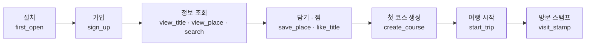

# 앱 분석 이벤트 (MZ2AZ-353)

- **상태**: iOS·Android 둘 다 SDK·이벤트 기록·설정 값까지 들어가 **분석이 켜져 있다**(2026-10-05)
- **담당**: 정승길(앱) · Firebase 프로젝트는 정권호·정승길
- **근거**: 2026-10-01 윤지환 멘토님 마케팅 멘토링(볼트 `00_멘토링 및 회의역사/71_(10.01) 윤지환 멘토님 마케팅`), 2026-10-03 팀 회의

## 1. 왜

광고를 집행하기 전에 **들어온 사람이 무엇을 하고 다시 오는가**를 알아야 한다. 멘토링의 결론이 「설치·가입이 아니라 첫 가치 행동을 재라」였고, 우리의 첫 가치 행동은 **씬 담기·찜 → 첫 코스 생성**이다. 10월 계획이 「측정 모델 적용 · 베타 테스트 · 오가닉 데이터」다.

도구는 무료인 것만 쓴다 — **Firebase Analytics(= GA4)** 와 UTM. MMP(유료)는 넣지 않는다.

## 2. 퍼널

- **핵심 지표(KPI)**: `create_course` — 광고 소재·채널을 비교하는 기준
- **리텐션**: `create_course` 뒤 30일 안에 `start_trip` 이 있는가(방한해서 앱을 쓰는가)
- 가입은 지금 필수가 아니다(비회원도 담고 코스를 만든다). 그래서 퍼널에서 `sign_up` 을 건너뛰는 사람이 있다 — 사용자 속성 `account` 로 나눠 본다

## 3. 이벤트

이름은 GA4 규칙(소문자·밑줄, 40자 이하). GA4 가 미리 정해 둔 이름이 있으면 그것을 쓴다(★). **두 앱이 같은 이름·같은 매개변수를 쓴다.**

| 이벤트 | 언제 | 매개변수 | 구현(iOS) | 구현(Android) |
| --- | --- | --- | --- | --- |
| `first_open` ★ | 설치 뒤 첫 실행 | (SDK 가 자동으로) | — | — |
| `select_language` | 언어를 골랐다(첫 실행·마이페이지) | `language` | `AppLanguage.choose` | 미연결 — `AppLanguage`가 main 에 없다(MZ2AZ-343 병합 대기) |
| `tutorial_begin` ★ | 사용법 첫 장이 보였다 | — | `OnboardingView` | `OnboardingView` |
| `tutorial_complete` ★ | 사용법을 끝냈다(건너뛰기 포함) | — | `OnboardingView.finish` | `OnboardingView.finish` |
| `sign_up` ★ | 이 구글 계정으로 처음 로그인(가입) | `method` = `google` | `AuthStore.signInWithGoogle` | 미연결 — `AuthStore`가 main 에 없다(MZ2AZ-336 병합 대기) |
| `login` ★ | 다시 로그인 | `method` | 〃 | 〃 |
| `logout` | 로그아웃 | — | `AuthStore.signOut` | 〃 |
| `delete_account` | 탈퇴 | — | `AuthStore.deleteAccount` | 〃 |
| `screen_view` ★ | 탭·덮개가 바뀌었다 | `screen_name` = `search`·`home`·`community`·`courses`·`profile` | `RootTabs` | `RootTabs` |
| `search` ★ | 검색어를 확정했다 | `term_length`, `kind`(`content`·`person`·`place`·`typed`) — **검색어 원문은 보내지 않는다** | `SearchTabView.commit` | `SceneData.search` + `SearchTabScreen.commit` |
| `view_title` | 작품 상세를 열었다 | `content_id` | `ContentDetailView` | `ContentDetailView` |
| `view_place` | 장소 상세를 열었다 | `place_id` | `PlaceDetailView` | `PlaceDetailView` |
| `like_title` | 작품 하트를 눌렀다 | `content_id`, `liked`(1·0) | `LikeStore.toggle` | `LikeStore.toggle` |
| `save_place` | 장소를 담았다(서버가 받았을 때) | `place_id` | `CartStore.add` | `CartStore.add` |
| `generate_plan` | AI 일정 초안을 받았다(저장 전) | `day_count`, `title_count` | `RouteStore` | `RouteStore.guideDraft` |
| **`create_course`** | **코스를 새로 만들어 저장했다**(고쳐 저장은 세지 않는다) | `origin`(`ai`·`self`·`review`), `day_count`, `place_count` | `RouteStore.save` | `RouteStore.save` |
| `start_trip` | 한 장소로 안내를 시작했다 | `place_id` | `TripSession.start` | `TripSession.start` |
| `get_directions` | 길찾기를 불렀다 | — | `TripSession` | `TripSession.fetchLeg` |
| `visit_stamp` | 성지에 도착해 도장이 찍혔다 | `place_id` | `TripSession.arriveNow` | `TripSession.markArrived` / `checkArrival`(둘 다 도착 판정이라 각각 기록) |
| `ask_guide` | 가이드 챗봇에 물었다 | — | `RouteGuide` | `RouteGuideSession.ask` |
| `post_review` | 여행후기를 올렸다 | `photo_count`, `has_course`(1·0) | `CommunityStore.add` | `CommunityStore.add`(지금 Android 글쓰기에 사진이 없어 `photo_count`는 늘 0) |

### 사용자 속성

| 속성 | 값 | 쓰임 |
| --- | --- | --- |
| `app_language` | `ko`·`en` | 언어별로 퍼널을 나눠 본다 |
| `account` | `guest`·`member` | 비회원·회원을 나눠 본다 |

## 4. 보내지 않는 것 (개인정보)

- **이름·이메일·설치 식별자·좌표·글 본문·검색어 원문.** 작품·장소는 우리 DB 의 id 로만 적는다
- **광고 식별자(IDFA)** — iOS 는 `FirebaseAnalyticsCore`(광고 식별자 없는 제품)를 쓴다. 그래서 추적 동의 창(ATT)이 필요 없다. **광고를 집행해 전환을 매체에 돌려주려면 다시 정해야 한다** — 그때는 동의 창과 처리방침 변경이 따라온다
- 분석 수집 자체는 개인정보 처리방침에 적어야 한다(수집 항목: 앱 사용 기록, 기기·OS 정보, 대략적 지역 — Firebase 가 IP 로 추정). 볼트 `(9주차) 08_앱이 다루는 개인정보` 참고
- 단위 시험 `AppEventTests.testNoPersonalDataInParameters` 가 매개변수 이름을 지킨다

## 5. 설정 파일

Firebase 는 앱 번들 안의 설정 파일로 켜진다. Firebase 프로젝트는 `scenetrip-5bf07`(2026-10-05, 정승길 생성).

| 플랫폼 | 파일 | 두는 곳 | 상태 |
| --- | --- | --- | --- |
| iOS | `GoogleService-Info.plist` | `apps/scenetrip-ios/resources/` | 번들에 실린다 — 분석이 켜져 있다 |
| Android | `google_services.json`(원본) + `res/values/firebase.xml`(파생 리소스) | `apps/scenetrip-android/src/main/res/raw/`, `.../res/values/` | 리소스가 실린다. `google-services` Gradle 플러그인이 보통 자동으로 만드는 리소스를 `firebase.xml`에 손으로 옮겨 적었다(Bazel 에 그 플러그인이 없다). 이 리소스가 있으면 Firebase 의 `FirebaseInitProvider`가 앱이 뜰 때 혼자 초기화한다 — `AppAnalytics.start`는 **직접 초기화하지 않고** 성공했는지만 확인한다(§8) |

- **두 파일은 저장소에 있다**(2026-10-05 정승길 결정). CI 와 팀원 빌드, 베타 빌드에 분석이 똑같이 들어가게 하려는 것이다
- 파일 안의 API 키는 **비밀이 아니다** — 앱에 그대로 실려 배포되는 식별자다. 다만 구글 클라우드 콘솔에서 이 키에 앱 제한(iOS 번들 ID · Android 패키지와 서명)을 걸어 두어야 남이 가져다 쓰지 못한다 — **아직 걸지 않았다**
- 파일이 없어도 빌드되고 돈다 — 없으면 `AppAnalytics.start` 가 Firebase 를 켜지 않고 이벤트를 버린다
- 구글 로그인은 이 프로젝트와 무관하다(다른 구글 클라우드 프로젝트의 클라이언트 ID 를 `Info.plist` 에서 읽는다)
- 프로젝트를 바꾸려면 콘솔에서 새 파일을 받아 같은 자리에 덮어쓴다

## 6. 확인하는 법

1. `just ios-run`
2. 시뮬레이터 실행 인자에 `-FIRDebugEnabled` 를 주면 Firebase 콘솔 **DebugView** 에 이벤트가 몇 초 안에 찍힌다
3. 퍼널 순서대로 눌러 본다: 검색 → 작품·장소 열기 → 하트·담기 → 코스 만들기 → 코스 시작

## 7. 남은 것

- `select_language`·`sign_up`·`login`·`logout`·`delete_account`는 Android 쪽 `AppLanguage`·`AuthStore`가 아직 main 에 없어(각각 MZ2AZ-343·MZ2AZ-336 병합 대기) 연결하지 못했다. 병합되면 이어서 연결한다
- UTM — 스토어 등록과 랜딩 링크가 정해진 뒤(설치 출처는 Android 는 Play Install Referrer, iOS 는 App Store 캠페인 링크)
- GA4 에서 `create_course` 를 주요 이벤트(전환)로 표시, 퍼널·코호트 보고서 만들기(대시보드)
- 광고 집행을 정하면: 광고 식별자·동의 창, 구글 광고 연결

## 8. Android 구현 메모 (2026-10-05)

- `com.google.firebase:firebase-analytics:23.2.0`을 `MODULE.bazel`에 추가했다(BoM 대신
  버전을 바로 박는다 — 이 파일의 다른 Maven 좌표와 같은 방식). KTX 모듈은 2025-07 부터
  더 안 나와 일반 아티팩트를 썼다
- **`FirebaseOptions`를 코드로만 지어서는 분석이 안 켜졌다.** `FirebaseApp.initializeApp`은
  성공했는데 로그에 `E FA: Missing google_app_id. Firebase Analytics disabled.`가 떴다
  (실기 확인). Firebase Analytics(정확히는 그 안의 play-services-measurement)는
  `FirebaseOptions`를 거치지 않고 **`google_app_id` 문자열 리소스를 따로 직접 읽는다** —
  google-services 플러그인이 보통 만들어 주는 리소스가 없어서였다
- 고쳐서 `res/values/firebase.xml`에 그 플러그인이 만드는 리소스 이름 그대로
  (`google_app_id`·`google_api_key`·`google_crash_reporting_api_key`·
  `google_storage_bucket`·`project_id`·`gcm_defaultSenderId`)를 손으로 적었다. `res/raw/google_services.json`은 그 값들의 원본 출처로 남겨 둔다
- 그런데 이 리소스가 있으면 Firebase 의 `FirebaseInitProvider`(SDK 가 매니페스트에 등록해
  두는 `ContentProvider`)가 **`AppAnalytics.start`가 불리기도 전에 혼자 `[DEFAULT]` 앱을
  초기화해 버린다.** 그 뒤에 코드로 `FirebaseApp.initializeApp`을 또 부르면
  `IllegalStateException: FirebaseApp name [DEFAULT] already exists!`로 죽는다(실기
  확인). 그래서 `AppAnalytics.start`는 **직접 초기화하지 않고** `FirebaseApp.getApps(context)`가
  비어 있지 않은지만 확인해 `sink`를 고른다
- 값은 모두 `google-services.json`과 같다 — 비밀이 아니다(§5)
