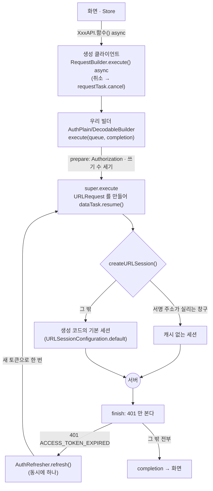
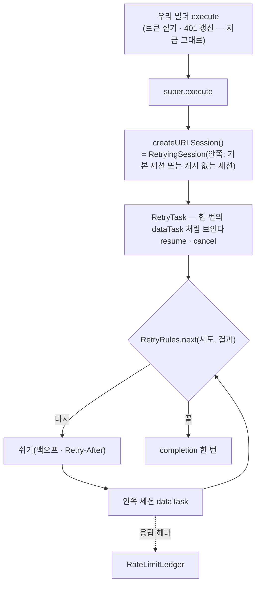

# 앱 재시도 규칙 — 끊김·5xx 재시도, 챗봇 멱등 키, 429 안내 (MZ2AZ-366)

- **상태**: **PR A(공통 재시도 계층)를 넣었다(2026-10-08)** — 규칙·세션·장부·뒷문, 조회와 쓰기의 재시도, 검색 탭의 「다시 시도」.
  실기로 본 것과 못 본 것은 §9. 챗봇·길찾기·마법사의 재시도와 429 안내는 아직이다(B·C·D). §7 의 1·2·3·4·7·8·15 는 추천안으로 정했다
- **담당**: 정승길 — iOS 먼저, Android 는 따라간다(§8)
- **서버·계약**: [rate-limit.md](./rate-limit.md)(MZ2AZ-334, 정권호). 계약 scene-api **1.5.0**(PR #159)과 서버 구현(PR #163,
  2026-10-08 17:30 머지)이 main 에 있다. 로컬 서버는 2026-10-08 19시에 `just update scene-api` 로 올렸다(§9)
- **근거**: 지라 MZ2AZ-366 본문(재시도 표·챗봇 멱등 키)과 댓글 「계약 1.5.0 — 앱이 할 것」, 계약 「요청 한도」 절,
  `docs/api/errors.md` 「한도 초과」

이 문서의 사실은 코드에서 확인한 것이다(파일:줄). 확인하지 못한 것은 「추측」 「확인 필요」 라고 적었다.

## 1. 지금

### 1-1. 요청이 지나가는 길

화면은 생성 클라이언트(`contracts/openapi:scene_api_swift_lib`, 모듈 `SceneApiClient`)의 `XxxAPI.함수()` 를 부른다. 생성 코드는
요청마다 `SceneApiClientAPI.requestBuilderFactory` 에서 빌더를 받는데, 앱이 그 자리에 우리 빌더를 꽂아 두었다
(`apps/scenetrip-ios/src/Auth/AuthStore.swift:33`).



| 자리 | 사실 |
| --- | --- |
| 헤더 | `Accept-Language` 는 `SceneApiClientAPI.customHeaders` 에 한 번(`src/Models/AppLocale.swift:21-23`), `Authorization` 은 빌더가 보내기 직전에(`AuthRequestBuilder.swift:26-29`). `X-Install-Id` 는 계약이 받는 창구에서만 인자로 넘긴다 — 모든 요청에 실리지는 않는다 |
| 세션 | 생성 코드의 `defaultURLSession` 은 `.default` 설정이다(생성물 `URLSessionImplementations.swift:59`) — 요청 시간 벽을 따로 두지 않아 **URLSession 기본값(60초)**이 적용된다. 서명된 사진 주소가 실리는 창구만 캐시 없는 세션(`AuthRequestBuilder.swift:82-94`) |
| 실패 신호 | 연결 자체가 실패하면 상태 `-1` 과 원래 오류(`URLError`), HTTP 가 아니면 `-2`, 2xx 가 아니면 그 상태 코드와 본문·`URLResponse`(생성물 `URLSessionImplementations.swift:188-200`) |
| 응답 헤더 | 생성된 `async` 함수는 본문만 돌려준다(`GuideAPI.swift:25-26` 의 `.execute().body`) — **성공 응답의 헤더는 화면까지 오지 않는다.** 실패는 `ErrorResponse.error(상태, 본문, URLResponse, 오류)` 라 헤더를 읽을 수 있다 |
| 취소 | `Task` 가 취소되면 `requestTask.cancel()` 이 **지금 떠 있는 dataTask 하나**를 끊는다(생성물 `APIs.swift:55-76`, `Models.swift` 의 `RequestTask`). 떠 있는 task 가 없으면 아무 일도 없다 |

### 1-2. 지금 다시 보내는 것 — 401 하나

`AuthIntercept.finish`(`AuthRequestBuilder.swift:37-75`)가 `401` 의 `code` 를 보고 갈린다(`AuthRules.swift:15-23`).
`ACCESS_TOKEN_EXPIRED` 면 갱신하고 **같은 빌더로 한 번** 다시 보낸다 — 헤더가 그대로라 `Idempotency-Key` 도 같은 값으로 나간다.
`/auth/` 창구는 가로채지 않는다(`AuthRules.swift:50-52`). 그 밖의 실패(끊김·5xx·429)는 한 번도 다시 보내지 않고 화면으로 올라간다.

### 1-3. 창구별 — 실패가 화면에 어떻게 보이나

| 창구 | 부르는 곳 | 실패하면 |
| --- | --- | --- |
| 조회 — 검색 탭(작품·촬영지 목록) | `src/Models/SceneData.swift:51,83` | `ApiFailure` — 문구 셋(연결 실패 / 500 / 그 밖), 「다시 시도」 는 **연결 실패와 500 에만**(`SceneData.swift:130-132`, `SearchTab/Rows.swift:178`). 503·429 는 「요청을 처리하지 못했습니다.」 에 단추 없음 |
| 조회 — 홈·프로필·카드·편의시설 점·자동완성 | `HomeTabModel` · `RouteGuide.pois/card` · `SearchTabView:490` 등 | 대부분 `try?` — **조용히 빈 화면**(장식이라 막지 않는다는 주석) |
| 코스 목록·상세·저장·지우기·진행 | `src/RouteTab/RouteStore.swift` | `ApiFailure` 한 줄. 새 코스 저장은 `POST /courses` 뒤 `PUT` 이고, 뒤가 실패하면 만든 코스를 지운다(`RouteStore.swift:143-169`) |
| 가이드 챗봇 `POST /guide/chat` | `RouteGuide.swift:131-133` → `RouteGuideSession.ask` | `RouteGuideFailure` — 401 둘·400·503·50초 초과·연결 실패·그 밖(`RouteGuideFailure.swift:32-57`). 시트에 주황 한 줄(`RouteGuideSheet.swift:116-120`), **「다시 시도」 단추 없음.** 실패한 질문은 대화에 남는다(`RouteGuideSession.swift:69`) — 다시 물으려면 다시 친다. 429·409·422 는 「가이드 요청을 처리하지 못했어요 (429)」 |
| 일정짜기 마법사 `POST /guide/plan` | `RouteStore.swift:272` | 같은 `RouteGuideFailure` 를 알림 창으로(`RouteWizardView.swift:105-114`). 시간 벽 없음(60초 기본값) |
| 길찾기 `POST /navigation/next-leg` | `TripSession.swift:248`, `RouteNavControls.swift:58` | `RouteNavFailure` — 401 둘·404·409·422·503·연결 실패·그 밖. 503·연결 실패·그 밖에만 「다시 시도」(`RouteNavFailure.swift:106-111`, `RouteEditorTrip.swift:192-202`). **실패한 뒤에는 걸어도 다시 묻지 않는다**(`TripSession.swift:216-220`). 429 는 「길찾기를 처리하지 못했어요 (429)」 + 「다시 시도」 |
| 리뷰 저장·지우기 `PUT`·`DELETE …/reviews/me` | `Reviews/ReviewSubject.swift:75-84` | 쓰기 화면이 `code` 로 가른 문구(`ReviewComposeView.swift:268-`) |
| 사진 올릴 주소 `POST /uploads` | `Reviews/PhotoUploader.swift:121` | `PhotoUploadFailure` — **`rateLimited`(429) 가 이미 있다**(`PhotoUploader.swift:13-14,43,48`): 칸에 「요청이 많아요. 잠시 뒤 다시 시도해 주세요」, 줄을 멈추고 사람이 「다시 시도」. 저장소로의 PUT 은 우리 API 가 아니다(재시도 규칙 밖) |
| 로그인·갱신·닉네임 | `AuthStore.swift`, `AuthTokens.swift:81-98` | 로그인은 「연결이 원활하지 않아요…」, 갱신 실패는 토큰을 그대로 두고 다음 요청에서 다시 |
| 찜·장바구니 | `LikeStore`, `CartStore` | 대부분 조용히 넘긴다(찜은 서버가 정본, 기기에 사본) |

### 1-4. 서버 구현을 계약·티켓과 맞대 본 것 (읽기만 했다)

| # | 무엇 | 사실 | 앱에 닿는 것 |
| --- | --- | --- | --- |
| 1 | `Retry-After` 단위 | **초**(정수). 분당 창은 그 분이 끝날 때까지 1~60(`RequestRateLimitFilter.java:66,70`), 유료 창은 그 창이 끝날 때까지(`PaidQuota.java:106-107,149-152`) | HTTP 날짜 꼴은 오지 않는다. 그래도 숫자가 아니면 「모름」 으로 다룬다 |
| 2 | 짧은 창과 하루 한도의 구분 | **`code` 가 같다** — 챗봇은 1 시간·하루 모두 `GUIDE_LIMIT_REACHED`, 길찾기는 1 분·하루 모두 `NAVIGATION_LIMIT_REACHED`. 가르는 것은 `Retry-After` 의 크기뿐이다(계약도 그렇게 적었다) | 「하루 한도인가」 를 묻지 않고 **`Retry-After` 가 길면 기다리지 않는다**로 푼다(§2-3) |
| 3 | `RateLimit-*` 가 실리는 곳 | 유료 둘이 아닌 **모든 `/v1/` 응답**에 분당 한도의 것(`RequestRateLimitFilter.java:82-84`), 챗봇·길찾기의 **200** 에 그 기능 한도 중 **남은 수가 가장 적은 창**의 것(`PaidQuota.java:110-118`, `QuotaResponses.java:28-34`) | 「오늘 N 번」 이 아닐 수 있다 — 1 시간 창이 더 빠듯하면 그것이 온다(§5-4) |
| 4 | 멱등 키로 되돌려 준 답 | 저장한 답에는 `RateLimit-*` 가 없다(`GuideController.java:85`) | 남은 양은 마지막으로 본 값을 그대로 둔다 |
| 5 | 같은 내용인지 가리는 지문 | **요청 본문 전체 + `Accept-Language`** 의 SHA-256(`GuideController.java:134-143`). 본문에는 위치와 화면 상태(`context` — 남은 거리·걸은 거리)가 들어 있다 | 재시도는 질문 글자만 같아서는 안 된다 — **처음 만든 요청을 그대로** 다시 보내야 한다. 다시 만들면 `422` 다(§4) |
| 6 | 처리 중 | 같은 키가 처리 중이면 `409 IDEMPOTENCY_IN_PROGRESS`. 처리 중인 채 **1 분**이 지나면 죽은 것으로 보고 새로 처리한다. 보관 **24 시간**(`IdempotencyStore.java:39-49`) | 끊긴 뒤 바로 다시 보내면 서버는 아직 첫 요청을 처리 중이라 409 가 온다 — 「두 번 누른 것」 만이 아니다(§4-3) |
| 7 | 키를 지우는 때 | 한도 초과(429)·에이전트 실패(503)·장바구니 적용 실패 때 키를 지운다(`GuideController.java:98-126`) | 같은 키로 다시 보내면 새로 처리된다 |
| 8 | 장바구니 적용이 실패한 턴 | 모델은 이미 답했으므로 한도를 되돌리지 않고 키만 지운다(`GuideController.java:117-126`) | 이 경우 같은 키 재시도가 **모델을 한 번 더 부르고 한도도 한 번 더 깎는다.** 티켓의 「한도도 한 번만」 과 다르다 — 서버 쪽에 알린다(§7-12) |
| 9 | 분당 제한의 「누구」 | 믿을 수 있는 토큰 → 계정, 아니면 `X-Install-Id`, 둘 다 없으면 접속 주소(`RequestRateLimitFilter.java:101-122`) | 비회원이 `X-Install-Id` 를 받지 않는 조회(`/places`·`/contents`·`/pois`·`/search`)를 부르면 **주소로 센다**(§7-11) |
| 10 | 게이트웨이의 429·503 | DEV·PRD 게이트웨이(nginx)도 IP 당 제한으로 429 를 낸다(`platform/helm/scenetrip/templates/config.yaml:72,90-92`). 우리 본문(`code`)과 `Retry-After` 가 없다. 동시 연결 상한(`limit_conn`)을 넘으면 nginx 기본값은 503 이다(추측 — 설정에 `limit_conn_status` 가 없다). `proxy_read_timeout` 45초(`config.yaml:103`)를 넘기면 504 | **`code` 없는 429** 와 502·504 를 규칙이 받아야 한다(§2-1) |
| 11 | `/guide/plan` | 계약은 「모델을 부르지 않는다 · 실측 0.02초」 라 적었지만(`scene-api-v1.yaml` `/guide/plan` 설명), 에이전트는 `config/llm_planner.json` 의 `enabled` 가 참이면 모델을 부른다(`agents/trip-guide/web/server.py:273-276`). **저장소의 값은 `"enabled": true`** 다(`agents/trip-guide/config/llm_planner.json:4`). 실패하면 엔진으로 돌아간다. 서버는 이 창구에 가입 조건도 유료 한도도 두지 않았다(`GuideController.java:145-149`) | 티켓 댓글의 「마법사는 비용이 없다」 전제가 지금 설정에서는 맞지 않는다(§5-2, §7-6) |
| 12 | 계약의 429 선언 | `429` 응답이 선언된 창구는 길찾기·챗봇·마법사 셋뿐이다. 글로는 「어느 창구든 낼 수 있다」 | 생성 클라이언트는 선언과 무관하게 2xx 가 아니면 같은 오류로 올린다 — 동작에 차이 없음 |

**로컬 서버(2026-10-08 18:42 확인)** — `scene-api:dev` 파드가 그날 오전에 뜬 것이고, `GET /v1/contents?limit=1` 응답에 `RateLimit-*` 가
없으며 DB 마이그레이션이 V23 까지다(V24 `usage_counter`·`idempotency_key` 없음). **요청 한도·멱등 키가 없는 옛 서버다.**
DEV·PRD 는 이 조사에서 확인하지 않았다.

## 2. 규칙

### 2-1. 결과별 — 티켓의 표 그대로, 빈 곳을 채운 것

| 결과 | 재시도 (티켓) | 채운 것 |
| --- | --- | --- |
| 응답 없음(끊김·시간 초과) | ✅ **같은 멱등 키로** | 상태 `-1` 의 `URLError`. **취소(`cancelled`)는 재시도하지 않는다.** 기기가 오프라인(`notConnectedToInternet`·`dataNotAllowed`)이면 자동으로는 다시 보내지 않는다(§2-5). `-2`(HTTP 가 아닌 응답)는 다시 보내지 않고 그대로 올린다(실제로 본 적이 없는 갈래다) |
| 503 | ✅ 잠시 뒤 | 502·504 도 같게 다룬다(게이트웨이가 낸다 — §1-4 #10, §7-3) |
| 409 처리 중 | ✅ 잠시 뒤 | **`code` 가 `IDEMPOTENCY_IN_PROGRESS` 일 때만.** 다른 409(`COURSE_NOT_ACTIVE`·닉네임 중복·이미 담김)는 4xx 로 — 재시도 안 함 |
| 500 | ⚠️ 한 번 | 조회와 멱등 쓰기(PUT·DELETE)만. 멱등이 아닌 쓰기는 §2-2 |
| 429 `RATE_LIMITED` | `Retry-After` 초 뒤(조용히) | 한 번. `code` 가 없는 429(게이트웨이)도 이것으로 보되 `Retry-After` 가 없으니 백오프 값으로. 기다림 상한은 §7-2 |
| 429 `GUIDE_LIMIT_REACHED` · `NAVIGATION_LIMIT_REACHED` | **하루 한도면 안 함** | 공통 계층은 **둘 다 재시도하지 않고** 화면으로 올린다 — 화면이 `Retry-After` 로 문구와 길을 정한다(§5) |
| 401 토큰 만료 | 갱신 후 같은 키로(지금처럼) | 지금 코드 그대로. 재시도 계층의 **바깥**에서 한다(§3-3) |
| 400·403·404·422 | ❌ 안 함 | `422 IDEMPOTENCY_KEY_REUSED` 포함 — 앱 버그다(§4-4) |

- **간격**: 지수 백오프 1 → 2 → 4초, 각 간격에 ±20% 지터(같은 화면의 요청들이 한 순간에 몰려 나가지 않게). 상한 4초
- **횟수 상한**: 창구별(§2-2). 어느 창구도 자동 재시도가 3 번을 넘지 않는다. 무한 재시도 금지
- **전체 시간 상한**: 재시도까지 합친 기다림에 벽을 둔다 — 벽을 넘으면 남은 횟수가 있어도 그만둔다(값은 §7-4)
- 자동 재시도 뒤에도 실패하면 화면에 「다시 시도」 — 챗봇은 **단추도 같은 키**(§4)

### 2-2. 메서드·창구별

티켓이 적은 것은 셋이다 — 조회 자동 2~3 번, 챗봇 자동 **1 번** 후 단추, 리뷰 저장(PUT) 1~2 번. 나머지는 티켓에 없어 §7 로 올렸고,
아래 표의 「추천」 열이 그 추천안이다.

| 갈래 | 창구 | 자동 재시도 | 근거 |
| --- | --- | --- | --- |
| 조회 `GET` | 전부 | 끊김·503 **3 번**(1·2·4초), 500 한 번, `RATE_LIMITED` 한 번 | 티켓 「2~3 번」 — 백오프 「1→2→4초」 가 세 번을 말한다(§7-1) |
| 챗봇 `POST /guide/chat` | **키를 실었을 때만** | 끊김·503·500 **1 번** 후 단추. `409 처리 중` 은 횟수에 넣지 않고 기다린다(§4-3). **A 에서는 재시도 없음 — B 에서 켠다** | 티켓. 키가 없으면(스위치 꺼짐 — §4-5) 지금처럼 재시도 없음 |
| 멱등 쓰기 `PUT` — **화면이 끝까지 기다리는 것** | 리뷰 저장, 코스 덮어쓰기 | 끊김·503 **2 번**, 500 한 번 | 티켓 「리뷰 저장 1~2 번」. 나머지 PUT 은 추천 — 계약이 「PUT 은 전체 교체」 라 같은 요청을 두 번 받아도 결과가 같다 |
| `DELETE` — 화면이 끝까지 기다리는 것 | 리뷰·코스 지우기 | PUT 과 같게 | 두 번 지워도 결과가 같다. 응답을 못 받고(또는 5xx 뒤) 다시 보낸 것이 404 로 오면 **성공으로 올린다** — 앞선 시도가 지운 것이다 |
| **화면이 응답을 기다리지 않는 쓰기** | 찜 풀기(`DELETE /favorites/contents/{id}`), 장바구니 빼기(`DELETE /cart/items/{id}`), 방문 체크(`PUT …/visit`), 여행 시작·종료(`PUT …/progress`), 마켓 좋아요 풀기(`DELETE …/likes` — 앱은 아직 부르지 않는다) | **서버에 닿지 않은 것이 확실할 때만** 2 번 | PUT·DELETE 라 두 번 닿아도 같지만, **늦게 도착한 재시도가 그 뒤의 쓰기를 덮는다** — 찜을 풀었다(응답 잃음) 곧바로 다시 찜하면 0.8초 뒤 다시 나간 「풀기」 가 「찜」 을 지운다(화면은 찜, DB 는 없음 — 2026-10-08 검증에서 재현) |
| 탈퇴 `DELETE /me` | | **다시 보내지 않는다** | 응답만 잃고 다시 보내면 지워진 계정의 토큰으로 나가 401 → 세션 끊김으로 처리된다. 탈퇴는 됐는데 실패로 보이고 분석 이벤트가 빠진다 |
| 멱등이 아닌 `POST` 와 닉네임 `PUT` | 코스 만들기, 사진 올릴 주소, 로그인, 닉네임 | **서버에 닿지 않은 것이 확실할 때만** 2 번 — 연결 거부·호스트 못 찾음·DNS 실패, `RATE_LIMITED`. 시간 초과·연결 끊김·5xx 는 재시도하지 않는다. **토큰 갱신·로그아웃은 아예 다시 보내지 않는다** | 닿았는지 모르는 요청을 다시 보내면 코스가 둘 생기고, 리프레시 토큰은 일회용이라 재사용으로 판정돼 세션이 폐기된다(`AuthRules.swift` `SingleFlight` 주석) |
| 사실상 멱등인 `POST` | 장바구니 담기, 찜 | 멱등이 아닌 POST 와 같게(추천) | 같은 장소면 409 라 안전하지만(rate-limit.md §5), 재시도한 것이 409 로 오면 화면이 실패로 본다 — 따로 풀 만큼 흔하지 않다 |
| 길찾기 `POST /navigation/next-leg` | | **A 에서는 자동 재시도 없음** — 실패를 그대로 올린다. 「1 번 후 단추」 는 D 에서 | 상태를 바꾸지 않지만 **유료**다. 응답만 잃은 경우 다시 보내면 카카오를 한 번 더 부른다. 서버는 503 이면 한도를 되돌린다(`NavigationController.java:94-103`) |
| 마법사 `POST /guide/plan` | | **A 에서는 자동 재시도 없음**(유료일 수 있다) | 저장하지 않는 계산이지만 지금 설정에서는 모델을 부른다(§1-4 #11) |

### 2-3. `Retry-After`

- 초(정수)로 읽는다. 없거나 숫자가 아니면 「모름」
- `RATE_LIMITED`: 그 초만큼 기다렸다 한 번 다시 보낸다. 모르면 백오프 첫 값(1초)
- 유료 한도 둘: 공통 계층은 기다리지 않는다. 화면이 값을 받아 쓴다 — **1 시간 이하면 「N 분 뒤」, 넘으면 「내일」**(§5).
  하루 한도가 자정 30 분 전에 걸려도 「30 분 뒤」 는 참이라, 창의 종류를 따로 알 필요가 없다

### 2-4. 화면을 떠났을 때

- 재시도는 **부른 `Task` 가 살아 있는 동안만** 한다. 화면이 닫혀 `Task` 가 취소되면 떠 있는 요청을 끊고, **백오프로 쉬는 중이어도
  다음 요청을 내보내지 않는다.** 지금 생성 코드의 취소는 떠 있는 dataTask 만 끊으므로(§1-1), 재시도 계층이 「취소됨」 을 들고 있어야
  한다 — §3 에서 고른 자리가 이것을 준다
- 자동완성·지도 범위 조회처럼 금세 낡는 요청은 부르는 쪽이 `Task` 를 취소하는 것으로 충분하다(따로 규칙을 두지 않는다)
- 챗봇은 예외로 두지 않는다 — 시트를 내려도 대화 객체(`RouteGuideSession.shared`)가 `Task` 를 들고 있어 요청이 이어진다(지금과 같다)

### 2-5. 오프라인

- 판단은 **실패한 요청의 오류 코드**로 한다(`notConnectedToInternet`·`dataNotAllowed`·`internationalRoamingOff`). 망 상태를 따로
  지켜보는 것(`NWPathMonitor`)은 이번에 넣지 않는다(§7-8)
- 오프라인이면 자동 재시도를 쓰지 않고 바로 화면으로 올린다 — 1·2·4초 안에 망이 돌아올 일이 드물고, 횟수만 쓴다. 화면은
  「인터넷 연결을 확인해 주세요」 와 「다시 시도」

## 3. 어디에 넣나

### 3-1. 고른 것 — 우리 빌더가 내주는 **세션을 감싼다**

생성 코드는 손대지 않는다. 생성 코드가 열어 둔 자리가 둘이다 — 빌더의 `execute` 와, 빌더가 쓸 세션을 정하는 `createURLSession()`
(생성물 `URLSessionImplementations.swift:82-84`, `URLSessionProtocol` 은 「시험에서 바꿔 끼우라」 고 만든 공개 프로토콜이다 — 같은 파일
`27-32`). 우리 빌더는 이미 둘 다 재정의하고 있다(`AuthRequestBuilder.swift:92-94,116-118`).



| 새 파일(`apps/scenetrip-ios/src/Models/`) | 하는 일 |
| --- | --- |
| `RetryRules.swift` | **순수 함수.** `policy(method:path:)` → 갈래·횟수·시간 벽, `next(policy:method:history:outcome:elapsed:jitter:)` → 다시(몇 초 뒤)·그만·이미 지워짐, `record(_:outcome:in:)` → 내력(다시 보낸 횟수, 500·한도를 이미 썼는지, 서버에 닿았을 수 있는지). 멱등 키 유무로 가르는 것은 B 에서 더한다. 결과는 `응답 없음(URLError 코드)` · `HTTP(상태, code, Retry-After)`. 지터와 시계는 밖에서 넣는다 |
| `RetryingSession.swift` | `URLSessionProtocol` 을 따르는 얇은 껍데기 — 안쪽 세션으로 보내고, `RetryRules` 가 「다시」 라 하면 쉬었다 같은 `URLRequest` 를 다시 보낸다. 돌려주는 `RetryTask` 가 취소를 들고 있어 쉬는 중에도 멈춘다. 요청 시간 벽(`timeoutInterval`)도 여기서 건다 |
| `RateLimitLedger.swift` | 응답의 `RateLimit-*` 를 창구별로 적어 둔다(남은 수·크기·다시 차는 때·본 시각). 챗봇 시트가 읽는다(§5-4). 「이 서버가 한도를 아는가」(§4-5)도 여기서 나온다 |

### 3-2. 견준 것

| 안 | 좋은 점 | 한계 | 판정 |
| --- | --- | --- | --- |
| A. 빌더의 `execute` 안에서 `super.execute` 를 되풀이(401 재시도와 같은 꼴) | 고칠 곳이 한 파일 | **쉬는 중의 취소를 알 길이 없다** — `RequestTask` 는 `final` 이고 `set(task:)` 이 모듈 안쪽 것이라, 쉬는 동안에는 끊을 task 가 없어 `cancel()` 이 빈손으로 끝나고 화면을 떠난 뒤에 요청이 나간다. 성공 응답의 헤더도 여기서는 `Response` 를 한 겹 더 풀어야 본다. 두 빌더(Plain·Decodable)에 같은 코드가 두 벌 | ✗ |
| **B. 세션을 감싼다**(위) | 취소가 `RetryTask.cancel()` 로 곧장 온다. `URLRequest`·`HTTPURLResponse` 를 직접 봐서 메서드·경로·`Idempotency-Key` 유무·헤더를 한 곳에서 읽는다. **가짜 안쪽 세션 + 가짜 시계로 순서 전체를 단위 시험**할 수 있다(네트워크 없이). 401 갱신 코드는 한 줄도 안 바뀐다 | 생성 코드가 `taskIdentifier`·`progress` 를 요구한다 — `RetryTask` 가 제 번호(진짜 세션과 겹치지 않게 1,000,001 부터)와 빈 `Progress` 를 낸다. 둘 다 인증 챌린지 표와 진행률에만 쓰이고 우리는 쓰지 않는다 | **✓ 고른다** |
| C. 부르는 곳마다 `Retry.run { try await … }` | 창구마다 규칙이 눈에 보인다 | 부르는 곳이 60 군데가 넘는다(§1-3) — 빠뜨린다. 티켓의 「공통 계층에 한 번」 과 반대 | ✗ |
| D. `URLProtocol` 로 가로채기 | 세션 밑에서 전부 잡는다 | 생성 코드의 기본 세션은 설정을 바꿀 수 없어(모듈 안 `private`) 어차피 우리 세션을 새로 만들어야 한다. 전역 등록이라 저장소로 가는 PUT·사진 받기까지 걸린다 | ✗ |

### 3-3. 맞물리는 것

| 무엇 | 어떻게 |
| --- | --- |
| 401 갱신과의 순서 | 재시도가 **안쪽**, 401 이 **바깥**. 401 은 재시도 규칙에 없으므로 그대로 올라가고, 바깥이 갱신한 뒤 `super.execute` 를 다시 부르면 그 요청은 새 횟수로 재시도 계층을 다시 지난다. 갱신 창구 자신(`POST /auth/refresh`)은 「멱등이 아닌 POST」 규칙을 따른다 |
| 캐시 없는 세션 | 안쪽 세션이 무엇이든 감싼다 — `RetryingSession(inner: 캐시 없는 세션)` 과 `RetryingSession(inner: 기본 세션)` 둘을 만들어 둔다. 서명 주소가 디스크에 남지 않는 성질은 그대로다 |
| 쓰기 수 세기(`PendingWrites`) | 빌더의 `execute` 가 시작·끝을 세므로 재시도하는 동안도 「나가 있는 쓰기」 로 남는다. 로그인이 기다리는 시간이 3초 상한이라(`AuthTokens.swift:143-147`) 재시도가 길어지면 지금처럼 기다림을 넘긴다 — 바뀌는 것 없음 |
| 동시 요청 | 요청마다 따로 센다. 한 화면의 조회 다섯이 함께 실패하면 다섯이 각자 다시 보낸다 — 지터로 흩고, 재시도도 분당 한도에 들어가므로 횟수 상한(3)이 폭주를 막는다. 앱 전체의 재시도 총량을 묶는 장치는 두지 않는다 |
| 응답 헤더의 대소문자 | `HTTPURLResponse.value(forHTTPHeaderField:)` 로 읽는다. 생성 코드의 `Response.header` 는 받은 글자 그대로의 사전이라 HTTP/2 에서 소문자로 오면 못 찾는다 |
| 저장소로의 사진 PUT | `URLSession` 을 직접 쓰므로(`PhotoUploader`) 이 계층을 지나지 않는다 — 지금의 칸별 「다시 시도」 그대로 |

### 3-4. 시험할 수 있게

- `RetryRulesTests` — 결과×창구 갈래 전부: 표(§2-1·§2-2)의 칸마다 한 줄. 횟수 상한, 백오프 값, 지터 범위, `Retry-After` 해석(없음·숫자
  아님·0·큰 값), 오프라인, 취소, `code` 없는 429, `IDEMPOTENCY_IN_PROGRESS` 와 다른 409 의 구분, 키 없는 챗봇은 재시도 없음
- `RetryingSessionTests` — 가짜 안쪽 세션에 「실패, 실패, 성공」 을 넣고 가짜 시계로: 다시 보낸 요청이 **같은 `URLRequest`**(헤더의
  `Idempotency-Key` 포함)인지, completion 이 한 번만 불리는지, 쉬는 중 `cancel()` 뒤에 요청이 더 나가지 않는지, 시간 벽을 넘으면 멈추는지
- `RateLimitLedgerTests` — 헤더 읽기(대소문자), 창구별로 따로 적기, 되돌려 준 답(헤더 없음)이 값을 지우지 않기

## 4. 챗봇 멱등 키

### 4-1. 키를 드는 자리 — 대화 객체의 「보내는 중인 턴」

`RouteGuideSession`(앱에 하나, `@MainActor`)에 한 칸을 더한다.

```
PendingTurn { key: UUID, request: GuideChatRequest, lang: Lang }     // 메모리에만. 앱을 끄면 사라진다(대화도 그렇다)
```

| 때 | 하는 일 |
| --- | --- |
| 「전송」 | 새 UUID 로 `PendingTurn` 을 만든다. **요청을 이때 한 번 만들어 넣어 둔다** — 위치·화면 상태·이력이 박힌 채로(§1-4 #5). 질문을 대화에 적는다(지금처럼) |
| 자동 재시도 | 공통 계층이 같은 `URLRequest` 를 다시 보낸다 — 키도 본문도 그대로다. 대화 객체는 모른다 |
| 답이 왔다 | `PendingTurn` 을 비우고 답을 적는다. `RateLimit-*` 는 장부가 이미 적었다 |
| 다시 해 볼 만한 실패(끊김·시간 초과·503·500·`RATE_LIMITED`) | `PendingTurn` 을 **남기고** 실패 문구 옆에 「다시 시도」 |
| 「다시 시도」 | 남겨 둔 `request` 와 `key` 로 다시 보낸다. 질문을 대화에 **또 적지 않는다** |
| 새 질문을 쳐서 「전송」 | 남아 있던 `PendingTurn` 을 버리고 새 키. 실패한 질문은 지금처럼 대화에 남는다 |
| 다시 해도 같은 실패(400·401·422·`GUIDE_LIMIT_REACHED`) | `PendingTurn` 을 비운다 — 단추 없음(한도는 §5-2 의 안내) |
| 코스가 바뀜(`bind`) · 대화 지우기(`clear`) | `PendingTurn` 도 버린다 |

앱 언어를 바꾼 뒤의 「다시 시도」 는 `Accept-Language` 가 달라져 지문이 어긋난다 — `lang` 이 지금 언어와 다르면 그 턴은 새 키로 보낸다.

### 4-2. 시간 벽

지금은 한 번의 요청에 50초 벽을 둔다(`RouteGuide.swift:37`, 서버 벽 40초보다 길게). 자동 재시도가 한 번 붙으면 최악의 기다림이
50 + 1 + 50초가 된다. 한 번의 요청 벽 50초는 그대로 두고(공통 계층의 `timeoutInterval`), 턴 전체의 벽을 따로 둔다(값은 §7-4).
첫 시도가 실패해 다시 보내는 동안에는 「생각 중」 대신 「다시 연결하는 중」 을 보인다.

### 4-3. 409 — 「두 번 누른 것」 과 「끊긴 뒤의 재시도」

- **두 번 누름**은 앱에서 이미 막혀 있다 — 보내는 중이면 전송이 잠긴다(`RouteGuideSession.swift:66`, `RouteGuideSheet.swift:326-328`)
- 그래서 실제로 409 를 보는 것은 **응답을 잃고 다시 보낸 경우**다: 서버는 첫 요청을 아직 처리 중이고(모델 호출 수 초~30초), 기다릴
  「첫 응답」 은 끊긴 연결과 함께 사라졌다. 티켓의 「무시하고 첫 응답을 기다린다」 를 그대로 따를 수 없는 자리다
- 계약은 「첫 응답을 기다리거나, **잠시 뒤 같은 키로 다시 보낸다**」 고 적었다. 그래서: 409 를 받으면 **3초 뒤 같은 키로 다시 묻기**를
  답(저장된 답 200, 또는 실패)이 올 때까지 되풀이한다. 이것은 처리를 새로 일으키지 않으므로 「자동 1 번」 에 넣지 않는다. 턴 전체의
  벽에서 멈춘다. 서버는 처리 중 1 분이 지나면 새로 처리하므로 끝없이 409 만 오는 일은 없다(§7-5)

### 4-4. 422 `IDEMPOTENCY_KEY_REUSED`

앱 버그다(같은 키에 다른 내용). 재시도하지 않고, `PendingTurn` 을 버리고, 「가이드 요청을 처리하지 못했어요」 를 보인다. 개발 빌드에서는
`assertionFailure` 로 드러낸다. 다음 「전송」 은 새 키다.

### 4-5. 스위치 — 서버가 키를 아는 때만 켠다

티켓: 「서버 구현 배포 전에는 키를 보내도 저장·재생이 안 된다 — 그 전에는 챗봇 자동 재시도를 켜지 않는다.」

| 판단 재료 | 평가 |
| --- | --- |
| 계약 버전 | 앱은 서버가 어느 버전인지 물을 창구가 없다. 앱에 들어 있는 계약이 1.5.0 이라는 것은 서버가 1.5.0 이라는 뜻이 아니다 |
| 빌드할 때 넣는 값(`--define`) | 환경마다 사람이 맞춰야 하고, 서버를 되돌리면 어긋난다 |
| **서버가 한도를 안다는 표시 — 응답의 `RateLimit-*`** | 요청 한도와 멱등 키는 **같은 PR(#163)** 로 들어갔고, 새 서버는 유료 둘이 아닌 모든 `/v1/` 응답에 `RateLimit-*` 를 싣는다(§1-4 #3). 앱은 켜자마자 조회를 부르므로 챗봇을 열기 전에 이미 안다. 서버를 되돌리면 헤더가 사라져 스위치도 저절로 꺼진다 |
| 서버가 키를 받았다는 직접 표시(응답에 키를 되돌려 주는 헤더 등) | 가장 확실하지만 계약에 없다 — 계약 수정은 이번 범위 밖(§8). 필요하면 서버 쪽에 청한다(§7-9) |

**추천**: `RateLimitLedger` 가 이번 실행에서 `RateLimit-*` 를 한 번이라도 봤으면 켠다. 못 봤으면 — 키는 보내되(옛 서버는 모르는 헤더를
흘려보낸다) **자동 재시도도 「다시 시도」 단추도 없다**: 지금과 똑같이 실패 문구만 보인다.

| 환경 | 지금(2026-10-08) |
| --- | --- |
| 로컬 kind | **꺼짐** — 옛 이미지(§1-4). `just update scene-api` 뒤에 켜진다 |
| DEV · PRD | 확인하지 않았다. #163 의 배포 여부를 서버 담당에게 묻는다(§7-9) |

## 5. 429 안내

### 5-1. `RATE_LIMITED` — 조용히

공통 계층이 `Retry-After` 초 뒤 한 번 다시 보낸다(§2-1). 그래도 429 면 화면으로 올라간다 — 그때의 문구는 사진 올리기가 이미 쓰는
「요청이 많아요. 잠시 뒤 다시 시도해 주세요」 로 맞춘다. `ApiFailure` 에 429 문구를 더하고, 「다시 시도」 를 보이는 조건
(`isRetryable` — 지금은 연결 실패와 500 뿐)에 **429·502·503·504 를 더한다.** 사진 올리기의 `rateLimited` 는 그대로 둔다 — 공통 계층이
먼저 한 번 기다려 주므로 칸의 실패로 드러나는 일이 줄 뿐이다.

### 5-2. `GUIDE_LIMIT_REACHED` — 문구 + 마법사 안내

`RouteGuideFailure` 에 `limitReached(retryAfter: Int?)` 를 더한다. 가이드 시트의 실패 줄 자리에:

| `Retry-After` | 문구 |
| --- | --- |
| 1 시간 이하 | 「가이드에게 잠시 많이 물어봤어요. N분 뒤에 다시 물어볼 수 있어요」 |
| 그보다 길다 · 모름 | 「오늘은 가이드에게 물어볼 수 있는 횟수를 다 썼어요. 내일 다시 물어봐 주세요」 |

그 아래 한 줄 「일정은 일정짜기 마법사로도 짤 수 있어요」 와 단추 「일정짜기 마법사 열기」(티켓 댓글·계약 「요청 한도」).

**주의할 사실 둘**

1. **마법사는 지금 설정에서 모델을 부른다**(§1-4 #11). 「비용이 없다」 는 전제로 한도를 다 쓴 사람을 마법사로 보내면, 한도 없는
   창구로 모델 호출을 옮기는 셈이 된다. 앱은 티켓대로 안내를 넣되, 이 사실을 서버·에이전트 담당이 알고 정해야 한다(§7-6)
2. **챗봇은 코스 편집 화면 안에 있고 마법사는 새 코스를 만드는 길이다**(`RouteTabView` 의 「AI 로 짜기」). 여행 중에 「근처 맛집」 을
   묻다 한도에 걸린 사람에게 마법사는 대신이 되지 않는다. 단추는 편집 화면을 닫고 마법사를 여는 길이라, 고치던 것이 있으면 닫을 때의
   확인(MZ2AZ-369)을 그대로 지난다. 단추까지 둘지 글만 둘지는 §7-6

### 5-3. `NAVIGATION_LIMIT_REACHED` — 카카오맵·네이버 지도로 넘긴다

`RouteNavFailure` 에 `limitReached(retryAfter: Int?)` 를 더한다. 안내 띠의 실패 자리(`RouteEditorTrip.swift:192-202`)에 문구와 단추 둘.

**넘기는 주소** — 새 파일 `RouteTab/ExternalDirections.swift`(순수 함수, `NaverMapLink` 와 같은 꼴 — 단위 시험). 지금 앱에는 길찾기를
밖으로 넘기는 코드가 없다. 있는 것은 이름 검색 링크(`NaverMapLink.swift:13-25`)뿐이고, `Info.plist` 에
`LSApplicationQueriesSchemes` 도 없다.

| 대상 | 주소(대중교통, 내 자리 → 목적지) | 비고 |
| --- | --- | --- |
| 카카오맵 앱 | `kakaomap://route?sp=<위도>,<경도>&ep=<위도>,<경도>&by=PUBLICTRANSIT` | 카카오맵 URL Scheme 문서의 꼴 — **구현 때 문서와 실기기로 확인** |
| 네이버 지도 앱 | `nmap://route/public?slat=&slng=&sname=&dlat=&dlng=&dname=&appname=<번들 id>` | 네이버 지도 앱 URL Scheme 문서의 꼴 — 같다. 이름은 한국어 원본(`NaverMapLink` 와 같은 이유) |
| 앱이 없을 때 | 카카오맵 웹 `https://map.kakao.com/link/to/<이름>,<위도>,<경도>` | 카카오 문서의 꼴. 네이버 웹 길찾기 주소는 꼴이 자주 바뀌어 확인 필요 — 안 되면 네이버 단추는 앱이 있을 때만 |

- 앱이 깔려 있는지는 `canOpenURL` 로 본다 — `Info.plist` 의 `LSApplicationQueriesSchemes` 에 `kakaomap`·`nmap` 을 더한다. 대신
  `open(_:completionHandler:)` 가 실패하면 웹으로 넘기는 길도 있다(목록 없이 된다) — §7-10
- 시뮬레이터에는 두 앱이 없다 — **앱으로 넘어가는 것은 실기기에서만 확인된다**

**여행 모드가 어떻게 이어지나**([trip-mode.md](./trip-mode.md) §8 과 맞물린다)

| 무엇 | 사실 · 정할 것 |
| --- | --- |
| 안내 상태 | 경로를 못 받아도 `phase` 는 `guiding` 그대로다(`TripSession.swift:260-262` — 실패만 적는다). 지도에는 계획 단계의 직선이 남는다 |
| 도착 판정 | 경로와 무관하게 돈다 — 반경 100 m 에 머무르면 스탬프(`TripSession.swift:225-232`). 다만 위치 권한이 「앱 사용 중」 이고 백그라운드 모드가 없어(`Info.plist`), **지도 앱에 가 있는 동안은 위치를 받지 않는다.** 돌아와서 머무름을 다시 채우거나 「여기 도착함」 을 누른다(`RouteEditorTrip.swift:342-348` — 도착 전이면 실패와 무관하게 보인다) |
| 돌아왔을 때 | 「도착하면 돌아와서 『여기 도착함』 을 눌러 주세요」 한 줄을 단추 아래에 둔다 |
| 다음 성지 | 「다음 · M번으로」 는 다시 길찾기를 부른다. 한도가 다시 찰 때(`Retry-After`)까지는 **부르지 않고 바로 넘기는 단추를 보인다** — `TripSession` 이 「언제까지 한도 없음」 을 메모리에 든다. 뻔히 429 인 요청을 보내지 않는다 |
| 짧은 창(1 분)에 걸렸을 때 | `Retry-After` 가 60초 이하다. 넘기는 단추와 함께 「다시 시도」 도 둔다 — §7-13 |
| 실패 뒤 걷기 | 지금처럼 다시 묻지 않는다(`TripSession.swift:216-220`) |

구현할 때 trip-mode.md 에 「§12 길찾기 한도 — 지도 앱으로 넘기기」 절을 더한다.

### 5-4. 남은 양 — 어디에 보이나

- **챗봇 시트에만**, 입력창 위 한 줄. 길찾기는 넉넉해(하루 300) 보이지 않는다(§7-14)
- 값은 `RateLimitLedger` 의 `/guide/chat` 칸 — 챗봇의 200 응답이 실어 온 것. **그래서 이번 실행에서 첫 답을 받기 전에는 줄이 없다**
  (남은 양만 묻는 창구가 없다)
- **언제 보이나**: 남은 수가 한도 크기의 20% 이하일 때(둘 다 헤더로 온다 — 숫자를 앱에 박지 않는다). 넉넉할 때는 보이지 않는다
- **문구**: 서버가 주는 것은 「가장 빠듯한 창」 이라 1 시간 창일 수도 하루 창일 수도 있다(§1-4 #3). 「오늘 3 번」 이라고 못 박으면
  틀릴 수 있어, **다시 차는 때를 함께 말한다** — `RateLimit-Reset` 이 1 시간 이하면 「N번 더 물어볼 수 있어요 · M분 뒤 다시 채워져요」,
  넘으면 「오늘 N번 더 물어볼 수 있어요」(§7-14)
- 0 이면 줄 대신 §5-2 의 안내가 뜬다(다음 질문이 429 를 받았을 때). 줄이 「0번」 을 미리 말하지는 않는다 — 시간이 지나 찼을 수 있다

### 5-5. 새 문구 초안

| 자리 | 한국어 | English |
| --- | --- | --- |
| 공통 429 | 요청이 많아요. 잠시 뒤 다시 시도해 주세요 | Too many requests. Please try again in a moment |
| 오프라인 | 인터넷 연결을 확인해 주세요 | Check your internet connection |
| 잠시 장애(502·503·504, 조회) | 잠시 문제가 생겼습니다. | (지금 문구 그대로) |
| 챗봇 — 다시 보내는 중 | 다시 연결하는 중이에요 | Reconnecting… |
| 챗봇 — 실패 뒤 단추 | 다시 시도 | Try again |
| 챗봇 한도(짧은 창) | 가이드에게 잠시 많이 물어봤어요. %d분 뒤에 다시 물어볼 수 있어요 | You've asked the guide a lot. You can ask again in %d min |
| 챗봇 한도(하루) | 오늘은 가이드에게 물어볼 수 있는 횟수를 다 썼어요. 내일 다시 물어봐 주세요 | You've used up today's questions for the guide. Please come back tomorrow |
| 마법사 안내 | 일정은 일정짜기 마법사로도 짤 수 있어요 | You can still build a plan with the trip planner |
| 마법사 단추 | 일정짜기 마법사 열기 | Open trip planner |
| 남은 양(짧은 창) | %1$d번 더 물어볼 수 있어요 · %2$d분 뒤 다시 채워져요 | %1$d questions left · refills in %2$d min |
| 남은 양(하루) | 오늘 %d번 더 물어볼 수 있어요 | %d questions left today |
| 길찾기 한도 | 지금은 앱 안에서 길을 찾을 수 없어요. 지도 앱에서 이어서 볼 수 있어요 | Directions aren't available in the app right now. Continue in a map app |
| 넘기는 단추 | 카카오맵에서 길찾기 · 네이버 지도에서 길찾기 | Directions in KakaoMap · Directions in Naver Map |
| 돌아와서 | 도착하면 돌아와서 「여기 도착함」 을 눌러 주세요 | When you arrive, come back and tap "I'm here" |

「마법사」 의 화면 이름은 지금 앱의 글자(「AI 로 짜기」)와 맞춰야 한다 — 구현 때 번역 표의 기존 열쇠를 찾아 쓴다. 영어 「I'm here」 도
기존 번역을 따른다. 두 앱(iOS·Android)의 문구는 같아야 한다.

## 6. 나눠 넣는 순서

| PR | 내용 | 예상 크기(본문 / 시험) | 서버 없이 확인되는 것 | 서버가 있어야 하는 것 |
| --- | --- | --- | --- | --- |
| **A** | `RetryRules` · `RetryingSession` · `RateLimitLedger`, 빌더에 꽂기, 요청 시간 벽, 조회·PUT·DELETE·POST 규칙, `ApiFailure` 의 429·503 문구와 「다시 시도」, 오프라인 문구, (정해지면) 실패 넣기 뒷문 | 약 450 / 350 줄 | 규칙 전부(단위 시험), 서버를 끈 채의 조회 화면 | 실제 503·429 |
| **B** | 챗봇 — `PendingTurn`, 키 싣기, 자동 1 번, 409 기다리기, 「다시 시도」 단추, 「다시 연결하는 중」, 스위치 | 약 200 / 200 줄 | 상태 모델(단위 시험), 옛 서버에서 지금과 같은지 | 같은 키로 되돌려 받기 — **모델 호출 1 번** |
| **C** | 429 세 코드 중 둘 — `GUIDE_LIMIT_REACHED` 문구·마법사 안내, 남은 양 줄, 공통 429 문구, 분석 이벤트(정해지면) | 약 200 / 120 줄 | 문구 갈래(단위 시험) | 한도 화면 — 모델 호출 0 번(아래) |
| **D** | 길찾기 — `ExternalDirections`, `Info.plist`, `RouteNavFailure.limitReached`, 안내 띠의 단추, 한도 동안 부르지 않기, trip-mode.md §12 | 약 220 / 120 줄 | 주소 만들기(단위 시험), 시뮬레이터의 웹 폴백 | 한도 화면 — 카카오 호출 0 번. **앱으로 넘어가기는 실기기** |

A 가 먼저다(B·C·D 가 그 위에 선다). B 는 서버(#163)가 그 환경에 떠 있어야 켜진다 — 떠 있지 않아도 넣을 수는 있다(스위치가 꺼진 채).
C 와 D 는 서로 무관하다. PR 마다 `just check`, 그리고 Opus 서브에이전트의 실기 검증.

고치는 문서(각 PR 에서): `apps/scenetrip-ios/README.md`(「자동 재시도 없음」 줄), [guide-app.md](./guide-app.md)(「타임아웃 50초, 자동 재시도
없음」), [analytics-events.md](./analytics-events.md)(이벤트를 더하면 표 먼저), trip-mode.md(§12). 서버 계획
[guide-endpoints.md](./guide-endpoints.md) 의 「재시도는 없다」 절은 서버 담당의 문서다 — 알리기만 한다.

### 6-1. 실기에서 실패를 어떻게 만드나

먼저 로컬 서버를 새로 올려야 한다(`just update scene-api` — V24 마이그레이션과 한도·멱등 키가 들어온다). **클러스터를 바꾸는 일이라
사용자 승인이 필요하다.** 그 뒤의 방법들:

| 만들 실패 | 방법 | 비용 · 주의 |
| --- | --- | --- |
| `GUIDE_LIMIT_REACHED` · `NAVIGATION_LIMIT_REACHED` | **로컬 DB 의 사용량을 한도까지 채워 둔다.** 서버는 모델·카카오를 부르기 **전에** 세므로(`GuideController.java:98-106`, `NavigationController.java:83-88`) 다음 요청이 곧장 429 다. `just db-psql` 로 `usage_counter` 에 한 줄 — `subject` 는 시험 계정 id, `feature` 는 `guide-chat:hour` · `guide-chat:day` · `navigation:minute` · `navigation:day`(`PaidQuota.java:52-56`), `window_start` 는 그 창의 시작(시간 창 `date_trunc('hour', now())`, 하루 창 `date_trunc('day', now() AT TIME ZONE 'Asia/Seoul') AT TIME ZONE 'Asia/Seoul'`), `count` 는 한도 값. 끝나면 지운다 | **유료 호출 0.** 로컬 DB 에 시험 자료를 쓰는 것(review-app.md §6 의 시험 리뷰와 같은 종류). 길찾기는 그 전에 코스가 여행 중이어야 한다(404·409 가 먼저 걸린다) |
| 남은 양 줄 | 같은 방법으로 `count` 를 한도 − 3 으로 두고 한 번 묻는다 | **모델 호출 1 번** |
| 설정으로 한도 낮추기 | `scenetrip.limits.plans.free.guide-chat.per-hour`(기본 15) · `per-day`(100) · `navigation.per-minute`(10) · `per-day`(300) · `requests-per-minute`(120) · `scenetrip.limits.guest-requests-per-minute`(60) — `application.yaml:105-115` | ConfigMap·환경 변수를 바꾸고 다시 띄워야 한다 — **클러스터 변경, 사용자 승인 필요.** 위의 DB 방법이 있어 필요 없을 것으로 본다 |
| `RATE_LIMITED` | 같은 「누구」 로 1 분 안에 한도만큼 부른다 — 비회원 상태의 앱과 같은 주소에서 `curl` 로 `GET /v1/contents?limit=1` 을 60 번 넘게(§1-4 #9) | 유료 호출 0. 포트포워드를 지난 요청의 접속 주소가 앱과 `curl` 에 같은지는 **추측 — 해 보고 안 되면 뒷문으로** |
| 챗봇 503 | 로컬 에이전트(8898)·릴레이(8899)를 띄우지 않은 채 묻는다 — `GUIDE_UNAVAILABLE` | 유료 호출 0. 지금도 이렇게 본다 |
| 응답 없음(끊김) · 조회 503 · 500 | 서버를 끄면 「닿지 않음」 은 만들 수 있다(사용자가 쓰는 스택을 끄는 일이라 미리 알린다). **「보냈는데 응답만 잃음」 과 임의의 상태 코드는 밖에서 만들기 어렵다** | 아래 뒷문 |
| 챗봇 409 → 되돌려 받기 | 요청이 처리되는 도중에 연결을 끊어야 한다 | 아래 뒷문 + **모델 호출 1 번** |

**실패 넣기 뒷문(넣었다 — `Models/NetFault.swift`)**: 개발 빌드의 시뮬레이터에서만 읽는 실행 인자다(`#if DEBUG &&
targetEnvironment(simulator)` — 기기에 올라가는 빌드에는 그 코드가 없다). `-netFault "v1/places:status:503:2"`(처음 두 번은 서버에 보내지
않고 503 인 척), `"v1/contents:lost:1"`(보내고 응답을 버린다), `"v1/contents:down:all"`(연결 거부), `"…:offline"`, `"…:status:429"`
(`RATE_LIMITED` + `Retry-After: 3`), 메서드를 가리려면 `"DELETE@reviews/me:lost"`. 보낸 뒤 N초에 끊는 것(`cut`)은 B 에서 더한다. 지금 앱의 다른 뒷문(`-previewNickname`·`-tripDwellSeconds`·`-demoDrive`)과 같은 종류다. 응답을 지어내는 것은 서버에 닿지 않으므로
유료 호출이 없다. Opus 서브에이전트가 같은 순서를 몇 번이고 되풀이해 볼 수 있다.

**디버거(lldb)**: 시뮬레이터의 앱에 붙어(`lldb -n SceneTrip`) `RetryRules.next` 에 중단점을 걸고 인자(상태 코드)를 바꾸는 길이 있다. 규칙이
순수 함수 하나로 모이므로 걸 자리는 하나다. 다만 Swift 의 `let` 인자를 `expr` 로 바꾸는 것이 빌드 설정에 따라 안 될 수 있고, 손으로
해야 해 되풀이 검증에 맞지 않는다 — **해 보지 않았다(추측).** 뒷문을 넣지 않기로 하면 이 길을 먼저 시험한다.

### 6-2. 유료 호출이 드는 확인

| 확인 | 호출 | 횟수 |
| --- | --- | --- |
| 챗봇: 끊김 → 자동 재시도 → 409 → 같은 답을 되돌려 받기(모델이 한 번만 불렸는지 — 로컬 DB 의 사용량이 1 만 늘었는지로 본다) | 모델 | **1** |
| 챗봇: 실패 뒤 「다시 시도」 단추가 같은 키로 나가 한 번만 처리되는지 | 모델 | **1** |
| 남은 양 줄 | 모델 | **1**(위 둘 중 하나와 겹쳐 볼 수 있다) |
| 길찾기: 재시도 계층을 지난 뒤에도 정상 경로가 그대로 그려지는지(회귀) | 카카오 | **1** |
| 한도 화면 둘, 지도 앱으로 넘기기, `RATE_LIMITED`, 조회 재시도 | — | **0** |

모두 합쳐 모델 2~3 번, 카카오 1 번. 로컬 에이전트가 로컬 모델(mlx)을 보고 있으면 모델 비용은 없다. TMAP 대중교통은 부르지 않는다.

## 7. 정해야 할 것

「승」 은 정승길(제품·앱), 「권」 은 정권호(서버) 에게 묻는 것이다.

| # | 누구 | 정할 것 | 추천 | 이유 |
| --- | --- | --- | --- | --- |
| 1 | 승 | **정했다(10/8, 추천안 — 승길 확인 대기)** · 조회의 자동 재시도 횟수 — 티켓은 「2~3 번」 | **3 번**(1·2·4초) | 백오프를 「1→2→4초」 로 적은 것이 세 번을 말한다. 전체 시간 벽(#4)이 있어 길어지지 않는다 |
| 2 | 승 | **정했다(10/8, 추천안 — 승길 확인 대기)** · `RATE_LIMITED` 를 조용히 기다리는 상한 — `Retry-After` 는 최대 60초다 | 60초까지 그대로 기다리되, **5초를 넘기면** 로딩 자리에 「요청이 많아 잠시 기다리는 중이에요」 | 티켓은 「`Retry-After` 초 뒤 다시(조용히)」. 말없이 1 분을 돌리면 멈춘 것으로 보인다 |
| 3 | 권 | **정했다(10/8, 추천안 — 승길 확인 대기)** · 502·504 와 `code` 없는 429·503(게이트웨이가 낸다)을 503·`RATE_LIMITED` 처럼 다뤄도 되나 | 그렇게 다룬다 | 배포 중·게이트웨이 한도에서 실제로 온다(§1-4 #10). 티켓 표에 없다 |
| 4 | 승 | **정했다(10/8, 추천안 — 승길 확인 대기)** · 요청 시간 벽 — 지금은 조회도 60초(기본값)다 | 한 번의 요청: 조회 15초 · 쓰기 30초 · 챗봇 50초(그대로) · 마법사 60초. 재시도까지 합쳐: 조회 25초 · 챗봇 110초 | 60초 벽에 재시도 세 번이면 빈 화면이 4 분이다. 챗봇은 서버 벽 40초·게이트웨이 45초보다 길어야 한다 |
| 5 | 승·권 | 409 `처리 중` 을 「자동 1 번」 과 따로 세어 3초마다 다시 물어도 되나(§4-3) | 따로 센다 | 응답을 잃은 경우 기다릴 첫 응답이 없다. 다시 묻는 것은 새 처리를 일으키지 않는다. 계약도 「잠시 뒤 같은 키로」 를 허락한다 |
| 6 | 승·권 | `GUIDE_LIMIT_REACHED` 의 마법사 안내 — (가) 마법사가 지금 모델을 부르는 것(§1-4 #11)을 어떻게 할지, (나) 글만 둘지 단추까지 둘지 | (가) 서버·에이전트 쪽에서 정한다 — 한도에 걸린 사람의 마법사 요청은 엔진으로만 짜거나, 마법사에도 한도를 둔다. 앱은 그때까지 티켓대로 넣는다. (나) **글 + 단추** | (가) 전제가 사실과 다르다는 것을 알리는 것까지가 앱의 몫이다. (나) 티켓이 「마법사로 안내」 라 적었다. 다만 여행 중의 질문에는 대신이 못 된다 |
| 7 | 승 | **정했다(10/8, 추천안 — 승길 확인 대기)** · 티켓에 없는 쓰기의 재시도 | 화면이 끝까지 기다리는 PUT·DELETE(리뷰·코스 저장과 지우기)는 2 번, 다시 보낸 DELETE 의 404 는 성공. **화면이 기다리지 않는 쓰기(찜·장바구니 빼기·방문 체크·여행 시작/종료)와 POST·닉네임은 「닿지 않은 것이 확실할 때만」.** 길찾기·마법사·탈퇴·토큰 갱신은 다시 보내지 않는다(§2-2) | 닿았는지 모르는 POST 를 다시 보내면 코스가 둘 생기고 리프레시 토큰이 재사용으로 판정된다. 기다리지 않는 쓰기는 늦은 재시도가 뒤의 쓰기를 덮는다. 길찾기·마법사는 돈이 든다 |
| 8 | 승 | **정했다(10/8, 추천안 — 승길 확인 대기)** · 오프라인 판단 — 실패한 요청의 오류 코드로만 할지, 망 상태를 지켜보다 돌아오면 저절로 다시 부를지 | **오류 코드로만.** 저절로 다시 부르기는 넣지 않는다 | 티켓에 없다. 화면마다 「무엇을 다시 부를지」 가 달라 공통 계층 한 곳에서 풀리지 않는다 |
| 9 | 권 | 스위치(§4-5) — 「응답에 `RateLimit-*` 가 보이면 멱등 키도 된다」 고 믿어도 되나. DEV·PRD 에 #163 이 떠 있나 | 그렇게 본다. 더 확실한 표시가 필요하면 서버가 키를 받았음을 알리는 응답 헤더를 계약에 더한다(서버 몫) | 둘이 같은 PR 이라 지금은 참이다. 나중에 한쪽만 끄는 설정이 생기면 깨진다 |
| 10 | 승 | 지도 앱이 깔렸는지 미리 볼지(`LSApplicationQueriesSchemes`) | **본다** — 깔린 앱의 단추만, 없으면 웹 | 눌렀는데 아무 일도 없는 단추를 두지 않는다. 목록 두 줄은 심사에 문제가 되지 않는다(추측) |
| 11 | 권 | 비회원의 조회가 접속 주소로 세어지는 것(§1-4 #9) — DEV·PRD 에서 서버가 보는 주소가 사용자 주소인가, 게이트웨이 주소인가. 앱이 모든 요청에 `X-Install-Id` 를 실어야 하나 | 서버 쪽 확인이 먼저. 필요하면 앱이 `Accept-Language` 처럼 기본 헤더에 싣는다(한 줄) | 게이트웨이 주소로 세면 비회원 전체가 한 칸(분당 60)을 나눠 써 `RATE_LIMITED` 가 흔해진다. 확인하지 못했다 |
| 12 | 권 | 장바구니 적용이 실패한 턴은 같은 키 재시도가 모델을 다시 부르고 한도를 또 깎는다(§1-4 #8) | 서버에 알린다 — 앱은 500 을 한 번 재시도한다(티켓) | 티켓의 「한도도 한 번만 깎인다」 와 다른 가장자리 |
| 13 | 승 | 길찾기가 **1 분 창**에 걸렸을 때(`Retry-After` ≤ 60초) — 바로 넘길지, 기다렸다 다시 부를지 | 넘기는 단추 + 「다시 시도」 **둘 다** 보인다. 하루 한도(길다)면 넘기는 단추만 | 티켓은 넘기라고만 적었다. 1 분 창은 금방 풀리는데 지도 앱으로 보내면 스탬프 흐름에서 벗어난다 |
| 14 | 승 | 남은 양 줄(§5-4) — 자리(챗봇 시트 입력창 위), 보이는 때(20% 이하), 문구(다시 차는 때를 함께), 길찾기에는 없음 | 그대로 | 서버가 주는 값이 「오늘」 의 것이 아닐 수 있다(§1-4 #3). 넉넉할 때까지 숫자를 보이면 쓰기를 망설이게 한다 |
| 15 | 승 | **정했다(10/8, 추천안 — 승길 확인 대기)** · 실패 넣기 뒷문(`-netFault`, 개발 빌드 전용 — §6-1) | 넣는다 | 「응답만 잃음」 과 임의의 상태 코드는 밖에서 못 만든다. 유료 호출 없이 되풀이 검증이 된다. 출시 빌드에서는 컴파일되지 않게 한다(빌드 설정 확인 필요) |
| 16 | 승 | 분석 이벤트 — 한도에 걸림(`limit_reached`: `feature`), 지도 앱으로 넘김(`handoff_directions`: `app`) | 둘 다 더한다(analytics-events.md 표 먼저) | 한도 숫자를 조정할 근거가 된다(rate-limit.md §8 「DEV 에서 재고 숫자 조정」). 재시도 횟수 자체는 보내지 않는다 |

## 8. 안 하는 것

- **Android** — iOS 네 PR 이 끝난 뒤 같은 순서로 따로 한다. 규칙 표(§2)와 문구(§5-5)는 두 앱이 같이 쓴다
- **서버·계약·에이전트·게이트웨이 수정** — §1-4 와 §7 의 서버 쪽 항목은 알리기만 한다
- 망 상태를 지켜보다 저절로 다시 부르기, 오프라인 동안의 쓰기 쌓아 두기
- 챗봇 밖 창구의 멱등 키(코스 만들기 등) — 계약에 없다
- 저장소로의 사진 PUT 재시도 규칙 — 우리 API 가 아니고 이미 칸별 「다시 시도」 가 있다
- 재시도 횟수를 서버로 보내는 것, 앱 전체의 재시도 총량 제한(회로 차단기)

## 9. PR A — 넣은 것, 실기로 본 것과 못 본 것 (2026-10-08)

**넣은 것** — 새 파일 넷(`apps/scenetrip-ios/src/Models/`): `RetryRules`(순수 규칙. **숫자는 전부 `RetryRules.Tuning` 한 곳**),
`RetryingSession`(세션 껍데기와 `RetryTask`), `RateLimitLedger`(헤더를 적어 두기만 — 보이는 것은 C), `NetFault`(뒷문). 고친 것:
`AuthRequestBuilder`(두 빌더가 재시도 세션을 내준다 — 캐시 없는 세션도), `ApiFailure`(429·502·503·504 의 문구와 「다시 시도」, 오프라인
문구), 번역 표 한 줄.

| 정한 값 | |
| --- | --- |
| 조회 | 끊김·502·503·504 세 번(1·2·4초 ±20%), 500 한 번. 한 번의 벽 15초, 합쳐 25초 |
| PUT·DELETE | 두 번, 500 한 번. 한 번의 벽 30초, 합쳐 45초(티켓·결정에 없던 값 — 조회에 맞춰 두었다) |
| POST·닉네임 | 닿지 않은 것이 확실할 때만 두 번. 벽 30초 |
| `RATE_LIMITED`·`code` 없는 429 | `Retry-After`(없으면 1초) 뒤 한 번, 60초까지. 어느 갈래든(재시도 없는 갈래 제외). 기다린 시간은 합친 벽에서 뺀다 |
| 챗봇·길찾기·마법사·토큰 갱신·로그아웃 | 다시 보내지 않는다. 챗봇·마법사의 요청 벽은 60초(챗봇의 50초 벽은 전처럼 `RouteGuideTimeout`) |

**계획과 달라진 것**

- 길찾기·마법사를 「1 번 후 단추」 가 아니라 **재시도 없음**으로 넣었다(10/8 결정 — 단추는 B·D 의 일)
- 닉네임(`PUT /me/nickname`)을 멱등 쓰기가 아니라 「닿지 않은 것이 확실할 때만」 갈래에 넣었다(10/8 결정)
- 「요청이 많아 잠시 기다리는 중」 문구는 **화면에 올리지 않았다.** 상태만 있다(`RateLimitLedger.waitingUntil` — 5초 넘게 기다리는 동안
  그 끝 시각). 로딩 자리가 화면마다 달라 한 곳에서 못 올린다 — C 에서 자리를 정한다
- 뒷문의 `cut`(보낸 뒤 N초에 끊기)은 넣지 않았다 — 챗봇 409 를 보는 데만 쓰여 B 로 미뤘다. 대신 메서드 가리기(`PUT@…`)를 넣었다

**실기로 본 것** — 로컬 서버(main, `RateLimit-*` 헤더·V24 확인), iPhone 17 시뮬레이터, 로그인한 계정, 영어. 유료 호출 0.

| 무엇 | 결과 |
| --- | --- |
| 조회에 503 두 번·응답 잃음 한 번을 넣고 앱 켜기 | 홈이 평소처럼 뜬다. 로그: `GET /v1/contents 503 → 1.1초 뒤 다시 (1/3)` → `끝 — 200` |
| 조회가 끝내 실패 | 1·2·4초(지터 포함 0.9~4.6초) 간격으로 세 번 더 보내고 「Something went wrong.」 + **「Try again」**(전에는 503 에 단추가 없었다). 누르면 목록이 뜬다 |
| 넣은 429(`Retry-After: 3`) | 화면은 조용하고 3.0초 뒤 다시 보내 200 |
| 오프라인 | 다시 보내지 않고 곧장 「Check your internet connection.」 + 「Try again」 |
| 화면을 떠남 | 실패하는 촬영지 상세를 열고 쉬는 중에 뒤로 — 그 자리에서 끝나고(취소) 세 번째 요청이 나가지 않는다 |
| PUT 의 응답만 잃음(진짜 서버) | 리뷰 고치기 저장 → 0.8초 뒤 다시 보내 200. DB 에 리뷰 한 건, 별점은 고친 값 |
| DELETE 의 응답만 잃음(진짜 서버) | 다시 보낸 것이 204 로 끝났다. 화면은 「No reviews yet」, DB 에서 사라짐. 그 204 가 서버의 답인지 앱이 404 를 성공으로 바꾼 것인지는 구현 때의 로그로 가르지 못했다 — 따로 돈 검증이 「404 → 성공」 을 봤다 |
| 토큰 | 만료된 토큰으로 온 401 → 갱신 → 다시 보내기가 재시도 계층을 지나 그대로 된다(`refresh_token` 에 새 줄, 로그인 유지). 만료 시각을 모르게 하고 리뷰 시트를 열면 먼저 갱신한다(「My review」 표시) |
| 회귀 | 홈, 검색(작품 목록 → 작품 → 촬영지 상세), 리뷰 시트, 내 리뷰(사진 포함), 리뷰 쓰기·고치기·지우기(시험 리뷰 — 지웠다), 코스 열기 |
| 진짜 서버의 429 | `curl` 로 비회원 한도(분당 60)를 넘기니 `429` · `Retry-After: 22` · `RateLimit-Remaining: 0` · `{"code":"RATE_LIMITED",…}` — 계약대로다 |

**못 본 것**

- **앱이 진짜 `RATE_LIMITED` 를 받아 기다리는 것** — 앱은 로그인한 계정으로 세어져(분당 120) 스스로는 못 넘긴다. 같은 계정으로 `curl` 을
  부르려면 토큰을 꺼내야 해서 하지 않았다. 넣은 429 로만 봤다
- POST 가 두 번 나가지 않는 것(코스 만들기·장바구니 담기), 닿지 않은 POST 의 재시도 — 단위 시험으로만. 실기로는 서버에 쓰지 않았다
- 5초 넘는 한도 대기, 합친 벽(25초)에서 멈추는 것, 15초 벽 — 단위 시험으로만
- 실기기, 진짜 끊김(터널·비행기 모드), 한국어 화면의 새 문구, 게이트웨이(DEV·PRD)의 `code` 없는 429·502·504
- 챗봇·길찾기·마법사 — 부르지 않았다(유료). 재시도 대상이 아니라는 것은 단위 시험이 지킨다

### 검증 뒤 고친 것 (2026-10-08, 같은 날)

따로 돈 검증이 실기로 재현한 것들이다(자료: 검증 세션의 `verify366a/`). 다시 실기로 봤다.

| # | 무엇 | 어떻게 풀었나 |
| --- | --- | --- |
| 1 | **늦게 도착한 쓰기 재시도가 그 뒤의 쓰기를 덮는다** — 찜 풀기(응답 잃음) → 곧바로 찜(201) → 0.8초 뒤 「풀기」 재시도(204). 화면은 찜, DB 는 없음. 이 계층이 만든 회귀였다 | 화면이 응답을 기다리지 않는 쓰기를 「닿지 않은 것이 확실할 때만」 갈래로 낮췄다(§2-2 표, `RetryRules.unawaited`). 응답을 잃었거나 5xx 면 다시 보내지 않는다 |
| 2 | 탈퇴(`DELETE /me`)의 응답만 잃으면 재시도가 401 을 받아 세션 끊김으로 보인다 | 다시 보내지 않는 갈래(`RetryRules.neverRetried`) |
| 3 | **사진 붙은 리뷰의 PUT 은 두 번 보내면 안 된다** — 첫 요청이 임시 사진을 옮겨 두 번째가 `400 REVIEW_PHOTO_INVALID`. 「사진을 다시 올려 주세요」 가 뜨는데 실제로는 저장돼 있다(사람이 저장을 다시 눌러도 같다) | 앱에서 푼다 — 저장이 `REVIEW_PHOTO_INVALID` 로 끝나면 내 리뷰를 다시 읽어 방금 보낸 것과 같으면(별점·글, 그리고 **사진의 파일 이름이 순서대로 같다** — 서버가 `uploads/tmp/<이름>` 을 `reviews/<이름>` 으로 옮겨 이름이 남는다(`ReviewsController.java:134`). `ReviewRules.landed`. 장수만 보면 같은 장수로 바꿔 끼운 고치기가 거절됐을 때 옛 리뷰를 저장된 것으로 읽는다) 저장된 것으로 보고 성공 흐름을 탄다. 다르면 전처럼 문구와 「다시 시도」 |
| 4 | 재시도가 낡은 토큰으로 나가 **갱신이 두 번** 된다 — 쉬는 사이에 다른 요청이 갱신한 경우 | 401(만료)을 받은 요청이 실었던 토큰과 지금 저장된 토큰이 다르면 갱신하지 않고 새 토큰으로 바로 다시 보낸다(`AuthRules.alreadyRefreshed`). 그것도 401 이면 보통 흐름(갱신 → 한 번 → 그래도 401 이면 로그인 화면) — 되풀이되지 않는다 |
| 5 | 취소를 확인한 뒤 안쪽 요청을 띄우기까지의 틈 | 띄우기 직전에 한 번 더 본다 — 늦었으면 내보내지 않는다(`RetryTask.fly`) |
| 6 | 한도 대기 | 기다림에 **더하는 쪽으로만** 지터(최대 1초 — 풀리는 순간 한꺼번에 나가지 않게). 벽이 3초도 안 남았으면 기다리지 않고 실패로. 한국어 429 문구 끝에 마침표 |

**다시 실기로 본 것**

| 무엇 | 결과 |
| --- | --- |
| 찜한 작품의 하트를 빠르게 두 번(`DELETE@favorites/contents:lost:1`) | 늦은 재시도가 나가지 않는다(재시도 로그 없음). 화면의 하트와 DB(`saved_content`)가 같다. 끝나고 찜을 원래대로(7·8·11) 되돌렸다 |
| 사진 한 장 붙인 리뷰 저장(`PUT@reviews/me:lost:1`) | 로그: `응답 없음 → 1.2초 뒤 다시` → `끝 — 400`. 화면은 **성공으로 닫히고** 목록에 내 리뷰와 사진. DB 에 리뷰 한 건·사진 한 장. 시험 리뷰는 앱에서 지웠다 |
| 정상 흐름 | 홈, 검색, 리뷰 시트, 코스 열기 |

**이 고침이 남기는 것** — 기다리지 않는 쓰기는 응답만 잃으면 다시 보내지 않으므로, 서버는 처리했는데 화면은 실패로 보고 되돌린다(찜 풀기라면
하트가 다시 켜진다). 그래서 **찜 쓰기가 실패하면 서버의 찜을 한 번 다시 받아 맞춘다**(`LikeStore.toggle` 의 실패 자리 — 찜 목록은 평소 앱을
켤 때와 계정이 바뀔 때만 받는다). 그 조회도 실패하면 되돌린 채로 둔다. 장바구니 빼기는 원래 성패와 무관하게 끝에 목록을 다시 받는다
(`CartStore.remove`). 방문 체크·여행 시작/종료는 실패하면 화면과 서버가 어긋난 채 남을 수 있다 — 코스를 다시 열 때 맞춰진다.

**남긴 것**(이번에 고치지 않는다)

- **장애 때 홈의 실패 표시가 늦다** — 조회를 한 줄로 이어 부르는 자리(`HomeTabView.swift:97-101`, `RouteStore.swift:81-108`)는 요청마다 재시도가
  붙어 실패가 뜨기까지 16초쯤 걸린다. 조회를 나란히 보내는 것은 다음 PR
- **기존 뒷문이 출시 바이너리에 남아 있다** — `-previewNickname`·`-tripDwellSeconds`·`-demoDrive` 등은 실행 인자를 그대로 읽는다(이번에 넣은
  `-netFault` 만 컴파일 조건으로 막혀 있다). 별도 티켓감
- 「요청이 많아 잠시 기다리는 중」 을 화면에 올리는 것(C), 뒷문의 `cut`(B)

