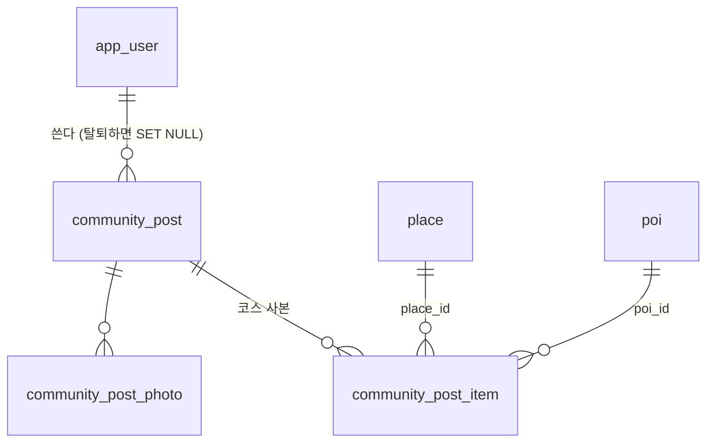

# 커뮤니티 여행후기 서버 — 글·사진·코스 사본·담기 (MZ2AZ-352)

앱의 여행후기 화면(MZ2AZ-351)은 글·사진을 **기기에만** 저장한다 — 다른 사람에게 보이지 않는다. 서버에 둔다. 앱 연동은
MZ2AZ-396(iOS, 정승길). 2026-10-03 팀 회의 결정: 게시판은 여행후기 하나, 후기에서 「내 코스로 담기」.

## 1. 결정 (2026-10-10, 권호)

| 항목 | 결정 | 이유 |
| --- | --- | --- |
| 쓰기 | 가입한 사용자만(`SIGN_IN_REQUIRED`). 읽기는 누구나 | 리뷰·마켓과 같다 |
| 글 | 제목(1~100 자), 본문(1~5,000 자), 사진 0~8 장(첫 장이 대표), 코스(선택) | 앱 화면 그대로 |
| 사진 | 리뷰 사진 길(`POST /uploads`, 목적 `post`)을 그대로 쓴다. 붙을 때 `uploads/tmp/` → `posts/` 로 옮긴다 | 저장소·서명 주소·형식/크기 검사가 이미 있다(review.md §6) |
| 코스 | **글 쓴 순간의 사본** — 장소 목록(촬영지·편의시설, 일차·순서·체류)을 떠 둔다. 이름·주소·사진은 지금의 자료로 보인다 | 글쓴이가 코스를 고치거나 지워도 후기가 그대로여야 한다. 앱도 사본으로 둔다 |
| 직접 찍은 핀 | 사본에서 **뺀다** | 마켓과 같은 이유 — 개인 숙소 위치를 공개하지 않는다. 앱은 쓰기 화면에서 미리 알린다 |
| 담기 | 후기의 코스를 내 코스로 새로 만든다(마켓 `saves` 와 같은 동작). 출처(`origin`)는 `market` | `CourseOrigin` 에 값을 더하면 낡은 앱이 코스를 못 읽는다(계약 `CourseItemSource` 의 1.8.0 교훈). 후기가 마켓 자리를 대신한다 |
| 탈퇴 | 글은 남고 글쓴이가 끊긴다(「탈퇴한 사용자」) | 리뷰와 같은 규칙. 지우려면 탈퇴 전에 지운다 |
| 운영자 내리기 | `removed_at` 칸만 — 찬 글은 목록·상세에 없다. 신고 화면은 나중 | 리뷰와 같다 |
| 고치기·좋아요·댓글 | 하지 않는다 | 앱이 요구하지 않는다(351 은 화면에서 뺐다) |
| 마켓 API | 그대로 둔다 | 앱에서는 걷어냈지만 계약에서 빼는 것은 파괴적 변경 — 다음 메이저에 |

## 2. 표 (V27)

- `community_post` — `user_id`(SET NULL), `title`, `body`, `course_title`·`course_day_count`(코스를 붙였을 때만), `created_at`, `removed_at`.
- `community_post_photo` — `post_id`(CASCADE), `sort_order` 0~7, `storage_key`(유일).
- `community_post_item` — `post_id`(CASCADE), `day_no`, `sort_order`, `place_id`·`poi_id` 중 하나, `dwell_min`, `source_content_id`.

## 3. 계약 (scene-api 1.10.0, 더하기만)

스키마 이름은 `TripPost…` 다 — `Post…` 로 두면 생성된 iOS 클라이언트의 `PostCourse` 가 앱에 이미 있는 같은 이름의 타입과 부딪힌다.

| 창구 | 내용 |
| --- | --- |
| `POST /posts` | 쓰기 — 제목·본문·`photoKeys`(0~8)·`courseId`(선택, 내 코스). 201 + 상세 |
| `GET /posts` | 목록, 최신순, `limit`·`offset` — 제목·본문 앞부분·글쓴이·시각·대표 사진·사진 수·코스 요약(제목·일수·장소 수)·`isMine` |
| `GET /posts/{postId}` | 상세 — 사진들·본문 전체·코스의 일차별 장소(출처·id·이름·표시말·주소·좌표·분류·사진) |
| `DELETE /posts/{postId}` | 내 글 지우기 — 204. 남의 글·없는 글은 404 |
| `GET /me/posts` | 내 글 목록 |
| `POST /posts/{postId}/saves` | 내 코스로 담기 — 201 + 새 코스 id |
| `UploadPurpose` | `post` 가 더해진다 |

## 4. AWS

사진 역할(`MediaRole`, bootstrap)이 `uploads/tmp/*`·`reviews/*` 만 다룬다 — `posts/*` 를 더한다. dev 는 머지 뒤 bootstrap apply,
prd 는 prd bootstrap 때. 로컬(MinIO)은 상관없다.

## 5. 순서

1. 계약 PR → 머지. 앱: MZ2AZ-396(iOS) · MZ2AZ-401(Android), 정승길.
2. 서버: V27 · `PostStore` · `PostsController` · 사진 옮기기 · 담기. 시험은 새 컨텍스트가 명세로.
3. 로컬에서 실제로 — 사진 올려 글 쓰기, 목록·상세, 다른 사람으로 담기, 지우기, 핀이 빠지는지.

## 6. 하지 않는 것

글 고치기, 좋아요·댓글, 신고 화면, 마켓 API 지우기.
