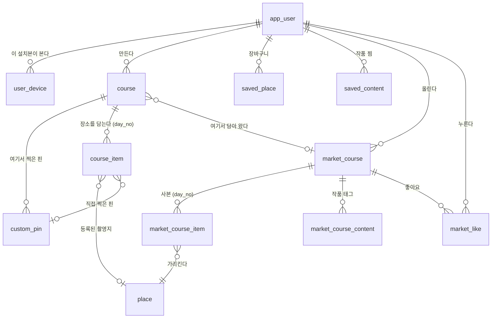

# 경로여정(코스) 백엔드 API 구현 계획 (MZ2AZ-199)

- **스토리**: [MZ2AZ-199](https://mz2az.atlassian.net/browse/MZ2AZ-199) — 에픽 [MZ2AZ-107](https://mz2az.atlassian.net/browse/MZ2AZ-107) "코스"
  - [MZ2AZ-227](https://mz2az.atlassian.net/browse/MZ2AZ-227) 코스 도메인 ERD·스키마 설계
  - [MZ2AZ-228](https://mz2az.atlassian.net/browse/MZ2AZ-228) 경로여정 API 명세
  - [MZ2AZ-229](https://mz2az.atlassian.net/browse/MZ2AZ-229) 코스 CRUD API
  - [MZ2AZ-230](https://mz2az.atlassian.net/browse/MZ2AZ-230) 코스 아이템 API
  - [MZ2AZ-231](https://mz2az.atlassian.net/browse/MZ2AZ-231) 작품 찜 API
  - [MZ2AZ-232](https://mz2az.atlassian.net/browse/MZ2AZ-232) 코스 공유(마켓) API
  - [MZ2AZ-233](https://mz2az.atlassian.net/browse/MZ2AZ-233) 길찾기 API 연동 — 여행 중 전용
- **작성일**: 2026-08-12
- **상태**: 진행 중 — 이 문서가 MZ2AZ-227 의 산출물이다
- **근거**: 볼트 `00_기록/Sprint(권호작성)/(3주차)2026년 8월 11일 경로여정 목업 확정.md`

---

## 1. 무엇을 만드는가

경로여정 탭이 쓸 백엔드다. 사용자가 **며칠짜리 코스를 만들고**, 일차마다 갈 장소를
담고 순서와 머무는 시간을 정하고, 완성한 코스를 **마켓에 올려 남과 나눈다.**

프론트가 붙기 전에 계약을 먼저 낸다.

> "API 요청을 프론트에서 하는 건 아니잖아. 그래서 그거를 일단 계약을 먼저 만들어야
> 될 것 같거든요" (1부 02:57:37)

## 2. 검색 탭과 무엇이 다른가 — 시간 모델

이 스토리에서 가장 중요한 결정이다. 여기가 어긋나면 스키마와 명세가 통째로 틀린다.

| | 흔한 여행 앱 | **SceneTrip** |
| --- | --- | --- |
| 시작 시각 | 받는다 (09:00 출발) | **받지 않는다** |
| 장소별 도착·출발 시각 | 계산해서 보여 준다 | **계산하지 않는다** |
| 하루 소요 시간 | 시각의 차 | **머무는 시간 + 이동시간의 합** |
| 떠나는 날 | 필수 | **널 허용** — 나중에 붙이거나 비워 둔다 |

받지 않는 값은 저장하지 않는다. `course` 에 시작 시각 컬럼이 없는 이유가 이것이다.
나중에 "9시 출발" 이 필요해지면 컬럼 하나를 더하면 되지만, 지금 넣어 두면 언제나 NULL 인
컬럼이 되어 읽는 사람을 헷갈리게 한다. 돌아오는 날도 같은 이유로 없다 —
`start_date + day_count - 1` 로 나오는 파생값이다.

**이동시간은 계획 단계에서 직선거리로 낸다.** 실제 길찾기 API 는 여행 중에만 부른다
(§7).

## 3. 이 계획의 범위 밖

| 항목 | 이유 |
| --- | --- |
| 로그인 자체 | 8/23 주차 스토리. 다만 `app_user`·`user_device` 는 이번에 만든다 — 코스·찜·마켓이 전부 주체를 물어서 담을 자리가 먼저 있어야 한다 (§4-1) |
| 리뷰 | "일단 생각만 해 두고" (1부 02:12:14) |
| AI 코스 추천 | [MZ2AZ-200](https://mz2az.atlassian.net/browse/MZ2AZ-200). 찜([MZ2AZ-231](https://mz2az.atlassian.net/browse/MZ2AZ-231))을 입력으로 쓰므로 이 스토리가 선행이다 |
| 실제 길찾기 호출 | [MZ2AZ-233](https://mz2az.atlassian.net/browse/MZ2AZ-233). 선행 티켓 두 개가 남아 있다 (§7) |
| 방문 순서 자동 최적화 | 사용자가 드래그로 정한다. 최적화는 경로 엔진이 생긴 뒤의 일이다 |
## 4. 스키마 설계 (MZ2AZ-227)

**정본은 볼트의 [[MZ2AZ-199 코스 도메인 스키마 (DBML)]] 다.** 이 절은 그것을 SQL 로
옮기면서 갈린 곳과, DBML 이 표현하지 못해 손으로 붙인 것만 적는다. 컬럼의 뜻과 설계
근거는 그 문서를 볼 것.

### 4-1. 주체는 계정이다 — 설치 UUID 가 아니다

```
X-Device-Id 헤더 (설치 UUID)  →  user_device.install_uuid  →  app_user.id  →  저장
```

앱이 보내는 값은 그대로 두고 **서버 안에서 한 단계 건너뛴다.** 저장하는 모든 표
(`saved_place`·`course`·`saved_content`·`market_course`)의 주체는 `app_user.id` 다.

설치 UUID 를 그대로 주체로 쓰지 않는 이유는 그것이 사람이 아니라 **설치본**을 가리키기
때문이다. 앱을 지웠다 깔면 새로 생기는데 그것이 주체이면 그 사람의 코스와 장바구니가
통째로 끊긴다. 로그인이 붙으면 `user_device` 가 가리키는 곳만 계정 쪽으로 바꿔 달면
되고 데이터는 한 줄도 움직이지 않는다.

**계약은 바뀌지 않는다.** `X-Device-Id` 는 그대로이고 변환은 `UserStore` 안에 갇혀 있다.
그래서 이 변화에 프론트가 할 일이 없다.

### 4-2. ERD



### 4-3. SQL 로 옮기며 손댄 곳

DBML 은 CHECK·DESC·지연검사·괄호 있는 타입을 표현하지 못한다. 설계 문서가 "DDL 을 뽑은
뒤 직접 붙이라" 고 적어 둔 것들이다.

| 항목 | 어떻게 했나 |
| --- | --- |
| Enum 넷 | `TEXT` + `CHECK`. 이유는 V2 와 같다 — PostgreSQL Enum 은 값을 뺄 수 없고 추가한 값을 같은 트랜잭션에서 못 쓴다 |
| `custom_pin.geom` | `GEOGRAPHY(Point, 4326)` |
| 두 갈래 FK | `CHECK ((place_id IS NULL) <> (custom_pin_id IS NULL))` |
| 순서 유니크 | `UNIQUE (course_id, day_no, sort_order) DEFERRABLE INITIALLY DEFERRED` |
| 마켓 정렬 인덱스 | `save_count DESC` · `like_count DESC`, 그리고 `WHERE unpublished_at IS NULL` 부분 인덱스 — 내려간 코스는 목록에 안 나오므로 인덱스에서도 뺀다 |
| `app_user.id` 기본값 | 두지 않았다. 아래 참고 |

**UUIDv7 대신 v4 를 쓴다.** 설계 문서는 v7 을 권한다 — 앞자리에 시각이 들어가 대체로
생성 순서대로 정렬되므로 인덱스가 잘게 쪼개지지 않는다. 그런데 `uuidv7()` 은 PostgreSQL
18 부터이고 우리는 **17** 이다. 컬럼에 `gen_random_uuid()` 를 기본값으로 걸면 v4 가 되고,
나중에 v7 로 바꿔도 이미 들어간 행은 v4 로 남아 두 세대가 섞인다. 그래서 기본값을 두지
않고 애플리케이션이 만들어 넣는다. PG 18 로 올라가면 `DEFAULT uuidv7()` 을 붙이고
애플리케이션 쪽을 지운다.

### 4-4. 일차 범위는 무엇이 지키는가

`course_item.day_no` 가 `course.day_count` 를 넘으면 안 되는데, **이 규칙은 DB 가 막을
수 없다.** CHECK 는 같은 행 안만 보고(`day_count` 는 옆 표에 있다), FK 는 크기 비교를
하지 못한다. 일차를 표로 두었던 앞선 설계에서는 FK 가 공짜로 막아 주던 것이고, 표를
접으면서 치른 대가다.

**그런데 API 를 통해서는 그 상태가 만들어지지 않는다.** 편집 요청 본문에는 **일차 번호를
적는 칸이 없다.** 아이템이 일차 배열 안에 들어 있고(§5-1), 배열의 몇 번째 칸이냐가 곧
몇 일차인지다. 서버가 그 순서로 `day_no` 를 매긴다.

앞선 설계와 비교하면 분명하다. 거기에는 `POST /courses/{id}/days/{dayNumber}/items` 가
있어서 클라이언트가 일차 번호를 **주소에 직접 적었다** — 3일 코스에 `/days/7/items` 를
부를 수 있었고, 서버가 막지 않으면 그대로 들어갔다. 그 경로가 없어지면서 일차를 잘못
지목할 자리도 함께 사라졌다.

그래서 "기간을 줄이면 뒤 일차가 지워진다"(§4-5)도 별도 규칙이 아니다. `PUT` 의 일반
규칙인 **"요청에 없는 아이템은 지운다"** 의 한 사례다.

트리거도 검사도 두지 않는 이유가 이것이다. 남는 구멍은 API 밖 경로뿐이고 — psql 로 직접
넣거나, 나중에 배치·AI 추천이 다른 길로 쓰거나 — 지금 그런 경로는 없다. 생기면 그때
다시 본다.

### 4-5. 기간을 줄이면 뒤 일차가 지워진다

**[MZ2AZ-229](https://mz2az.atlassian.net/browse/MZ2AZ-229) 의 "줄일 때 장소가 든 일차는
지우지 않는다" 를 뒤집은 결정이다.** 근거는 그 티켓이 진짜 막으려던 것이 무엇인가에 있다.

티켓은 바로 다음 문단에서 이유를 밝힌다 — *"만들 때만 정할 수 있으면 사용자는 코스를
지우고 처음부터 다시 짜야 한다."* 그런데 지우지 않는 쪽으로 구현하면 그 상황이 오히려
생긴다. 3일로 줄여도 4일차가 남으니, 정말 3일로 만들려면 사용자가 4일차 장소를 하나씩
빼고 다시 줄여야 한다. 두 단계다.

지우는 쪽은 사용자가 말한 대로 된다. 그리고 `day_count` 가 언제나 요청받은 값 그대로라
계약이 단순해진다 — "응답이 요청과 다를 수 있다" 는 설명이 필요 없다.

티켓이 걱정한 것은 **조용한** 데이터 손실인데, 그것은 다른 방식으로 막는다.

- 편집 중에는 서버로 아무것도 나가지 않는다. 3일로 줄였다 다시 5일로 올리면 아무 일도
  안 일어난다 (§5-1).
- 완료를 누를 때 프론트가 "4일차·5일차의 장소 3곳이 삭제됩니다" 확인을 받는다.

곁가지로 두 가지가 따라온다.

**아이템과 함께 그 핀도 지운다.** 핀은 담은 자리 하나 전용이라(§5-4) 그 자리가 사라지면
남길 이유가 없다. 안 지우면 화면에 안 보이는 핀이 쌓인다.

**여행 중인 코스는 `current_day_no` 때문에 실패할 수 있다.** 지금 5일차인데 3일로
줄이면 V9 의 CHECK 가 막는다. 막히는 것 자체는 옳지만 그대로 두면 `500` 이 나가므로,
"여행 중에는 지금 일차보다 짧게 줄일 수 없습니다" 로 `409` 를 낸다.

### 4-6. 마이그레이션 — 적용 완료

적용된 마이그레이션 파일은 고치지 않는다(Flyway 체크섬). 뒤에 새 번호로 붙인다.

| 파일 | 내용 |
| --- | --- |
| `V8__app_user.sql` | `app_user` · `user_device` · `saved_place` 재작성 · `user_event.user_id` → UUID |
| `V9__course.sql` | `course` · `custom_pin` · `course_item` · `saved_content` |
| `V10__market.sql` | `market_course` · `_item` · `_content` · `market_like` + 순환 FK |

`V8` 이 기존 두 표를 정리한다. V2 의 `saved_place`(「찜」, 미사용)와 V5 의
`cart_item`(장바구니, 사용 중)이 같은 자리를 두고 겹쳐서, **둘 다 지우고 하나로 새로
만들었다.** 옮기지 않고 새로 만든 이유는 DB 에 있던 것이 개발 데이터 1행뿐이었기
때문이다 — 값을 살리려면 기기마다 계정을 만들되 그 id 를 설치 UUID 와 같게 두어야 하는데,
그러면 둘을 구분하라고 표를 나눈 취지가 첫 데이터부터 흐려진다.

`course` 와 `market_course` 가 서로를 가리키므로 `course.source_market_course_id` 의 FK 만
V10 으로 밀렸다.

## 5. API 명세 (MZ2AZ-228)

**기존 `contracts/openapi/scene-api-v1.yaml` 에 더한다.** 경로를 더하는 것은 기존
클라이언트를 깨지 않는 추가 변경이라 메이저 버전을 올릴 사유가 아니다. `info.version` 을
`1.1.0` 으로 올린다.

**기존 9개 엔드포인트의 모양은 한 글자도 바꾸지 않는다.** iOS 클라이언트가 이 명세에서
생성되고 `just test` 가 그것을 컴파일한다 — 응답 필드 하나만 바꿔도 프론트 코드가
컴파일에서 깨진다. `/cart` 계열이 `saved_place` 로 옮겨 갔지만 그것은 서버 안쪽 일이라
와이어에 드러나지 않는다. 바뀌는 것은 `X-Device-Id` 설명 문구뿐이다.

### 5-1. 편집은 완료 때 한 번, 여행 중 동작은 즉시

이 명세에서 가장 중요한 갈림이다.

**편집 화면은 서버와 대화하지 않는다.** 제목을 고치고, 기간을 늘렸다 줄이고, 장소를
담고 빼고, 드래그로 순서를 바꾸고, 체류시간을 조절하는 동안 요청이 한 번도 나가지
않는다. 프론트가 코스 사본을 메모리에 들고 논다. **완료를 누를 때 코스의 최종 모습을
`PUT /courses/{courseId}` 로 통째로 보낸다.**

얻는 것이 넷이다.

- **되돌리기가 공짜다.** 잘못 지웠어도 완료 전이면 서버에 아무 일도 안 일어났다.
- **반쪽만 반영되는 상태가 없다.** 한 트랜잭션이라 전부 되거나 전부 안 된다. 요청을
  쪼개면 중간에 끊겼을 때 순서만 바뀌고 삭제는 안 된 상태가 남는다.
- **엔드포인트가 준다.** 일차 추가·삭제, 장소 담기·빼기, 체류시간 수정, 순서 일괄
  변경 여섯 개가 사라지고 `PUT` 하나에 흡수된다. 순서는 배열 순서로 표현된다.
- 경계가 헷갈리지 않는다 — 편집이냐 여행이냐로 갈리지 우연히 갈리지 않는다.

**여행 중 동작은 편집이 아니라 즉시다.** 성지에 도착해 방문 체크를 누르는 것, 코스를
시작하는 것, 다음 일차로 넘어가는 것. 이때 코스 전체를 보내라고 할 수는 없다.

비용은 하나다 — **완료를 안 누르고 나가면 편집이 날아간다.** 프론트가 뒤로 가기에서
"저장하지 않고 나가시겠습니까?" 를 띄워 막는다.

### 5-2. 일차는 큐다

**일차는 뒤에서만 늘고 준다.** 중간 일차를 지워 뒤를 당기는 조작은 없다(프론트 설계
확정). 그래서 일차 개수가 `dayCount` 숫자 하나로 완전히 표현되고, 일차 전용
엔드포인트가 필요 없다.

### 5-3. 경로 목록

| 경로 | 하는 일 | 티켓 |
| --- | --- | --- |
| `POST /courses` | 코스 생성. 받는 것은 기간과 만든 방식 | 229 |
| `GET /courses` | 내 코스 목록 | 229 |
| `GET /courses/{courseId}` | 상세 — 일차·장소·하루 소요 시간 | 229 · 230 |
| `PUT /courses/{courseId}` | **편집 완료.** 코스 전체 교체 | 229 · 230 |
| `DELETE /courses/{courseId}` | 삭제 | 229 |
| `PUT /courses/{courseId}/progress` | 코스 시작·일차 이동 (여행 중, 즉시) | 229 |
| `PUT /courses/{courseId}/items/{itemId}/visit` | 방문 체크 (여행 중, 즉시) | 230 |
| `GET /favorites/contents` | 찜한 작품 목록 | 231 |
| `POST /favorites/contents` | 작품 찜하기 | 231 |
| `DELETE /favorites/contents/{contentId}` | 찜 해제 | 231 |
| `GET /market/courses` | 목록 — `sort=saves\|likes`, `q=작품명` | 232 |
| `POST /market/courses` | 올리기 (설명 200자) | 232 |
| `GET /market/courses/{marketCourseId}` | 올라온 코스 상세 | 232 |
| `DELETE /market/courses/{marketCourseId}` | 내리기 | 232 |
| `POST /market/courses/{marketCourseId}/saves` | 담기 — 내 코스로 복사 | 232 |
| `POST /market/courses/{marketCourseId}/likes` · `DELETE …` | 좋아요 토글 | 232 |
| `POST /navigation/next-leg` | 현재 위치 → 다음 목적지 (미구현) | 233 |

### 5-4. 프론트가 알아야 하는 것 — 명세에 적을 동작 규칙

모양만으로는 전달되지 않아 설명으로 적는 것들이다.

**기존 장소는 받았던 `id` 를 그대로 실어 보낸다.** `PUT` 에서 `id` 가 있는 아이템은
"원래 있던 것", 없는 것은 "새로 담은 것" 으로 본다. 빠뜨리면 서버가 새 장소로 취급해
**방문 체크(`visitedAt`)가 날아간다.**

**요청에 없는 아이템은 지워진다.** 직접 찍은 핀이었다면 핀도 함께 지워진다.

**직접 찍은 핀은 담은 자리마다 따로 만든다.** 2박 3일 숙소를 1일차 끝과 2일차 끝에
넣으면 핀이 둘 생긴다. DBML 은 핀 하나를 여러 자리가 나눠 쓰는 것을 전제로 핀을 일차가
아니라 코스에 매달았는데, 그렇게 하려면 요청에서 핀에 이름표를 붙여 아이템이 그것을
가리키게 해야 한다 — **프론트가 지기엔 무거운 관리 부담이고 사용자 눈에는 어느 쪽이든
같은 화면이다.** 대신 숙소 이름을 고치면 담은 자리마다 각각 보내야 한다.

DB 는 그대로 둔다. `custom_pin` 이 코스에 매달려 있어도 행을 여러 개 만드는 데 제약이
없고, 코스를 지울 때 함께 사라지는 성질도 그대로다. 나중에 공유가 필요해지면 계약만
바꾸면 된다.

**기간을 줄이면 그 뒤 일차의 장소가 지워진다.** 프론트는 완료를 누르기 전에 몇 곳이
지워지는지 계산해 확인을 받는다 — 편집 중 화면에 그 정보가 이미 있으므로 추가 호출이
필요 없다.

**구간별 소요 시간은 주지 않는다.** 아이템에는 앞 장소로부터의 **직선거리(m)** 만 있고
소요 시간 필드가 없다. 여행 전에는 "몇 분" 을 보여 주지 않기로 했기 때문이다
([MZ2AZ-233](https://mz2az.atlassian.net/browse/MZ2AZ-233)). 필드가 아예 없으면 실수로
그릴 수 없다. 하루 합계에만 `travelMinutes` 가 있고, `travelBasis` 가 그것이 직선거리
추정임을 밝힌다.

**비회원이 할 수 없는 것이 넷이다.** 좋아요, 마켓에서 담기, 마켓에 올리기, 여행 중
길찾기. 이때 `401` 이다. 코스를 만들고 시작하는 것까지는 계정 없이 된다 — 로그인 벽을
앞에 세우면 사람들이 앱을 써 보기도 전에 나간다.

**`401` 은 지금 아무도 통과하지 못한다.** 로그인 스토리가 8/23 주차라 `registered_at` 을
채울 방법이 아직 없다. 계약에 자리를 잡아 두는 것이고, 프론트는 그 화면을 아직 만들지
않는다.
## 6. 하루 소요 시간을 어떻게 내는가

```
하루 소요 시간 = Σ 머무는 시간 + Σ 이동시간
이동시간 = 직선거리 ÷ 이동 속도
```

직선거리는 PostGIS 가 낸다 — `place.geom` 과 `custom_pin.geom` 이 둘 다
`GEOGRAPHY(Point, 4326)` 이라 `ST_Distance` 가 미터를 그대로 준다. 저장하지 않고 조회할
때 계산한다. 한 일차의 장소는 많아야 십여 개라 비용이 무시할 수준이고, 순서를 바꿀
때마다 갱신할 캐시를 만들면 그 캐시가 어긋나는 경로가 생긴다.

**직접 찍은 핀도 거리 계산에 들어간다.** 숙소가 하루의 시작과 끝이라 그것을 빼면 하루
소요 시간이 실제와 크게 어긋난다.

이동 속도도 `application.yaml` 설정이다(기본 도보 4km/h). 직선거리는 실제 도로보다
짧으므로 보정 계수를 함께 둔다 — 실측 없이 정한 값이라 설정으로 두고 데이터가 쌓이면
조정한다.

## 7. 여행 전과 여행 중을 가른다 (MZ2AZ-233)

| | 계획 단계 | 여행 중 |
| --- | --- | --- |
| 표시 | 직선거리·km 만 | 실제 경로 |
| 예상 소요 시간 | 보여 주지 않는다 | 보여 준다 |
| 바깥 API | 안 쓴다 | **카카오** — 대중교통·도보 둘 다 (2026-08-24 확정, 이 절 아래) |
| 과금 | 무료 | 유료 |

> "여행 전에는 무조건 직선으로 보여 주는 거 하고, 몇 분 걸릴지도 그냥 안 보이도록
> 하고. 여행 중에만 이걸 넣기로 하면 어때요?" (2부 17:06)

여행 중에는 **「현재 위치 → 다음 목적지」 한 구간씩** 부른다. 전체 구간을 미리 계산해
두는 방식은 접었다.

> "저희가 무조건 성지에 도착해서 뭔가 딴 짓을 할 거라고 봤단 말이에요" (2부 24:36)

`course.status = 'active'` 가 이 갈림길의 스위치다. 서버가 상태를 보고 길찾기 호출을
허용할지 정한다 — 클라이언트가 정하게 두면 과금이 클라이언트 손에 넘어간다. 가입
사용자만 부를 수 있는 것도 같은 이유다(계정이 없으면 누가 얼마나 썼는지 셀 수 없다).

**엔진은 카카오로 정했다 (2026-08-24).** 대중교통(`dapi.kakao.com/v2/routing/publictraffic`)과
도보(`.../v2/routing/walk`) 둘 다 카카오다. 처음에는 도보를 T맵으로 두고 있었는데
(계단 정보 `facilityType 17` 을 T맵만 준다), 같은 구간(북촌→삼청동, 약 580 m)을 두
서비스에 나란히 물어 견줘 봤다 —

| | 카카오 도보 | T맵 도보 |
| --- | --- | --- |
| 거리 | 581 m | 520 m |
| 시간 | 618초 (오르막 반영) | 444초 (평지 속도만) |
| 좌표 밀도 | 34개 | 51개 |
| 계단 | 모름 | 2구간 발견 |

같은 POI(뚝섬역) 좌표를 두 서비스에 물었을 때 차이는 5.5 m — 정확도는 사실상 같다.
150 m 짜리 짧은 구간에서도 정상 응답이었다. **잃는 것은 계단 정보뿐이다.** 프로토타입
(`SceneTrip_navi`) 실측으로는 후보 73개 중 11개(15%)에 계단이 있었고, 그중 1/5은 최단
경로 순위가 바뀌었다. 그 트레이드오프를 받아들이는 이유는 **엔진이 하나가 되기
때문**이다 — 앱도 백엔드도 회사 하나의 키·요청 모양만 다루면 된다. 무릎·캐리어
사용자를 위해 도보를 T맵으로 되돌리는 길은 남겨 둔다(엔진 이름으로 분기하면 된다) —
지금 당장 만들지는 않는다.

**여전히 보류인 것은 구현 자체다.** 선행 [MZ2AZ-205](https://mz2az.atlassian.net/browse/MZ2AZ-205)
(남용 방지 정책 — 「한 계정이 하루에 몇 번까지」가 아직 안 정해졌다)가 남아 있다.
(위 8/11 판이 적어 두었던 "선행 MZ2AZ-204"는 검색해 보니 **Jira 에 없는 티켓**이다 —
번호만 남고 실제로 만들어진 적이 없어 보인다. 더는 선행으로 세지 않는다.)

명세에는 여전히 자리만 있고 핸들러는 `501` 을 낸다 — **다만 실제 배포에는 그 자리조차
없다.** `POST /navigation/next-leg` 를 실 서버에 불러 보면 `404` 다(2026-08-24 실측,
`curl` 로 확인) — 계약에 경로는 있지만 서버 라우팅에 아직 등록되지 않았다는 뜻이다.
MZ2AZ-233 을 시작하는 사람은 "501 스텁을 501 답게 고치는 일"이 아니라 **엔드포인트를
새로 등록하는 일**부터라는 것을 알아 둔다.

> **2026-09-03 덧붙임 — 구현됐다 ([MZ2AZ-296](https://mz2az.atlassian.net/browse/MZ2AZ-296)).** 이 절이 남긴 자리에 서버가 들어갔다. 어떻게 만들었고
> 실측이 무엇을 뒤집었는지는 [navigation-next-leg.md](./navigation-next-leg.md), 결정은
> [ADR 0009](../../architecture/adr/0009-navigation-is-called-by-the-server.md)·
> [0010](../../architecture/adr/0010-server-does-not-translate-guidance.md). 선행으로 남겨 뒀던
> MZ2AZ-205(남용 방지)는 **기다리지 않고 진행했다** — 「하루 몇 번」은 여전히 없고, 지금 통제는
> 가입·활성 코스·한 구간씩이다. 위 표의 「카카오 도보 150 m 짜리 짧은 구간에서도 정상 응답」은
> 대중교통에도 그대로 해당한다 — 150 m 에도 `NO_RESULTS` 가 아니라 버스 답이 온다(걷는 게
> 빠른데). 900 m 컷의 이유가 그래서 「실패 회피」에서 「엉뚱한 답 회피」로 바뀌었다.

MVP1 데모를 굴리기 위해 **iOS 앱이 지금 이 자리를 직접 메우고 있다**
(`apps/scenetrip-ios/src/RouteTab/KakaoTransit.swift`) — 카카오 REST 키를 빌드 시점에
바이너리에 박아 앱이 직접 부른다. 스토어에 내기 전에 반드시 이 티켓으로 옮겨야 한다 —
그때까지는 남이 앱에서 키를 뽑아 우리 쿼터를 쓸 수 있다.

## 8. 경로 캐시 테이블도 자체 경로 엔진도 두지 않는다

§7 의 갈림이 이 계획에서 표 하나만큼의 차이를 만든다.

**계획 단계는 직선거리만 쓰고 소요 시간을 감춘다.** 그래서 `CourseItem` 에 구간 소요
시간 필드가 없고, `route_segment` 같은 캐시 테이블도 자체 경로 엔진(OSRM)도 이 계획에
없다.

여행 중에 부르는 값은 **현재 위치에 따라 매번 다르다.** 같은 두 지점을 잇더라도 사용자가
어디 서 있느냐로 답이 갈리므로 애초에 캐싱할 대상이 아니다. 캐시를 두면 적중하지 않는
표를 유지하는 값만 치른다.

도보 경로 엔진과 OSM 데이터 품질 자체는 별도 스파이크
([MZ2AZ-190](https://mz2az.atlassian.net/browse/MZ2AZ-190), 완료)가 다뤘다. 그 결과를
여기로 끌어오지 않은 이유가 위와 같다 — **계획 단계는 바깥 경로를 아예 부르지 않는다.**

## 9. 구현 순서

[CLAUDE.md §3](../../../CLAUDE.md) 의 작업 루프를 하위 티켓마다 한 바퀴씩 돈다.

| 순서 | 티켓 | 산출물 | 상태 |
| --- | --- | --- | --- |
| 1 | 227 | 이 문서 + `V8`·`V9`·`V10` | **끝** |
| 1.5 | — | `UserStore`, `saved_place` 로 옮긴 장바구니 | **끝** |
| 2 | 228 | `scene-api-v1.yaml` v1.1.0 + `just gen` | **끝** |
| 3 | 229 | `course/` 패키지 — 생성·목록·상세·완료(PUT)·삭제·진행 | **끝** |
| 4 | 230 | 방문 체크, 체류시간 기본값(`DwellDefaults`) | **끝** |
| 5 | 231 | `favorite/` 패키지 | **끝** |
| 6 | 232 | `market/` 패키지 + `V11`(살아 있는 사본 하나) | **끝** |
| 7 | 233 | 명세 자리 + `501` | **보류** — §7 참고 |

전부 실제 DB 에 태우고 배포한 서비스에 요청을 흘려 확인했다. 엔드포인트 26 개 중
25 개가 돌고, 남은 하나가 길찾기다.

마이그레이션이 하위 티켓별로 나뉘지 않고 앞으로 당겨진 이유는 `V8` 이 `cart_item` 을
없애기 때문이다. 그 표를 읽던 장바구니 API 가 함께 옮겨 가야 해서 셋을 한 번에 올렸다.

5 번은 3·4 번과 겹치는 파일이 없어 병행할 수 있다.

**테스트 레인은 기존 규칙을 그대로 따른다**(`services/scene-api/README.md` §테스트).
HTTP 계층 검증은 `:unit_test`, SQL 이 실제로 성립하는가는 `:integration_test` 다.
사본 스냅샷과 순서 변경은 특히 통합 테스트가 필요하다 — Store 를 가짜로 끼운 상태에서는
`DEFERRABLE` 제약도 `ON DELETE SET NULL` 도 한 줄도 실행되지 않는다.

## 10. 열어 둔 것

| 항목 | 왜 지금 정하지 않는가 |
| --- | --- |
| 새 서비스로 분리 | 코스는 `place` 를 무겁게 조인하고, 모놀리식·MSA 결정이 아직 없다(2026-08-08 멘토링 미결). `services/scene-api` 안에 둔다. 부하가 실제로 문제가 되면 그때 뗀다 |
| 기간 상한 15일 | 목업이 정한 값이다. 설정으로 빼지 않고 명세에 박는다 — 계약이 약속한 `400` 의 근거라 조용히 바뀌면 안 된다 |
| 마켓 신고·검열 | 로그인이 없으면 제재할 대상이 없다 |
| 직접 찍은 핀의 재사용 | "내 장소" 개념이 필요하고 그것은 로그인 뒤다 |
| `course_pace` 가 일정을 어떻게 바꾸는가 | 3주차 회의 Open Issue 3. 항목은 확정됐지만 로직이 없어 지금은 두 값의 결과가 같다. 값은 받아 두므로 로직이 정해지면 지난 코스도 다시 계산할 수 있다 |
| 길찾기 호출 한도 | 로그인 필수로 돌리면서 계정 단위로 셀 수 있게 됐지만, 하루 몇 번까지인지가 안 정해져 기록 테이블을 아직 두지 않았다. MZ2AZ-233 에서 함께 정한다 |
| 방치된 비회원 계정 정리 | `last_seen_at` 은 지금부터 받지만 몇 달 뒤에 지울지는 정하지 않았다 |

## 10-1. 뒤집힌 결정 (2026-08-13)

계획 README 의 규칙대로 — 결정이 뒤집히면 고친 자리만 남기지 않고 무엇이 뒤집혔는지
적는다. 아래 넷은 이 문서 2026-08-12 판이 다르게 적고 있던 것이다.

| 항목 | 8-12 판 | 지금 | 왜 |
| --- | --- | --- | --- |
| 주체 | `device_id` — 설치 UUID 를 직접 | `app_user.id`, 설치 UUID 는 `user_device` | 갱신된 DBML(8-12). 앱을 지웠다 깔면 데이터가 끊기는 문제 |
| 일차 | `course_day` 표, 행 수가 기간 | 표 없음. `course_item.day_no` + `course.day_count` | 갱신된 DBML. 표를 없애면 어긋날 상대가 사라진다 |
| 기간 축소 | 장소가 든 일차는 남긴다 (`dayCount` 가 요청보다 클 수 있음) | **지운다** (완료 시점 계산 + 확인) | §4-5 |
| 편집 반영 | 조작마다 즉시 요청 (엔드포인트 11개) | 완료 때 `PUT` 한 번 (7개) | §5-1. 일차가 큐라서 가능해졌다 |

이름도 전부 갈렸다 — `content_favorite` → `saved_content`, `course_market_post` →
`market_course`, `stay_minutes` → `dwell_min`, `planned/ongoing` → `upcoming/active`.
정본은 볼트의 DBML 이다.

## 11. 참고

- 볼트: `00_기록/Sprint(권호작성)/(3주차)2026년 8월 11일 경로여정 목업 확정.md`
- [scene-api-search-map.md](./scene-api-search-map.md) — 검색·지도 명세 작업 방식
- [scene-api-database.md](./scene-api-database.md) — 스키마 v1 과 DBML 에서 손본 곳
- [MZ2AZ-190](https://mz2az.atlassian.net/browse/MZ2AZ-190) — 도보 경로 엔진·OSM 품질 스파이크 (§8 참고)

## 12. 변경 이력

| 날짜 | 내용 |
| --- | --- |
| 2026-08-12 | 최초 작성. 시간 모델(시작 시각 없음)과 사본 마켓을 스키마의 두 축으로 확정 |
| 2026-08-13 | 갱신된 볼트 DBML 두 편(MZ2AZ-111 · MZ2AZ-199)에 맞춰 §4·§5 를 다시 씀. 스키마 정본을 그쪽으로 넘기고 이 문서는 SQL 로 옮기며 갈린 곳만 든다. 뒤집힌 결정 넷은 §10-1. `V8`·`V9`·`V10` 적용 완료 |
| 2026-08-14 | `route-tab.md` 가 내용이 틀려 지워졌다. 이 문서가 경로여정 계획의 정본이 된다 — 그쪽을 가리키던 §7·§8·§11 을 걷어내고 §8 은 「캐시 테이블을 두지 않는 이유」로 다시 썼다. 지워진 문서의 옛 조사 내용은 커밋 `a88c9a6` 이전 이력에 남아 있다 |
| 2026-08-24 | §7 갱신 — MZ2AZ-233 의 길찾기 엔진을 **카카오로 확정**(대중교통·도보 둘 다). 근거·실측·트레이드오프를 §7 에 적었다. 8/11 판이 적어 두었던 선행 MZ2AZ-204 는 Jira 에 실재하지 않는 번호로 확인돼 걷어냈다. 자세한 작업 이력은 [apps/scenetrip-ios/README.md](../../../apps/scenetrip-ios/README.md) 「최근 작업 로그」 |
