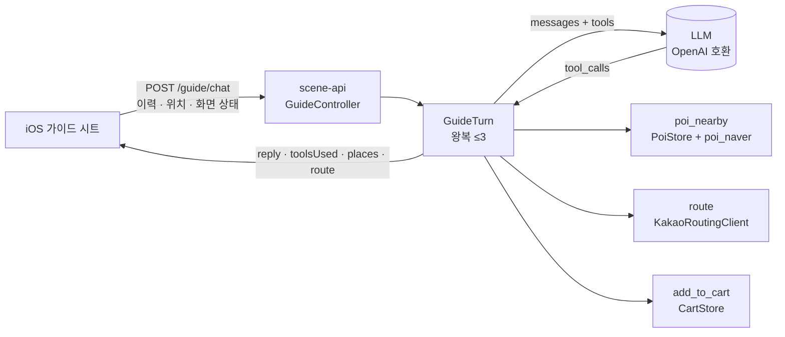

# 여행 가이드 챗봇 — 서버가 부른다 (MZ2AZ-239 계약 · MZ2AZ-285 구현)

- **에픽**: [MZ2AZ-201](https://mz2az.atlassian.net/browse/MZ2AZ-201) "여행 도우미 챗봇" (부모 [MZ2AZ-109](https://mz2az.atlassian.net/browse/MZ2AZ-109) 데이터·AI)
- **티켓**: [MZ2AZ-239](https://mz2az.atlassian.net/browse/MZ2AZ-239) 계약(이 문서·`contracts/`) · [MZ2AZ-285](https://mz2az.atlassian.net/browse/MZ2AZ-285) 백엔드 구현
- **작성일**: 2026-09-05
- **상태**: 계약 확정 — 구현 전. 프로토타입(`apps/navi_proto`, navi-proto 브랜치)이 실측으로 검증한 것을 옮긴다
- **결정**: [ADR 0012](../../architecture/adr/0012-guide-chat-is-served-by-the-server.md) — LLM 호출·도구 실행·프롬프트는 서버, 앱은 화면 상태를 보낸다
- **프로토타입**: `apps/navi_proto/server.py` 의 `guide_turn`·`GUIDE_TOOLS`·`context_text`·`harmony_unwrap`, `prompts/guide.ko.txt`

> 이 문서는 **읽고 바로 구현할 수 있게** 썼다. §3 계약, §4 도구, §5 LLM 호출 규칙, §8 검수 기준까지
> 있으면 프로토타입을 열어 보지 않아도 된다. 프로토타입 코드는 「왜」가 궁금할 때만 본다.

---

## 1. 무엇을 만드는가

경로 탭 오른쪽 서랍의 「여행 가이드」. 사용자가 말로 묻고, 모델이 **도구를 골라 부르고**, 도구가 돌려준
것을 말로 풀어 준다. RAG 가 아니다 — 「반경 300 m 안 음식점을 리뷰순으로」는 의미 검색이 아니라 조건
질의라 코드가 정확하고 빠르다. 모델이 하는 일은 둘뿐이다.

1. 사람 말을 알아듣고 어느 도구를 부를지 고른다(또는 안 부른다).
2. 도구가 돌려준 것을 사람 말로 푼다.

47만 건에서 고르는 것, 거리를 재는 것, 코스에 담는 것은 전부 코드다.

**앱에서 일어나는 일은 모델도 안다.** 발자국이 다 찍혔는데 「방문 여부는 알려지지 않았어요」라고 답한
것(2026-09-05)이 이 계약의 출발점이다. 질문별 답을 적는 대신 **화면 상태의 항목을 넓혀** 보낸다 —
「다 돌았어?」「다음은?」「몇 곳 남았어?」「얼마나 걸었어?」는 도구 없이 상태를 읽어 답한다.

## 2. 프로토타입에서 옮기는 것과 안 옮기는 것

| 옮긴다 | 안 옮긴다 |
| --- | --- |
| 도구 세 개의 **뜻과 인자** (`poi_nearby`·`route`·`add_to_cart`) | 파이썬 서버 자체, JSONL 메모리 적재 — 이미 `poi` 표(V12)와 `GET /pois` 가 있다 |
| 화면 상태 → 시스템 프롬프트 문장으로 푸는 규칙 (§6) | 네이버 비공식 호출 — 이미 `PoiCardService`(ADR 0011)가 있다. 챗봇은 그 결과 표(`poi_naver`)만 읽는다 |
| 프롬프트 파일 (부록 A) | 코스 플래너의 LLM 호출(`RoutePlanner`) — main 은 부르지 않는다(MZ2AZ-297). 별개 티켓 |
| 도구 왕복 상한 3회, 보여 준 장소 기억(`seen`), 좌표 감추기 | 베이지안 인기 순위의 정확한 식 — `score`·`review_count` 가 있는 곳을 위로, 없는 곳은 거리순이면 된다 |
| gpt-oss 채널 표식 풀기(`harmony_unwrap`) — 모델이 바뀌면 무해 | |

## 3. 계약 — `POST /guide/chat`

`contracts/openapi/scene-api-v1.yaml` 1.2.0. 요청·응답 모양은 명세가 정본이고, 여기엔 **실제로 오간
예**를 둔다. 아래는 2026-09-05 프로토타입 실측을 계약 이름으로 옮겨 적은 것이다.

### 요청 — 여행 중, 「모든 장소를 다 돈 거야?」

```json
{
  "sessionId": "0d4f7b1e-5c4a-4a1e-9b0e-6f1f6d2b8c11",
  "latitude": 37.5665, "longitude": 126.978,
  "messages": [{"role": "user", "content": "모든 장소를 다 돈거야?"}],
  "context": {
    "stops": [
      {"number": 1, "name": "서울 덕수궁 돌담길", "category": "명소", "latitude": 37.566, "longitude": 126.975, "visited": true},
      {"number": 2, "name": "인사동 쇠고집",     "category": "식당", "latitude": 37.573, "longitude": 126.985, "visited": true},
      {"number": 3, "name": "서울 운현궁 양관",   "category": "명소", "latitude": 37.576, "longitude": 126.989, "visited": false},
      {"number": 4, "name": "동대문디자인플라자", "category": "명소", "latitude": 37.567, "longitude": 127.009, "visited": false}
    ],
    "trip": {"phase": "guiding", "course": "도깨비 · 선재 2박 3일", "day": 1, "days": 3,
             "targetNumber": 3, "targetMeters": 420, "walkedKilometers": 3.2}
  }
}
```

### 응답 — 도구 없이 상태로 답한다 (실측 8.9초)

```json
{
  "reply": "아니요, 아직 3번(서울 운현궁 양관)과 4번(동대문디자인플라자) 두 곳이 남아 있습니다.",
  "toolsUsed": [], "places": [], "route": null, "tookSeconds": 8.9
}
```

### 요청 — 「서울시청 근처 카페 하나만 추천해줘」 → 응답 (도구 1회, 실측 29.8초)

```json
{
  "reply": "**서울시청 근처 카페**\n- **스타벅스 한국프레스센터점** — 거리 104 m, 서울 중구 태평로1가 …",
  "toolsUsed": [{"tool": "poi_nearby", "arguments": {"radius_m": 300, "group": "음식", "cat": "카페", "near": ""}}],
  "places": [
    {"id": 481233, "name": "카페돌담콩", "category": "카페기타", "categoryGroup": "food",
     "address": "서울 중구 정동", "latitude": 37.5662, "longitude": 126.9731, "distanceMeters": 410},
    {"id": 470912, "name": "스타벅스 한국프레스센터점", "category": "카페기타", "categoryGroup": "food",
     "address": "서울 중구 태평로1가", "latitude": 37.5671, "longitude": 126.9775, "distanceMeters": 104}
  ],
  "route": null, "tookSeconds": 29.8
}
```

`places` 의 `id` 는 `poi.id` 다. 앱은 이것으로 `GET /pois/{poiId}/card` 를 불러 카드를 띄운다.

### 오류

| 상황 | 응답 |
| --- | --- |
| `messages` 가 비었다, `context` 가 스키마를 어겼다 | `400 INVALID_PARAMETER` |
| LLM 이 안 뜬다·시간 초과·한도 초과 | `503 GUIDE_UNAVAILABLE` (`docs/api/errors.md`) — **규칙 기반으로 조용히 떨어지지 않는다** |
| 도구 왕복 3회 초과 | `200`. `reply` 는 「좀 더 구체적으로 물어봐 달라」, `toolsUsed` 에 부른 것이 다 남는다 |

## 4. 도구 — 이미 있는 것 위에

세 도구의 인자·결과 스키마는 `contracts/schemas/guide/tools/*.schema.json` 이다. **모델이 넣은 인자는
그 스키마로 검증하고, 어긋나면 버리고 기본값으로 간다.** 결과도 그 모양으로 만든다.

| 도구 | 서버 안의 자리 | 하는 일 |
| --- | --- | --- |
| `poi_nearby` | `PoiStore.list(Criteria)` — `lat`·`lng`·`radiusMeters`·`categoryGroup`(음식→`food` …), `limit` 30 | 반경 안 후보 30 → `poi_naver` 의 `score`·`review_count` 가 있는 곳을 위로 → 15곳. `near` 가 번호면 `context.stops[번호]` 좌표, `"선택"` 이면 `context.picked`, 비면 사용자 위치. **번호가 목록에 없으면 결과를 아예 주지 않고 `error` 만** — 경고만 붙이면 모델이 무시하고 「3번 주변입니다」라고 한다(실측 두 번) |
| `route` | `NextLegPlanner` 와 같은 카카오 호출 (`KakaoRoutingClient`) | 출발 = 사용자 위치, 도착 = **이번 대화에서 보여 준 장소** 중 이름이 같은 것의 좌표. 목록에 없으면 `error`. 47만 건을 이름으로 뒤지지 않는다 — 지어낸 이름에 우연히 걸린다 |
| `add_to_cart` | `CartStore` (`POST /cart/items` 와 같은 일) | 이름 → 보여 준 장소의 `id` → 담기. 이미 있으면 `error` (`DUPLICATE_CART_ITEM` 과 같은 뜻) |

**모델에게 좌표를 주지 않는다.** 화면에는 준다. 도구 결과를 모델에게 넘길 때 `lat`·`lng` 를 지운다 —
좌표를 보면 스스로 거리를 재려 들고 하버사인을 틀린다(8B 실측). 받는 쪽이 다르니 두 벌로 담는다.

**보여 준 장소를 대화별로 기억한다** (`sessionId` → 최근 40곳, 메모리, TTL 1시간). HTTP 는 요청마다 끊기는데
「거기 어떻게 가요」의 「거기」는 앞 턴을 가리킨다. 대화 이력엔 이름만 있고 id·좌표가 없다.

## 5. LLM 호출 규칙

| 항목 | 값 | 이유 |
| --- | --- | --- |
| 규격 | OpenAI 호환 `POST {LLM_URL}/v1/chat/completions`, `tools` 로 함수 호출 | MLX·Ollama·vLLM·상용 API 가 다 이 규격. 갈아 끼워도 코드 그대로 |
| 설정 | `GUIDE_LLM_URL`·`GUIDE_LLM_MODEL`·`GUIDE_LLM_API_KEY` 환경변수 → `application.yaml` | 모델 이름·키를 코드에 두지 않는다. 로컬은 `http://host.docker.internal:8900`(맥의 mlx_lm), 배포는 상용 API |
| 파라미터 | `temperature 0.3`, `max_tokens 800`, `chat_template_kwargs: {enable_thinking:false, reasoning_effort:"low"}` | 생각을 길게 늘어놓으면 토큰을 다 쓴다(Qwen3 실측 — content 가 비었다). 모르는 서버는 이 필드를 무시한다 |
| 시간 | LLM 한 호출 120초, 왕복 최대 3회 | 실측 2~57초. 짧게 잡으면 잘 되던 것이 시간 초과로 보인다 |
| 채널 표식 | content 에 `<\|channel\|>` 가 있으면 마지막 `final` 채널만 답, `commentary to=functions.NAME` 은 tool_call 로 | gpt-oss 를 mlx_lm 0.31 로 띄우면 이렇게 온다. 다른 모델엔 무해 (`harmony_unwrap`) |
| 프롬프트 | `services/scene-api/src/main/resources/guide/prompt.ko.txt` — 부록 A 그대로 | 버전 관리되는 파일. 인라인 문자열 금지(`agents/README.md` 규칙) |
| 출력 신뢰 | 인자는 스키마 검증, 이름은 보여 준 목록 안에서만, 숫자는 도구 값만 | LLM 출력은 신뢰할 수 없는 입력이다 |

## 6. 화면 상태 → 프롬프트 문장

`context` 를 시스템 프롬프트 뒤에 붙인다. **이 문장이 곧 모델의 눈이라 모양을 바꾸면 답이 바뀐다** —
프로토타입 `context_text` 를 그대로 옮긴다.

```
## 사용자가 담은 지점 (지도에 번호 핀으로 있다)
  1번 — 서울 덕수궁 돌담길 (명소) — 다녀옴 ✓
  2번 — 인사동 쇠고집 (식당) — 다녀옴 ✓
  3번 — 서울 운현궁 양관 (명소) — 지금 가는 곳 ←
  4번 — 동대문디자인플라자 (명소)

이 번호로 물으면(「1번 주변 맛집」) `poi_nearby` 의 `near` 에 그 번호를 넣어라.

## 여행 상태 (화면이 지금 보여 주는 것 — 도구 없이 이대로 답한다)
  코스: 도깨비 · 선재 2박 3일 — 1일차 (총 3일)
  단계: 안내 중 — 3번으로 가는 중, 직선거리 약 420 m 남음 (도로 거리가 아니다)
  다녀온 곳: 1번, 2번 (2/4)
  남은 곳: 3번 (지금 가는 중), 4번 (2곳)
  최근 하루 걸은 거리: 3.2 km (발자국 기록)

「다 돌았어?」「다음은 어디야?」「몇 곳 남았어?」「지금 어디로 가는 중이야?」「얼마나 걸었어?」 는
위 상태로 답한다. 도구를 부르지 마라. 여기 없는 것(도로 거리·소요 시간·주변 가게)만 도구다.
```

규칙 셋. `phase=arrived` 면 「단계: N번에 도착함 — 사용자가 「다음」을 누르면 다음 곳으로 간다」.
`phase=plan` 이면 「단계: 여행 중 (계획 보기) — 지금 안내 중인 곳은 없다」. **가는 중인 곳도 남은 곳에
넣는다** — 빼면 「4번만 남았다」고 답한다(실측). `picked` 가 있으면 「## 사용자가 지금 고른 곳」 절을 더하고
「여기 주변」은 `near: "선택"` 이라고 일러 준다.

## 7. 구조



패키지 제안: `sceneapi/guide/` — `GuideController`(web), `GuideTurn`(왕복·기억), `GuideTools`(도구 셋),
`GuideContextText`(§6), `LlmClient`(OpenAI 호환 + 채널 표식 풀기), `GuidePrompt`(파일 적재).

## 8. 검수 — 이 표가 통과하면 끝

프로토타입에서 같은 입력으로 얻은 실측이다(gpt-oss-20b, 2026-09-05). 모델이 달라도 **도구 사용 여부와
답의 사실**은 같아야 한다. 문구는 달라도 된다.

| 입력 (§3 의 여행 중 context) | 기대 | 실측 |
| --- | --- | --- |
| 모든 장소를 다 돈거야? | 도구 0회. 3번·4번이 남았다고 | 「3번과 4번 두 곳이 남아 있습니다」 8.9초 |
| 몇 군데 남았어? | 도구 0회. 2곳, 3번은 가는 중 | 「남은 곳은 2곳 … 현재 가고 있는 3번」 3.2초 |
| 다음은 어디야? 얼마나 남았어? | 도구 0회. 3번, 직선 420 m 언급 가능 | 「다음은 3번, 서울 운현궁 양관」 5.1초 |
| 오늘 얼마나 걸었어? | 도구 0회. 3.2 km | 「최근 하루 걸은 거리는 3.2 km」 3.1초 |
| (모두 visited, phase=arrived) 모든 장소를 다 돈거야? | 도구 0회. 다 돌았다고 | 「현재 남은 곳은 없습니다」 8.0초 |
| 서울시청 근처 카페 하나만 추천해줘 | `poi_nearby` 1회, `places` 비지 않음, 답에 그 목록의 이름만 | 스타벅스 한국프레스센터점 104 m, 29.8초 |
| 한 문장으로 인사해줘 | 도구 0회 | 1.6초 |
| 1번 주변 맛집 (context 에 1번 있음) | `poi_nearby` 의 `near:"1"`, 결과 `기준` 에 1번 이름 | 프로토타입 8/27 실측 |
| 9번 주변 맛집 (9번 없음) | `poi_nearby` 호출은 하되 결과 `error`, 답은 「1~4번뿐」 | 프로토타입 8/27 실측 |
| 거기 어떻게 가 (앞 턴에 장소 보여 줌) | `route` 1회, `route` 응답 채움 | 프로토타입 8/27 실측 |
| LLM 을 끄고 아무 질문 | `503 GUIDE_UNAVAILABLE` | — |

단위 검사는 LLM 을 **가짜로** 둔다(녹화한 응답). 실제 모델 검사는 `integration` + `requires-network`.

## 9. 구현 순서 (MZ2AZ-285)

1. `just gen` 으로 생성된 `GuideChatRequest`·`GuideChatReply` 를 받는 `GuideController` — 우선 LLM 없이 `503`.
2. `LlmClient` — OpenAI 호환 호출, 설정 3개, 채널 표식 풀기. 가짜 응답으로 단위 검사.
3. `GuideContextText` — §6 문장. 위 예로 스냅샷 검사.
4. `GuideTurn` — 왕복·기억·좌표 감추기. 도구는 처음엔 `poi_nearby` 만.
5. `route`·`add_to_cart`.
6. `application.yaml`·k8s 시크릿에 `GUIDE_LLM_*`. 로컬 kind 에서는 맥의 mlx_lm(:8900)을 `host.docker.internal` 로.
7. §8 표를 `just guide-smoke`(배포된 서버에 흘려 보기)로.

## 10. 앱에 생기는 일 (별개 티켓, iOS)

`RouteGuide.ask` 가 프로토타입(:8899) 대신 생성 클라이언트 `GuideAPI.chatWithGuide` 를 부른다. 보내는
`context` 는 navi-proto 의 `RouteEditorGuide.swift` 가 이미 이 모양으로 만든다. `places` 는 `PoiSummary` 라
편의시설 핀·카드와 같은 타입으로 그린다.

## 11. 열어 둔 것

- 배포 환경의 LLM. 맥의 mlx_lm 은 개발용이다. 상용 API 로 가면 사용자 위치·담은 지점 이름이 밖으로 나간다 —
  좌표는 안 나가지만 이름은 나간다. 팀 결정.
- 대화 기억을 표로 옮길지. 지금은 메모리라 파드가 둘이면 어긋난다. 데모는 파드 하나.
- 다국어. 프롬프트는 「사용자가 쓴 언어로 답한다」 한 줄로 두고, `Accept-Language` 는 도구 결과의 이름
  선택에만 쓴다(ADR 0010 과 같은 선).

## 부록 A. 프롬프트 — `guide/prompt.ko.txt`

```text
너는 한국을 여행하는 외국인을 돕는 여행 가이드다.
K-콘텐츠 촬영지를 보러 온 사람이라고 생각하면 된다.

## 네가 하는 일

말을 알아듣고 **알맞은 도구를 부르는 것**, 그리고 도구가 돌려준 결과를
**사람의 말로 풀어 주는 것**. 이 둘이다.

## 네가 하지 않는 일

**숫자를 직접 계산하지 마라.** 거리·시간·요금·순위는 전부 도구가 낸다.
「대략 500m 쯤 될 것 같다」 같은 말을 지어내지 마라. 모르면 도구를 불러라.

**장소를 기억에서 꺼내지 마라.** 네가 아는 식당 이름을 대지 말고,
반드시 `poi_nearby` 로 찾은 것 중에서만 골라라. 도구가 준 목록에 없는 곳은
**존재하지 않는 곳으로 취급한다.**

## 담은 지점을 「물어보는」 것과 「기준으로 쓰는」 것은 다르다

**「1번이 어디야?」·「1번 정보 있어?」 는 도구를 부르지 마라.**
그 답은 아래 「사용자가 담은 지점」 목록에 이미 있다. 그대로 읽어 주면 된다.

**「1번 주변 맛집」 처럼 무언가를 찾아 달라고 할 때만** `poi_nearby` 를 부른다.

이 둘을 헷갈려 「1번이 어디냐」 에 음식점 목록을 늘어놓으면 안 된다.

## 여행 상태는 화면이 안다

여행 중이면 아래에 「여행 상태」 가 온다 — 몇 일차인지, 어디를 다녀왔고(✓)
어디로 가는 중인지(←), 몇 곳 남았는지, 얼마나 걸었는지. **이 질문들은 도구
없이 그 상태를 읽어 답한다.** 「방문 여부를 모른다」 고 하지 마라 — 상태에
있다. 여행 상태 항목이 아예 없으면 지금 여행 중이 아닌 것이다.

## 어디를 기준으로 고르나

사용자가 담은 지점이 있으면 **번호 핀**으로 지도에 있다. 「1번 주변 맛집」
처럼 물으면 `poi_nearby` 의 `near` 에 그 번호를 넣어라.

「여기 주변」·「이 근처」 라고 하면 — 방금 고른 곳이 있으면 `near` 에 `선택`,
없으면 `near` 를 비운다(지도 한가운데가 기준이 된다).

**담은 지점이 없는데 번호로 물으면** 그렇다고 말해 줘라. 지어내지 마라.

## 어떻게 고르나

사용자가 「주변 맛집」 처럼 두루뭉술하게 물으면 `poi_nearby` 를 부르고,
돌아온 것 중 **서너 곳만** 골라서 왜 그것을 골랐는지와 함께 말해 준다.
**스무 개를 나열하지 마라.** 도구가 여덟 개를 줘도 너는 서너 개만 고른다.
고르는 것이 네 일이다. 목록을 그대로 옮기는 것은 도구도 할 수 있다.

도구 결과에 `near_spot`(가까운 촬영지)이 있으면 그것을 언급해 주면 좋다.
여기 온 이유가 그것이기 때문이다.

## 숫자를 지어내지 마라

**도구가 준 값만 말해라.** 도구 결과에 없는 항목은 아예 언급하지 마라.
`poi_nearby` 는 거리(`dist_m`)만 준다 — 계단·소요시간·요금은 주지 않는다.
그것을 말하고 싶으면 `route` 를 불러라. 부르지 않았으면 **모른다고 말해라.**

## 값을 지어내지 마라

도구에 넣는 값은 **직전에 도구가 돌려준 것 그대로** 써라.
장소 이름을 옮겨 적을 때 한 글자도 바꾸지 마라.
아직 아무것도 못 찾았으면 `route` 를 부르기 전에 `poi_nearby` 를 먼저 불러라.

## 경로

「거기 어떻게 가요」 라고 물으면 `route` 를 부른다.
결과에는 걷는 거리와 계단 수가 들어 있다. **계단은 꼭 말해 줘라** —
무릎이 안 좋거나 캐리어를 끄는 사람에게는 그것이 가장 중요하다.

## 말투

짧고 친절하게. 한 번에 한 가지씩. 목록이 길어지면 표로 만들어라.
사용자가 쓴 언어로 답한다.
```
