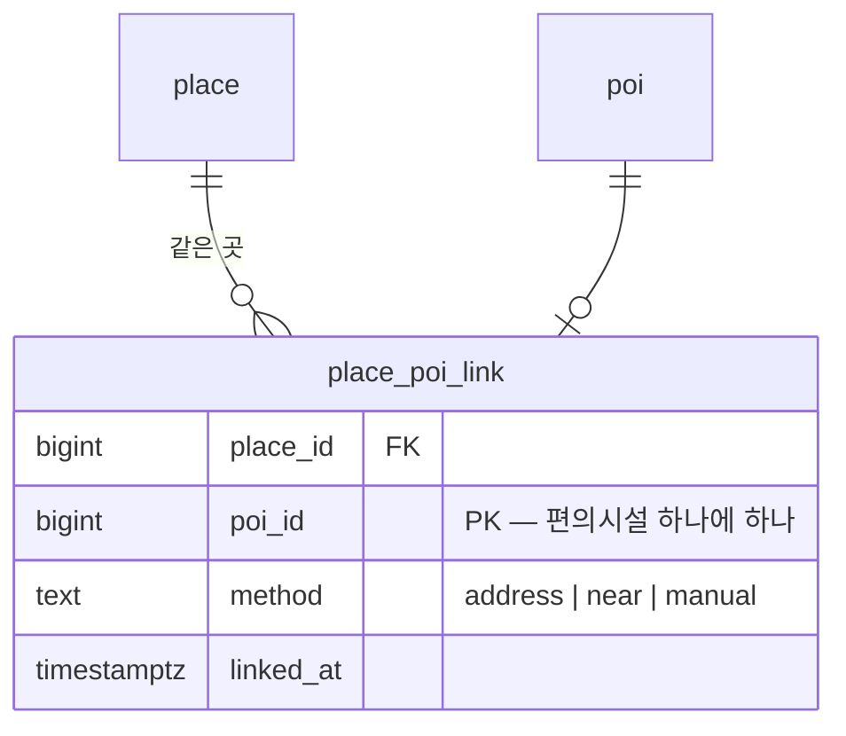

# 촬영지 ↔ 편의시설 같은 곳 연결 — 리뷰를 함께 쓴다 (MZ2AZ-371)

촬영지(`place`)와 편의시설(`poi`)은 따로 적재한 표다. 둘이 **같은 곳**이면 지도에 점이 두 번 찍히고, 리뷰·별점·사진이
두 갈래로 쌓인다. 같은 곳을 찾아 연결하고, **어디서든 촬영지가 그곳을 대표한다** — 상세는 촬영지 상세 하나, 리뷰는 촬영지
한 벌, 코스에는 촬영지로.

[review.md §2](./review.md) 의 「촬영지 ↔ 편의시설 — 따로 받는다」 를 뒤집는다(2026-10-09, 권호). 그때 「나중에 합치려면 연결표를
더하면 된다」 고 적어 둔 그 연결표다.

## 1. 결정 (2026-10-09)

| 항목 | 결정 | 이유 |
| --- | --- | --- |
| 대표 | 연결된 편의시설은 **어디서든 촬영지가 대표한다**(§5) | 규칙 하나로 상세·리뷰·지도·코스가 같이 풀린다. 앱의 주인공이 촬영지다 |
| 상세 | 연결된 편의시설을 누르면 **촬영지 상세**를 연다 — 상세 페이지가 하나 | 같은 곳에 페이지가 둘이면 어느 쪽 정보가 맞는지 사용자가 헷갈린다 |
| 리뷰 | 촬영지 쪽 한 벌. 편의시설 리뷰 창구로 와도 촬영지 리뷰로 처리한다 | 같은 곳의 별점이 둘로 갈리면 둘 다 표본이 작다. 낡은 앱이 편의시설 상세를 열어도 같은 리뷰가 보인다 |
| 같은 곳 판정 | 거리 + 이름 + **주소**(§2). 확실한 것은 자동, 나머지는 사람이 본다 | 이름·거리만으로는 「낙산공원」–음식점 「낙산」 같은 오판이 남는다 |
| 사람 판정의 자리 | 저장소의 목록 파일(§3) — 브랜드 사전과 같은 방식 | 판정이 리뷰 이력과 함께 남고, 다시 적재해도 사라지지 않는다 |
| 이미 갈린 리뷰 | 연결될 때 촬영지로 **옮긴다**. 한 사람이 양쪽에 썼으면 최근 것 하나 | 「한 사람 한 곳 하나」(review.md §2)를 지킨다 |
| 지도 | 편의시설 응답에 `placeId`. 촬영지 핀이 보이면 그 점을 그리지 않는다 | 코스 지도에 두 번 찍히던 것(371 본문)이 같이 풀린다 |
| 검색 | 할 일 없음 — 검색 탭(`GET /search`·자동완성)은 촬영지·작품·인물만, 코스 짜기의 장소 검색(`GET /places?q=`, MZ2AZ-372)은 촬영지만 다룬다. 편의시설은 검색에 나오지 않는다 | 확인 2026-10-09 |
| 챗봇 조회 | 편의시설도 그대로 나온다(`placeId` 가 실린다) | 「근처 카페」 를 물었는데 그 카페가 빠지면 안 된다 |
| 코스에 담기 | `placeId` 가 있으면 **촬영지로 담는다**(앱) | 코스에 같은 곳이 한 번만 들어가고, 담긴 것을 누르면 촬영지 상세가 열린다 |

## 2. 같은 곳 판정

**후보**: 촬영지마다 **50 m 안**의 편의시설 중, 띄어쓰기를 뺀 **편의시설 이름이 촬영지 이름 안에 들어 있는** 것.
반대 방향(촬영지 이름 ⊂ 편의시설 이름)은 보지 않는다 — 「대구 이월드」 ⊂ 「스타벅스 대구이월드」 처럼 그 안의 다른 가게다
(실측 9 쌍 전부 다른 곳).

후보를 셋으로 가른다.

| 단계 | 조건 | 처리 | 실측 (로컬, 촬영지 93) |
| --- | --- | --- | --- |
| A | 도로명 + 건물번호가 같다 | 자동 연결 | 17 쌍 — 미리내성지로 420, 두류공원로 200(이월드) … |
| B | 주소를 견줄 수 없고(편의시설 주소가 읍·면·동까지) **5 m 안** | 자동 연결 | 4 쌍 — 소소주점 0 m, 얄개분식 1 m, 사니다카페 3 m, 쇠고집 4 m |
| C | 그 밖 | **사람 판정 전까지 연결하지 않는다** | 6 쌍 — 명동, 낙산(음식점), 행궁동 벽화마을, 동광극장, 배다리 헌책방골목, 행리단길 |

주소는 도로명과 건물번호만 견준다(「경기도」/「경기」, 괄호 속 법정동 같은 표기 차이를 지운다). 지번 주소는 견주지 않는다.

**주소로도 못 거르는 것** — 주소는 같은데 성격이 다른 쌍: 「코엑스 K팝 스퀘어」–「코엑스」, 「대학로 마로니에공원」–「대학로」,
「용답역 육교」–「용답역」. 그래서 **처음 한 번은 A·B·C 전부를 사람이 본다.** 그 뒤로는 새로 생긴 C 만 묻는다.

한 편의시설은 촬영지 하나에만 붙는다(겹치면 가까운 쪽). 한 촬영지에는 여럿이 붙을 수 있다.

## 3. 판정 목록 파일

`services/scene-api/seed/place_poi_links.tsv` — 사람이 판정한 쌍만 적는다.

| 칸 | 뜻 |
| --- | --- |
| `place_key` | 촬영지의 고유 키(MZ2AZ-361) |
| `poi_source_id` | 편의시설의 출처 ID. DB 번호가 아니다 — 분기 갱신에도 바뀌지 않는다 |
| `verdict` | `same` 또는 `not` |
| `note` | 왜 그렇게 봤는지 한 줄 |

규칙: 파일의 판정이 자동(A·B)보다 앞선다 — `not` 이면 A 여도 연결하지 않고, `same` 이면 C 여도 연결한다.

## 4. 표와 적재

`just place-poi-link` 하나가 한다 — 촬영지 적재(`just seed`)와 편의시설 분기 갱신(`just seed-poi --update`) 뒤에 돌린다.

1. 후보를 뽑아 A·B·C 로 가르고 판정 파일을 덮어 연결 집합을 만든다.
2. 표를 그 집합으로 맞춘다(더하고, 빠진 것은 지운다). 한 트랜잭션.
3. 새로 연결된 쌍의 편의시설 리뷰를 촬영지로 옮긴다(§5).
4. **판정이 없는 C** 를 출력한다 — 사람이 파일에 적을 차례다.

연결이 풀려도(판정을 `not` 으로 바꿈) 옮긴 리뷰는 촬영지에 남는다. 그때 쓴 사람은 그곳을 같은 곳으로 보고 쓴 것이다.

## 5. 촬영지가 대표한다

| 장면 | 처리 | 누가 |
| --- | --- | --- |
| 상세 | `placeId` 가 있는 편의시설을 누르면 촬영지 상세(`GET /places/{placeId}`)를 연다 | 앱 |
| 지도(검색 탭·코스 지도) | 촬영지 핀이 보이면 그 편의시설 점을 그리지 않는다. 촬영지 핀을 끄고 편의시설 갈래만 볼 때는 점이 보이되 누르면 촬영지 상세 | 앱 |
| 편의시설 목록 `GET /pois` | **빼지 않는다** — `placeId` 만 싣는다. 「음식점」 만 보는 사람에게 그 가게가 사라지면 안 된다 | 서버 |
| 챗봇 `poi_nearby` | 빼지 않는다 — `placeId` 를 싣는다. 결과 카드를 누르면 촬영지 상세 | 서버·앱 |
| 코스에 담기 | `placeId` 가 있으면 그 촬영지로 담는다. 같은 촬영지를 두 번 담으면 기존 중복 검사(촬영지 id)에 걸린다. 앱이 하는 이유는 아래 | 앱 |
| 리뷰 | 편의시설 리뷰 창구(목록·요약·사진첩·쓰기·고치기·지우기·내 리뷰)로 와도 그 촬영지의 리뷰로 처리한다. 앱이 촬영지 상세로 가므로 평소엔 쓰이지 않지만, 낡은 앱·직접 호출에도 리뷰가 갈리지 않게 | 서버 |

**코스에 담기를 앱이 하는 이유**: 코스 저장(`PUT`)의 항목은 `placeId`(촬영지) 아니면 `customPin`(이름·좌표·분류)뿐이고
`course_item` 도 그 두 칸뿐이다. 앱은 편의시설을 지금 **개인 핀**으로 저장한다(`RouteBridge.swift`) — 서버에 닿을 때는 편의시설
번호가 이미 없다. 번호와 `placeId` 를 아는 것은 담는 순간의 앱뿐이다. 개인 핀의 이름·좌표로 서버가 추측해 바꾸면 사용자가 일부러
찍은 핀까지 바뀔 수 있어 하지 않는다.

**다음 일 — MZ2AZ-377**: 연결되지 않은 편의시설도 개인 핀이 아니라 편의시설로 저장한다(`course_item.poi_id`). 그때 서버도 저장할 때
연결된 편의시설을 촬영지로 바꾼다(앱이 놓쳐도). 이 문서는 그 전까지의 모양이다 — 연결된 것은 앱이 촬영지로, 나머지는 지금처럼 개인 핀.

**이미 갈린 리뷰 옮기기**: 연결될 때 `review.poi_id` → `place_id`. 같은 사람이 양쪽에 썼으면 `updated_at` 이 늦은 것을 남기고
다른 하나를 지운다(그 사진의 저장소 파일은 사진 정리 일과 같은 길로 지운다).

**편의시설에만 있는 정보**(전화·분류)는 촬영지 상세에 없다. 필요해지면 촬영지 상세에 연결된 편의시설의 전화·분류를 싣는다 —
이번에는 하지 않는다(§9).

## 5-1. 가이드 챗봇 (`agents/trip-guide` — 김태환, MZ2AZ-379)

| 도구 | 처리 |
| --- | --- |
| `search_places`·`places_near`·`list_title_places` | 할 일 없음 — 촬영지만 다룬다 |
| `poi_nearby` | 결과에 `placeId` 가 있으면 모델에게 「촬영지 「수원 카페 몽테드」 와 같은 곳」 을 함께 준다 — 촬영지와 편의시설을 같이 추천할 때 같은 곳을 두 번 소개하지 않게. 지도 핀은 그대로 |
| `update_cart` | 장바구니는 촬영지 전용이다(`cart_item.place_id`). 「몽테드 담아 줘」 가 이번 대화에서 보여 준 **연결된** 편의시설이면 그 촬영지로 담는다. 연결되지 않은 편의시설은 지금처럼 담지 못한다고 답한다 |

프롬프트(`prompts/system.txt`)에 한 줄 — 「같은 곳이면 촬영지 이름으로 소개한다」. 평가 케이스: 연결된 편의시설이 `poi_nearby` 에
나왔을 때 두 번 소개하지 않는가, 「몽테드 담아 줘」 가 촬영지로 담기는가(`evals/cases.json`, 결과는 `docs/ai/`). 시험은 모델을 부르지
않는다(가짜 클라이언트).

## 6. 계약 (scene-api 1.7.0)

- `PoiSummary.placeId`(선택, int64): 같은 곳인 촬영지. 편의시설 목록·상세, 챗봇 결과의 편의시설에 싣는다. 설명: 「있으면 앱은
  촬영지 상세로 열고, 코스에는 촬영지로 담는다. 촬영지 핀과 함께 그릴 때는 이 점을 그리지 않는다」.
- `GuidePlace`(챗봇 결과)는 `PoiSummary` 를 그대로 쓰므로 `placeId` 가 함께 실린다(`source: poi` 일 때만).
- 편의시설 리뷰 창구들의 설명: 「`placeId` 가 있으면 그 촬영지의 리뷰다」.
- 더하기만 — 앱이 몰라도 깨지지 않는다(그 경우 점이 두 번 찍히고 상세가 둘일 뿐, 리뷰는 이미 하나다).

## 7. 앱 (정승길 — MZ2AZ-378)

- 편의시설을 누를 때(지도 점·목록·챗봇 카드): `placeId` 가 있으면 촬영지 상세를 연다.
- 지도(검색 탭·코스 지도): 촬영지 핀이 보이면 `placeId` 가 있는 편의시설 점을 그리지 않는다.
- 코스에 담기: `placeId` 가 있으면 촬영지로 담는다.

### 7-1. iOS 구현 (2026-10-09)

판단은 `apps/scenetrip-ios/src/RouteTab/PlacePoiLink.swift` 한 곳에 있다(순수 함수, 시험 `PlacePoiLinkTests`).
편의시설의 `placeId` 는 화면 장소(`RouteGuide.Place.linkedPlaceId`)가 들고 다닌다 — 지도 범위 조회(`GET /pois`)와 챗봇 결과
(`GuidePlace`, `source: poi` 일 때만) 둘 다.

| 장면 | 규칙 | 자리 |
| --- | --- | --- |
| 누를 때 | 대상이 촬영지로 바뀐다(`Place.target`) — 카드가 `GET /places/{placeId}` 를 받아 촬영지 이름·유형·주소·사진·별점을 보이고, 리뷰 시트도 촬영지의 것이다. 새 화면은 없다 — 코스 화면이 촬영지를 보여 주던 그 카드(`RoutePlaceCard`)다 | 지도 점, 가이드 창의 결과 줄·카드 |
| 지도 | **그 촬영지의 핀이 지금 그려져 있을 때만** 점을 숨긴다(`drawsDot`). 그려진 핀 = 보고 있는 일차의 번호 핀 + 검색·장바구니 시트의 미리보기 핀 + 챗봇이 찾아 준 촬영지 | 코스 편집 지도의 주변 점·AI 장소 |
| 코스에 담기 | 촬영지로 담는다(`Place.courseEntry` — id 가 촬영지 id, 핀 아님 → 저장은 `CourseItemInput.placeId`). 이미 그 촬영지가 있으면 기존 중복 검사(`RouteDedupe.fresh` 의 촬영지 id)에 걸려 담기지 않고, 카드는 「경로에 있음」 을 보인다 | 지도 카드의 「경로에 추가」, 가이드 창의 ⊕ |

- **「촬영지 핀이 보이면」 을 「연결만 있으면 늘」 로 읽지 않았다.** 코스 지도에는 촬영지 핀을 끄는 스위치가 없다 — 촬영지는
  코스에 담겼을 때만 핀이 된다. 연결만으로 숨기면 코스에 담지 않은 곳(대부분)은 그 가게가 지도에서 통째로 사라진다. 그래서 핀이
  없으면 점이 남고 누르면 촬영지 상세다(§5 의 「편의시설 갈래만 볼 때」 와 같은 모양).
- **다른 일차에 담은 촬영지** — 갈래가 둘로 갈린다. **주변 점**은 지금 지도에 핀이 없으므로 남고, 누르면 카드가 「경로에 있음」 을
  보인다. **「AI 장소」**(챗봇이 찾아 준 곳)는 어느 일차에 담겼든 사라진다 — 「코스에 담긴 곳은 뺀다」 는 그쪽의 원래 규칙
  (`guidePlacesForMap`)이 모든 일차를 보기 때문이다. 갈래 칩의 수는 지도에서 숨긴 점을 세지 않는다.
- **촬영지 상세를 못 받으면** 연결된 점의 카드는 목록이 준 것(편의시설 이름·분류·주소)으로 선다 — 연결 전처럼 담을 수 있고,
  담으면 여전히 촬영지로 담긴다(`RouteGuide.card(place:listed:)`).
- 담은 줄은 편의시설 이름으로 먼저 서고, 촬영지 상세가 오면 촬영지의 이름·유형·주소·좌표로 바뀐다(`adopting`) — 번호 핀도
  촬영지 좌표로 다시 선다. 못 받아도 저장은 `placeId` 로 간다. 담은 직후 길찾기를 켜면 저장하고 돌아온 줄을 촬영지 id 로
  찾는다(`PlacePoiLink.row`).
- **남긴 것**: 영어 화면에서 점의 이름표는 편의시설의 로마자(「Mongtedeu」)이고 카드 제목은 촬영지의 영어 이름
  (「Montead Cafe」)이다 — 목록(`GET /pois`)에는 촬영지 이름이 실려 오지 않는다. 고치지 않았다.
- **검색 탭 지도에는 편의시설 점이 없다** — 그릴 것이 촬영지뿐이라 할 일이 없다. 편의시설 목록 화면도 따로 없다(가이드 창의
  결과 줄이 그 자리다).
- 연결되지 않은 편의시설은 편의시설 카드가 뜨고, 코스에는 **편의시설로**(`poiId`) 담긴다 — MZ2AZ-380
  ([course-poi-item.md](./course-poi-item.md) §6-1). 378 때는 개인 핀이었다.
- **MZ2AZ-380 에 넘긴 것(380 에서 풀었다)**: 챗봇이 준 촬영지는 이제 `placeId` 로 담기고 `drawnPlaceIds` 에 잡힌다.
  `RouteBridge.stop(from:)` 은 `source: poi` 를 편의시설 줄로 읽는다. 아래는 378 때의 상태다 —
  챗봇이 준 **촬영지**(`source: place`)는 아직 개인 핀(id 음수)으로 담긴다. 그 줄은
  `drawnPlaceIds` 에 잡히지 않아, 같은 곳의 주변 점이 번호 핀과 함께 보인다(촬영지 id 중복 검사에도 안 걸린다). 촬영지를
  `placeId` 로 담게 되면 같이 풀린다. `RouteBridge.stop(from:)` 은 `source: poi` 항목을 아직 다루지 못한다.

## 8. 순서

1. 계약 PR → 머지, 앱 티켓.
2. 서버: 마이그레이션(`place_poi_link`), `just place-poi-link`, `placeId` 싣기(목록·상세·챗봇), 리뷰 대상 바꿔
   끼우기·옮기기. 시험은 새 컨텍스트가 명세로.
3. 챗봇(§5-1, MZ2AZ-379 김태환): `poi_nearby`·`update_cart`·프롬프트 한 줄·평가.
4. 첫 판정: 27 쌍 전부를 목록으로 뽑아 권호가 판정 → `place_poi_links.tsv`.
5. 로컬에서 실제로 — 편의시설 응답에 `placeId` 가 실리는지, 편의시설 리뷰 창구로 쓴 리뷰가 촬영지에
   보이는지, 옮기기 뒤 리뷰 수가 맞는지.

## 9. 하지 않는 것

- 연결되지 않은 편의시설을 코스에 편의시설로 저장하기 — MZ2AZ-377(다음 일).
- 촬영지 상세에 연결된 편의시설의 전화·분류 싣기 — 필요해지면.
- dev·prd DB 에 연결을 싣는 원격 적재 — 촬영지·편의시설 원격 적재(PRD 전 과제)와 같이 한다.
- 새 촬영지 표(127 편 543 행)가 들어오면 후보가 늘어난다 — 그때 C 를 다시 판정한다.
