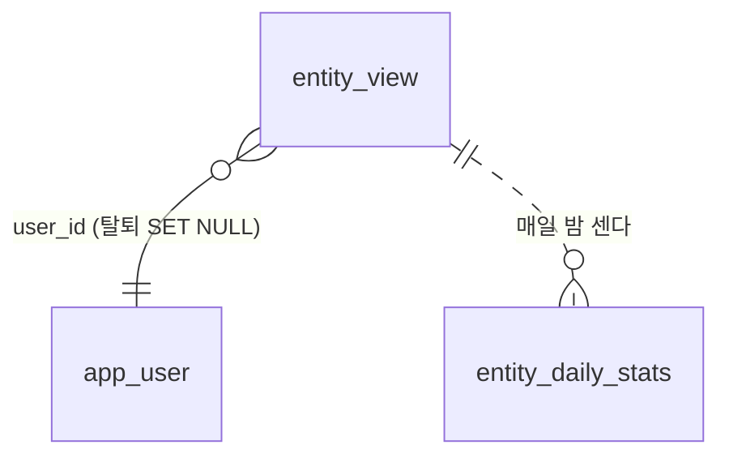

# 인기도 — 초기값과 사용자 활동을 섞어 매일 밤 다시 계산한다

- **상태**: 계획(2026-10-11). 티켓은 이 문서가 합쳐진 뒤 만든다 — 계약·서버(권호) · iOS·Android(정승길)
- **관련**: MZ2AZ-339(장소×작품 산정 점수) · [analytics-events.md](analytics-events.md)(Firebase 분석, MZ2AZ-353) ·
  [scene-api-database.md](scene-api-database.md)(`user_event` 를 만든 이유) · [catalog-scale.md](catalog-scale.md) §6(홈 선반 정렬)

## 1. 왜

앱 메인의 작품 순서와 top places 가 믿을 수 없다.

| 실측 (2026-10-10, 로컬) | 결과 |
| --- | --- |
| `content.popularity_score` | 128 편 **모두 50** — 적재가 임의값을 넣는다(`candidates.sql`, 2026-09-23 `famous_rank` 를 뺀 뒤) |
| `place.popularity_score` | 487 곳 **모두 50** — 작품 점수의 최댓값을 복사한다 |
| 서버 정렬 | `popularity_score DESC, id DESC` — 값이 같으니 사실상 「나중에 적재된 순」. CSV 를 다시 넣으면 순서가 바뀐다 |
| `user_event` | **0 행.** V2 에서 만들었지만 쓰는 코드·API·앱이 없다 |
| CSV `place_popularity_score` | 544 행 모두 차 있지만 **장소×작품** 점수다(N서울타워: 케데헌 60 · 별에서 온 그대 2.2). 적재가 받기만 하고 넣지 않는다 |

CSV 산정 점수는 **작품끼리 비교할 수 없다.** 케데헌 촬영지는 40~66, 나머지는 대부분 1.5~5 라서 최댓값·합계·평균 어느
것으로 장소 점수를 만들어도 1~7 위가 케데헌 촬영지다. 그래서 작품 인기도가 먼저 있어야 하고, 산정 점수는 **작품 안에서만**
쓴다.

데이터 담당자가 **작품별 인기도**를 구해 CSV 에 더해 주기로 했다(2026-10-10). 사용자가 없는 동안은 그것이 순서를 정하고,
사용자가 생기면 활동이 점점 순서를 넘겨받는다.

## 2. 결정

| 항목 | 결정 | 이유 |
| --- | --- | --- |
| 초기값 | `popularity_seed` 칸에 둔다. 최종값(`popularity_score`)과 나눈다 | 매일 밤 최종값을 덮어써도 출발점이 남아야 다시 계산할 수 있다 |
| 섞는 법 | 최종 = w × 초기값 + (1 − w) × 활동 순위, **w = K / (K + 활동 점수)** | 언제 넘길지 사람이 정하지 않아도 활동이 많은 것부터 넘어간다. 활동이 몇 건인 것은 초기값이 붙잡는다 |
| 활동 → 0~100 | 같은 종류끼리 **순위(백분위)** 로 바꾼다 | 초기값과 단위를 맞춘다. 한 작품이 크게 터져도 나머지가 0 근처로 눌리지 않는다 |
| 상세 조회 | **앱이 보낸다**(`POST /events`). 서버가 상세 API 호출을 세지 않는다 | 앱이 상세를 열지 않고도 상세 API 를 부른다(§3). 세면 부푼다 |
| 검색 | 앱이 **확정한** 검색어와 결과 수만 보낸다 | `/search/suggestions` 는 글자마다 불린다 — 「도」「도깨」「도깨비」 가 다 쌓인다 |
| 조회 중복 | 같은 기기·같은 대상·같은 날은 한 번 | 새로고침·뒤로 가기로 부풀지 않게. 표의 유일 제약으로 막는다 |
| 기간 | 최근 **30 일** 활동만 | 예전에 뜨고 지금은 아닌 것이 위에 남지 않게 |
| 보관 | 원본(`entity_view`·`search_log`) **90 일**, 하루 집계는 계속 | 원본은 기기 id 를 담는다. 집계로 추이는 남는다 |
| 계산 | scene-api 안의 매일 밤 작업 하나. 여러 파드가 떠도 한 번만(Postgres advisory lock) | 클러스터에 CronJob·배치 이미지를 따로 두지 않는다 |
| 가중치·K·기간 | 설정(`scenetrip.popularity.*`) | 사용자가 생긴 뒤 코드 없이 조정한다 |
| `user_event` | **지운다** | 0 행이고, 이벤트 종류가 지금 서비스와 맞지 않는다(편의시설·코스·후기 없음, 기기 칸 없음). 저장·담기·리뷰는 이미 제 표가 있다 |
| Firebase 와의 관계 | 겹쳐도 둘 다 둔다 | Firebase(GA4)는 마케팅 퍼널용이라 서버가 순위 계산에 읽을 수 없다. 이쪽은 정렬용이다 |

## 3. 앱이 상세 API 를 부르는 자리 (2026-10-11 확인)

서버에서 세면 안 되는 이유다. 상세 화면이 아닌데 상세를 부른다.

| 자리 | 부르는 것 | 언제 |
| --- | --- | --- |
| iOS `SearchTabView.swift:428` | `getContent` | 검색어를 칠 때마다 첫 작품 후보의 포스터를 채우려고 |
| iOS `RouteGuide.swift:198·202` | `getPlace`·`getPoi` | 챗봇 답의 장소마다 카드를 만들려고 |
| iOS `RouteEditorAmbient.swift:45`, Android `RoutePlaceCard.kt:100·117` | `getPlace`·`getPoi` | 코스에 담은 곳의 이름을 바로잡으려고 |
| iOS `MyReviewsView.swift:172` | `getPoi` | 내 리뷰 목록의 편의시설 이름 |

진짜 조회는 앱이 Firebase `view_title`·`view_place` 를 보내는 자리(`ContentDetailView`·`PlaceDetailView`)와 같다. 편의시설
상세에는 아직 Firebase 이벤트가 없다 — 이번에 함께 넣는다.

## 4. 재료와 무게

| 재료 | 표 | 작품 | 촬영지 | 편의시설 | 무게 | 시각 |
| --- | --- | --- | --- | --- | --- | --- |
| 상세 조회 | `entity_view` **새** | ✅ | ✅ | ✅ | 1 | `day` |
| 작품 하트 | `saved_content` | ✅ | | | 3 | `created_at` |
| 장소 담기(장바구니) | `saved_place` | `source_content_id` 로 | ✅ | | 3 | `created_at` |
| 코스에 넣기 | `course_item` | `source_content_id` 로 | ✅ | ✅ | 5 | 코스의 `updated_at`* |
| 실제 방문(도장) | `course_item.visited_at` | | ✅ | ✅ | 8 | `visited_at` |
| 리뷰 | `review`(`removed_at` 없음) | | ✅ | ✅ | 5 | `created_at` |

\* `course_item` 에는 담은 시각 칸이 없다. 그래서 「최근 30 일 안에 저장한 코스에 들어 있는가」로 센다(코스 단위). 한 코스가
같은 곳을 두 번 담아도 한 번이다. 칸을 더하지 않는 이유 — 지금 있는 항목에 채울 값이 없고, 코스 단위로도 「요즘 일정에 넣는
곳」 은 충분히 드러난다.

무게는 「실제로 가는 것」 에 가까울수록 크다 — 보기 1 · 담기 3 · 일정에 넣기 5 · 리뷰 5 · 가기 8. 여행후기 사본
(`community_post_item`)·마켓은 넣지 않는다 — 남이 짠 것을 옮긴 것이라 그 사람의 관심이 아니다.

## 5. 계산

매일 밤 한 번, 종류(작품·촬영지·편의시설)마다 따로.

1. **활동 점수** — 지난 30 일의 재료 × 무게를 더한다. `도깨비 = 조회 120×1 + 하트 30×3 + 코스 40×5 = 410`
2. **활동 순위** — 활동 점수가 0 보다 큰 것끼리 백분위(0~100). 0 인 것은 계산하지 않는다(w = 1 이라 쓰이지 않는다)
3. **w** = K / (K + 활동 점수). K 는 처음 **200**
4. **최종** = w × 초기값 + (1 − w) × 활동 순위 → `popularity_score` 에 쓴다

| 작품 | 초기값 | 30 일 활동 | 순위 | w | 최종 |
| --- | --- | --- | --- | --- | --- |
| 도깨비 | 90 | 40 | 50 | 200/240 = 0.83 | 0.83×90 + 0.17×50 = **83** |
| 신작 B | 40 | 900 | 100 | 200/1100 = 0.18 | 0.18×40 + 0.82×100 = **89** |
| 작품 C | 60 | 10 | 0 | 200/210 = 0.95 | 0.95×60 + 0.05×0 = **57** |

### 초기값이 어디서 오나

| 대상 | 초기값(`popularity_seed`) |
| --- | --- |
| 작품 | 데이터 담당자 CSV 의 작품 인기도를 0~100 으로. 칸이 오기 전에는 지금처럼 50 |
| 촬영지 | 작품마다 「산정 점수 ÷ 그 작품의 최고 산정 점수」(작품 안 상대값 0~1)를 구해 **작품 초기값 × 상대값** 의 최댓값 — 유명한 작품의 대표 촬영지가 위로 온다. 작품 초기값이 모두 50 인 동안은 작품 안 순위와 같다 |
| 편의시설 | 없음(0) — 활동만으로 오른다. 90 만 행이라 활동이 있는 것만 계산하고, 활동이 사라진 것은 0 으로 되돌린다 |

산정 점수 자체는 `place_content.popularity_score` 에 그대로 넣어 **작품 상세의 촬영지 순서**에 쓴다(MZ2AZ-339 의 1·2).
339 의 3(`ContentRef.popularity` 계약)·4 는 이 문서 범위 밖이다.

## 6. 표 (V28)

**지운다** — `user_event`.

**더한다**

| 표 | 칸 |
| --- | --- |
| `content` | `popularity_seed NUMERIC NOT NULL DEFAULT 50` |
| `place` | `popularity_seed NUMERIC NOT NULL DEFAULT 50` |
| `place_content` | `popularity_score NUMERIC` — CSV 산정 점수 |
| `poi` | `popularity_score NUMERIC NOT NULL DEFAULT 0` |

**새 표**

- `entity_view` — `entity_type`(`content`·`place`·`poi`) · `entity_id` · `install_id UUID NOT NULL` · `user_id UUID`(가입자, `app_user` 참조 ·
  탈퇴하면 NULL) · `lang` · `day DATE` · `created_at`. **유일: (`install_id`, `entity_type`, `entity_id`, `day`)** — 두 번째 조회는
  `ON CONFLICT DO NOTHING`. 대상에 FK 를 걸지 않는다(세 표를 가리킨다) — 없는 id 는 받을 때 거른다
- `search_log` — `query`(1~100 자, 앞뒤 공백 제거) · `result_count` · `lang` · `created_at`. **기기 id 를 두지 않는다** — 결과 0 건
  목록을 뽑는 데 기기가 필요 없다
- `entity_daily_stats` — (`entity_type`, `entity_id`, `day`, `lang`) 기본 키 · `viewers`(그날 그 언어로 본 기기 수). 원본을 지워도
  남는다

## 7. 계약 (scene-api, 더하기만)

| 창구 | 내용 |
| --- | --- |
| `POST /events` | 몸체 `{type: view, entityType, entityId}` 또는 `{type: search, query, resultCount}`. `X-Install-Id` 필수, 로그인 선택, `Accept-Language` 를 `lang` 으로. **204, 몸체 없음** |

- 앱은 **보내고 잊는다** — 기다리지 않고, 실패해도 다시 보내지 않고, 화면에 알리지 않는다. 기록 하나 때문에 화면이 늦어지면 안 된다
- 서버도 기록에 실패하면 로그만 남기고 204 — 앱이 알 방법도 이유도 없다
- 요청 한도(MZ2AZ-334)는 기기마다 넉넉히 — 정상 사용으로 걸리지 않게

**앱 — 정승길**(iOS·Android 같은 자리)

| 이벤트 | 자리 |
| --- | --- |
| `view` · `content` | Firebase `view_title` 옆 — `ContentDetailView` |
| `view` · `place` | Firebase `view_place` 옆 — `PlaceDetailView` |
| `view` · `poi` | 편의시설 상세가 열릴 때(Firebase 에도 `view_poi` 를 새로) |
| `search` | Firebase `search` 옆 — 검색 확정(`SearchTabView.commit`), 그때 보인 결과 수 |

## 8. 개인정보

- `entity_view` 는 기기 id 를 담는다 — 같은 날 중복을 막는 데만 쓰고 **90 일 뒤 지운다.** 조회 기록을 다른 용도(맞춤 추천 등)로 쓰려면
  다시 정한다
- `search_log` 의 검색어는 기기·사용자와 잇지 않는다. 그래도 사람이 이름·전화번호를 칠 수 있다 — 90 일 뒤 지운다
- 개인정보 처리방침의 수집 항목에 「서비스 이용 기록(조회한 작품·장소, 검색어)」 을 더한다. Firebase 쪽은 검색어 원문을 보내지
  않는다(analytics-events.md §4) — 원문은 우리 DB 에만, 기기와 떨어져 있다

## 9. 순서

1. 이 문서 → 머지
2. **계약 PR** — `POST /events`. 머지 뒤 앱 티켓(정승길, iOS·Android)
3. **서버** — V28 · `POST /events` · 매일 밤 계산 · `place_content.popularity_score` 적재 · `just popularity-recompute`(로컬에서 바로
   돌려 보기). 시험은 새 컨텍스트가 명세로
4. **로컬에서 실제로** — 시험 사용자로 조회·하트·코스를 만들고 `just popularity-recompute` 뒤 순서가 바뀌는지
5. 데이터 담당자 CSV 가 오면 — 작품 인기도 칸을 `content.popularity_seed` 로 적재(칸 이름은 그때 맞춘다)
6. 앱이 정렬을 바꾼다 — 홈 「지금 뜨는 작품」 이 지금은 **촬영지 수 순**이다. 인기순(같으면 촬영지 수)으로(catalog-scale.md §6)

## 10. 하지 않는 것

- 화면 노출(`impression`)·목록 순번 — 「보였는데 안 눌렀다」 보정은 지금 규모에 과하다
- 네이버 지도·길찾기 열기 — 강한 신호지만 앱이 바깥 앱을 연다. 사용자가 생긴 뒤 필요하면 `POST /events` 에 종류를 더한다
- 언어별 인기순 정렬 — 집계는 언어별로 남기지만, 정렬은 한 가지
- 위치·IP·챗봇 대화 내용
- 기존 사용자 데이터 이전 — PRD 전이다
