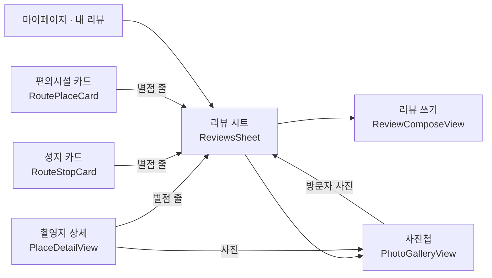

# 리뷰·별점·사진첩·닉네임 — 앱 화면 (MZ2AZ-363)

- **상태**: PR A(닉네임)가 들어갔다(2026-10-07) — 화면·규칙·단위 시험까지. 저장은 서버(362)가 없어 실기로 못 봤다. B~E 는 구현 전
- **담당**: 정승길 — iOS 먼저, Android 는 따라간다
- **서버·계약**: [review.md](./review.md)(MZ2AZ-362, 정권호). 계약 scene-api **1.4.0**(PR #145)은 main 에 있다.
  **서버 구현은 아직 없다** — 새 칸은 전부 옵셔널이라 없어도 앱은 돈다
- **근거**: 2026-10-03 팀 회의 안건 「장소 상세에 리뷰·평점」, 네이버 별점을 걷어낸 뒤의 빈자리(MZ2AZ-354)

## 1. 무엇을 만드나

| # | 화면 | 한 줄 |
| --- | --- | --- |
| 1 | 닉네임 정하기 | 로그인 직후 한 번(건너뛸 수 있다), 마이페이지에서 바꾸기 |
| 2 | 별점 줄·리뷰 목록 | 촬영지·편의시설에 「★4.6 · 리뷰 128」, 눌러서 목록 |
| 3 | 리뷰 쓰기 | 별점(필수)·글(선택)·사진 최대 10장. 고치기·지우기 |
| 4 | 사진첩 | 우리 사진 뒤로 방문자 사진을 이어 넘겨 본다 |
| 5 | 내 리뷰 · 탈퇴 안내 | 마이페이지 「내 리뷰」, 탈퇴 확인 문구 |

## 2. 화면을 어디에 붙이나

iOS 에는 촬영지 상세 화면이 있고(`SearchTab/PlaceDetailView`), **편의시설 상세 화면은 없다** — 편의시설은 코스 지도의
작은 카드(`RouteTab/RoutePlaceCard`)가 전부다. 그래서 리뷰를 화면마다 따로 짓지 않고 **한 벌을 시트로** 만든다.

| 자리 | 붙이는 것 |
| --- | --- |
| 촬영지 상세 | 대표 사진 아래 별점 줄, 사진을 누르면 사진첩, 아래쪽에 리뷰 미리보기 3줄 + 「전체 보기」 |
| 성지 카드 · 편의시설 카드 | 별점 줄 한 줄(누르면 리뷰 시트). 카드는 좁다 — 목록·쓰기는 시트에서 |
| 리뷰 시트 | 요약(평균·수·점수 막대) · 정렬 · 목록 · 「리뷰 쓰기」 · 사진첩 들머리 |

**별점 줄의 세 상태** — 서버가 아직 없을 때를 가른다.

| 상세의 `rating` | 보이는 것 |
| --- | --- |
| 없음(옛 서버) | 줄 자체가 없다 — 없는 기능을 있는 척하지 않는다 |
| `count == 0` | 「아직 리뷰가 없어요 · 첫 리뷰 쓰기」 |
| `count > 0` | 「★4.6 · 리뷰 128」 |

편의시설 목록(`GET /pois`)에는 별점이 실리지 않는다 — 카드가 여는 상세(`GET /pois/{id}`)에만 있다. 지도 점에 별점을
그리지 않는다.

## 3. 코드 구조 (iOS)

새 폴더 `apps/scenetrip-ios/src/Reviews/`. 화면은 대상이 촬영지인지 편의시설인지 모른다 — `ReviewTarget` 이 가른다.

| 파일 | 하는 일 |
| --- | --- |
| `ReviewTarget.swift` | `.place(id)` · `.poi(id)`. 생성된 클라이언트의 두 벌(`…/places/…`·`…/pois/…`)을 한 모양으로 감싼다 — 목록·내 리뷰·쓰기·지우기·사진첩 |
| `NicknameRules.swift` | 닉네임 검사(2~16자, 한글·영문·숫자·`_`)와 「한 번만 묻기」 |
| `ReviewRules.swift` | 순수 규칙: 별점 글자(`★4.6 · 리뷰 128`), 고칠 때 남길 `photoKeys`, 「수정됨」, 작성자 이름(null → 「탈퇴한 사용자」) |
| `RatingLine.swift` | 별점 줄 — §2 의 세 상태 |
| `ReviewsSheet.swift` · `ReviewRow.swift` | 요약·정렬·목록(끝에 닿으면 다음 쪽), 내 리뷰면 고치기·지우기 |
| `ReviewComposeView.swift` | 별 다섯·글·사진 줄. 열 때 `GET …/reviews/me` 로 채운다 |
| `PhotoUploader.swift` | 줄이기 → `POST /uploads` → 저장소로 PUT → `key`. 장마다 진행·실패·다시 시도 |
| `PhotoGalleryView.swift` | 넘겨 보기, 「방문자 사진」 딱지, 끝에서 다음 쪽 |
| `NicknameView.swift` | 로그인 뒤 물어보기와 마이페이지 바꾸기가 같은 화면 |
| `MyReviewsView.swift` | `GET /me/reviews` — 줄을 누르면 그 대상의 리뷰 시트 |

고치는 기존 파일: `PlaceDetailView` · `RouteStopCard` · `RoutePlaceCard`(별점 줄), `ProfileTabView`(닉네임·내 리뷰·탈퇴
문구), `AuthStore`(로그인 뒤 닉네임 물어보기), `RouteGuide.Card`(상세의 `rating` 싣기), `Localizable.strings`, `AppEvent`.

## 4. 정한 것

| 항목 | 결정 | 이유 |
| --- | --- | --- |
| 편의시설 리뷰의 자리 | 카드의 별점 줄 → 시트 | 편의시설 상세 화면이 없다. 새 화면을 짓는 것보다 한 벌을 세 곳에서 쓴다 |
| 비회원이 「리뷰 쓰기」 | 이미 있는 로그인 시트(`.signInSheet`)를 띄우고, 로그인하면 쓰기로 잇는다 | 서버는 `401 SIGN_IN_REQUIRED`. 누르기 전에 막아 헛걸음을 줄인다 |
| 닉네임을 묻는 때 | 로그인이 끝난 직후, `nicknameConfirmed == false` 일 때 한 번 | 티켓. 「건너뛰기」 하면 기기에 「물어봤음」 을 적어 다시 묻지 않는다(계정 id 별) |
| 남에게 보이는 이름 | 닉네임만. 마이페이지 계정 카드는 닉네임(누르면 바꾸기)과 메일 — 닉네임이 있으면 소셜 이름은 보이지 않는다 | `displayName` 은 실명일 수 있다 |
| 사진을 줄이는 크기 | 긴 변 2,048px, JPEG 0.82 | 계약 권장. 다시 그려 저장하므로 **위치 등 EXIF 가 빠진다** |
| 올리는 형식 | 언제나 `image/jpeg` | HEIC 를 그대로 올리면 Android·웹이 못 읽을 수 있다 |
| 올리는 때 | 사진을 고르는 즉시, 장마다 | 저장을 눌렀을 때 10장을 기다리지 않게. 서명 주소는 10분이라 고른 뒤 바로 올린다 |
| 리뷰 사진 주소 | 저장하지 않는다. 화면이 받은 것만 그 자리에서 쓴다 | 한 시간 뒤 만료. `RemoteImage` 가 주소를 열쇠로 오래 붙들지 않는지 구현 때 확인한다 |
| 리뷰 글 | 번역하지 않는다. 쓴 그대로 | 서버 결정(섞어서 최신순) |
| 고칠 때 사진 | 남길 사진은 `photos[].key`, 새 사진은 새 `key` — 화면의 순서 그대로 `photoKeys` | 계약: 보낸 것이 전부 |
| 지우기 | 확인 창 뒤 `DELETE` — 되돌릴 수 없다 | |
| 오류 | 서버 문장이 아니라 `code` 로 가른다: `NICKNAME_INVALID` · `NICKNAME_TAKEN` · `SIGN_IN_REQUIRED` · `REVIEW_NOT_FOUND` | MZ2AZ-345 의 규칙 |

## 5. 순서 — PR 다섯

작은 것부터, 서버 없이 확인되는 것부터.

| PR | 내용 | 서버(362) 없이 확인되는 것 | 서버가 있어야 하는 것 |
| --- | --- | --- | --- |
| A | 닉네임 — 로그인 뒤 물어보기, 마이페이지 표시·바꾸기 | 규칙 검사(단위 시험), 화면 모양 | 저장, 중복 오류, `nicknameConfirmed` |
| B | 별점 줄 + 리뷰 시트(읽기) | 옛 서버에서 줄이 안 보이는 것, 요약·목록의 모양(미리보기) | 실제 목록·정렬·다음 쪽 |
| C | 리뷰 쓰기·고치기·지우기 + 사진 올리기 | 줄이기·`photoKeys` 규칙(단위 시험), 화면 모양 | 올리기, 저장, 내 리뷰 불러오기 |
| D | 사진첩 — 촬영지 상세의 `photos`, 방문자 사진 | 우리 사진만 있을 때(지금 데이터) | 리뷰 사진, 만료 주소 |
| E | 내 리뷰, 탈퇴 안내 문구 | 문구 | 목록 |

**서버가 없는 동안 「된다」 고 말하지 않는다.** 각 PR 은 화면과 규칙만 넣고, 「서버가 있어야 하는 것」 은 362 가 로컬에
뜬 뒤 한꺼번에 실기로 본다. 그때까지 지라 363 은 진행 중이다.

## 6. 시험

- 단위 시험: `NicknameRulesTests`(닉네임 규칙의 경계 — 1자·2자·16자·17자, 한글 글자 수, 공백, 이모지, `_`, 풀어쓴 한글, 한 번만 묻기), `ReviewRulesTests`(별점 글자(null·0건·소수),
  `photoKeys` 조립(남기기·지우기·순서 바꾸기·10장 상한), 작성자 null, 「수정됨」)
- `ReviewTarget` 이 두 벌의 창구를 같은 뜻으로 부르는지 — 가짜 클라이언트로
- 실기: Opus 서브에이전트. 서버 쓰기(리뷰 저장·닉네임 변경)는 그 기능이 시험 대상일 때만, 끝나면 지운다

- 확인용 뒷문: `simctl launch … -previewNickname` — 로그인 응답 없이 닉네임 화면을 띄운다(`-initialTab` 과 같은 종류, 실행 인자로만 켜진다). 서버가 없는 동안 화면을 보는 유일한 길이다. 이 길로 띄운 화면에서 건너뛴 것은 기록하지 않는다

## 7. 다른 문서에 닿는 것

| | |
| --- | --- |
| 분석([analytics-events.md](./analytics-events.md)) | 더할 이벤트: `set_nickname`(`skipped` 1·0), `view_reviews`(`target_type`), `write_review`(`target_type`·`rating`·`photo_count`·`has_body` — **글·닉네임은 보내지 않는다**), `delete_review`. 표를 먼저 고치고 두 앱이 따른다 |
| 다국어 | 새 문구 전부 `en.lproj/Localizable.strings` 에. 「탈퇴한 사용자」·「방문자 사진」·「수정됨」 포함 |
| 개인정보(볼트 「앱이 다루는 개인정보」) | 새로 서버에 가는 것: 닉네임, 리뷰 글·별점, 사진. 탈퇴해도 리뷰는 작성자 표시 없이 남는다 — 처리방침·약관 문장이 필요하다(review.md §8) |
| 커뮤니티 여행후기(MZ2AZ-351·352) | 사진 올리기 창구와 닉네임을 같이 쓴다. `PhotoUploader` 는 `purpose` 를 받게 짓는다 — 후기 서버가 생기면 그대로 쓴다 |
| 편의시설 영어 표시(MZ2AZ-360) | 리뷰 시트의 제목은 `PoiLabel` 의 제목을 쓴다 |

## 8. 열어 둔 것

1. **362 가 언제 로컬에 뜨나** — 사진은 dev 버킷을 쓴다(review.md §12). 팀원용 dev 버킷 키가 필요하다
2. **신고** — 이번 범위가 아니다(운영자 내림만). 리뷰 줄에 「신고」 단추 자리는 두지 않는다
3. **촬영지 상세의 옛 칸**(`imageUrls`) — `photos` 로 옮긴 뒤에도 서버가 한동안 싣는다. 앱은 `photos` 가 있으면 그것을, 없으면 옛 칸을 본다
4. **지도·목록의 별점** — 계약에 없다. 필요해지면 서버 합계 표와 함께(review.md §4)
5. **Android** — iOS 다섯 PR 이 끝난 뒤 같은 순서로
