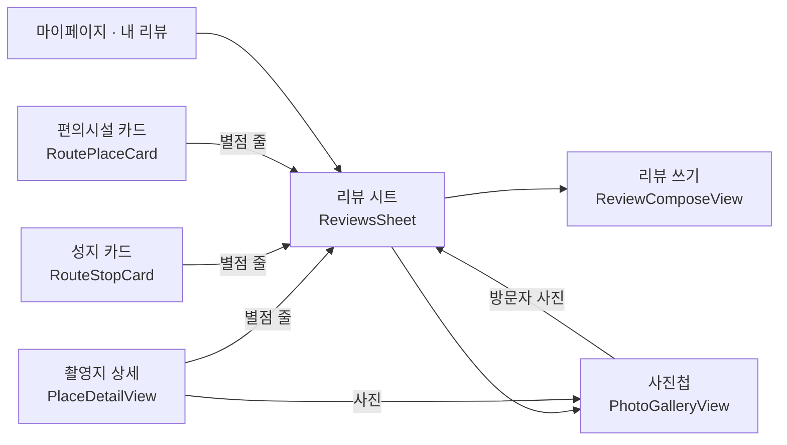

# 리뷰·별점·사진첩·닉네임 — 앱 화면 (MZ2AZ-363)

- **상태**: A(닉네임, #149·#151) · B(별점 줄·리뷰 보기, #150) · C-1(쓰기·고치기·지우기, #153) · E(내 리뷰·탈퇴 안내)까지 들어갔다(2026-10-07), 실제 서버로 확인했다. **사진 올리기(C-2)를 넣었다(2026-10-08)** — 리뷰 쓰기·고치기의 사진 줄, 목록·「내 리뷰」 의 사진과 크게 보기. 로컬 MinIO 로 끝까지 올려 확인했다(§9). **남은 것: 사진첩(D).** 사진첩은 촬영지 사진의 출처 문제(전부 네이버 주소)도 먼저 정해야 한다
- **담당**: 정승길 — iOS 먼저, Android 는 따라간다
- **서버·계약**: [review.md](./review.md)(MZ2AZ-362, 정권호). 계약 scene-api **1.4.0**(PR #145)과 서버 구현(PR #148)이 main 에 있다.
  로컬에서 보려면 `just update scene-api` 로 서버를 새로 올린다. 사진 저장소는 로컬에서는 클러스터 안의 MinIO 다
  (review.md §14 — `just stack-up` 이 띄운다, 키가 필요 없다)
- **근거**: 2026-10-03 팀 회의 안건 「장소 상세에 리뷰·평점」, 네이버 별점을 걷어낸 뒤의 빈자리(MZ2AZ-354)

## 1. 무엇을 만드나

| # | 화면 | 한 줄 |
| --- | --- | --- |
| 1 | 닉네임 정하기 | 로그인 직후 한 번(건너뛸 수 있다), 마이페이지에서 바꾸기 |
| 2 | 별점 줄·리뷰 목록 | 촬영지·편의시설에 「★4.6 · 리뷰 128」, 눌러서 목록 |
| 3 | 리뷰 쓰기 | 별점(필수)·글(선택)·사진 최대 10장. 고치기·지우기 |
| 4 | 사진첩 | 우리 사진 뒤로 방문자 사진을 이어 넘겨 본다 |
| 5 | 내 리뷰 · 탈퇴 안내 | 마이페이지 「내 리뷰」, 탈퇴 확인 문구 |

## 2. 화면을 어디에 붙이나

iOS 에는 촬영지 상세 화면이 있고(`SearchTab/PlaceDetailView`), **편의시설 상세 화면은 없다** — 편의시설은 코스 지도의
작은 카드(`RouteTab/RoutePlaceCard`)가 전부다. 그래서 리뷰를 화면마다 따로 짓지 않고 **한 벌을 시트로** 만든다.



| 자리 | 붙이는 것 |
| --- | --- |
| 촬영지 상세 | 대표 사진 아래 별점 줄, 사진을 누르면 사진첩, 아래쪽에 리뷰 미리보기 3줄 + 「전체 보기」 |
| 성지 카드 · 편의시설 카드 | 별점 줄 한 줄(누르면 리뷰 시트). 카드는 좁다 — 목록·쓰기는 시트에서 |
| 리뷰 시트 | 요약(평균·수·점수 막대) · 정렬 · 목록 · 「리뷰 쓰기」 · 사진첩 들머리 |

**별점 줄의 세 상태** — 서버가 아직 없을 때를 가른다.

| 상세의 `rating` | 보이는 것 |
| --- | --- |
| 없음(옛 서버) | 줄 자체가 없다 — 없는 기능을 있는 척하지 않는다 |
| `count == 0` | 「아직 리뷰가 없어요 · 첫 리뷰 쓰기」 |
| `count > 0` | 「★4.6 · 리뷰 128」 |

편의시설 목록(`GET /pois`)에는 별점이 실리지 않는다 — 카드가 여는 상세(`GET /pois/{id}`)에만 있다. 지도 점에 별점을
그리지 않는다.

## 3. 코드 구조 (iOS)

새 폴더 `apps/scenetrip-ios/src/Reviews/`. 화면은 대상이 촬영지인지 편의시설인지 모른다 — `ReviewSubject` 가 가른다.

| 파일 | 하는 일 |
| --- | --- |
| `ReviewSubject.swift` | `.place(id)` · `.poi(id)`(계약의 `ReviewTarget` 과 이름이 겹쳐 Subject). 생성된 클라이언트의 두 벌(`…/places/…`·`…/pois/…`)을 한 모양으로 감싼다 — 목록·내 리뷰·쓰기·지우기·사진첩 |
| `NicknameRules.swift` | 닉네임 검사(2~16자, 한글·영문·숫자·`_`)와 「한 번만 묻기」 |
| `ReviewRules.swift` | 순수 규칙: 별점 줄의 세 상태, 평균의 별 모양, 「수정됨」, 작성자 이름(null → 「탈퇴한 사용자」), 글 길이(서버처럼 UTF-16 단위)·저장 가능 여부 |
| `ReviewPhotoRules.swift` | 사진 줄의 순수 규칙: 상한 10장·남은 자리, `photoKeys` 조립(화면 순서), 저장을 막는 때(올리는 중·실패), 바뀌었는지, 진행 수 |
| `RatingLine.swift` | 별점 줄 — §2 의 세 상태 |
| `ReviewsSheet.swift` · `ReviewRow.swift` | 요약·정렬·목록(끝에 닿으면 다음 쪽), 아래 쓰기 단추, 내 리뷰 줄에 「고치기」(지우기는 고치는 화면 안에) |
| `ReviewPhotos.swift` | 리뷰에 붙은 사진 줄(`ReviewPhotoThumbs` — 목록과 「내 리뷰」 가 같이 쓴다)과 크게 보기(`ReviewPhotoViewer` — 넘겨 보기, 「2/3」) |
| `ReviewComposeView.swift` | 별 다섯·글·사진 줄. 열 때 `GET …/reviews/me` 로 채운다 |
| `ReviewPhotoStrip.swift` · `ReviewPhotoDraft.swift` | 쓰기 화면의 사진 줄과 그 상태 — 붙어 있던 사진 + 새로 고른 사진, 칸마다 올리는 중·실패(다시 시도)·빼기. 한 번에 한 장씩 올린다 |
| `PhotoUploader.swift` | 줄이기 → `POST /uploads`(생성 클라이언트) → 저장소로 PUT(`URLSession`, `requiredHeaders` 그대로·`Authorization` 없음) → `key`. 오류를 code 로 가르는 `PhotoUploadRules` |
| `Models/PhotoShrink.swift` · `Models/PhotoPickParts.swift` | 여행후기 쓰기와 **같이 쓰는** 것: 다시 그려 줄이기(EXIF 제거), 「사진 추가」 칸·「빼기」 단추·고른 것 읽기 |
| `PhotoGalleryView.swift` | 넘겨 보기, 「방문자 사진」 딱지, 끝에서 다음 쪽 |
| `NicknameView.swift` | 로그인 뒤 물어보기와 마이페이지 바꾸기가 같은 화면 |
| `MyReviewsView.swift` | `GET /me/reviews` — 줄을 누르면 그 대상의 리뷰 시트 |

고치는 기존 파일: `PlaceDetailView` · `RouteStopCard` · `RoutePlaceCard`(별점 줄), `ProfileTabView`(닉네임·내 리뷰·탈퇴
문구), `AuthStore`(로그인 뒤 닉네임 물어보기), `RouteGuide.Card`(상세의 `rating` 싣기), `Localizable.strings`, `AppEvent`.

## 4. 정한 것

| 항목 | 결정 | 이유 |
| --- | --- | --- |
| 편의시설 리뷰의 자리 | 카드의 별점 줄 → 시트 | 편의시설 상세 화면이 없다. 새 화면을 짓는 것보다 한 벌을 세 곳에서 쓴다 |
| 비회원이 「리뷰 쓰기」 | 이미 있는 로그인 시트(`.signInSheet`)를 띄우고, 로그인하면 쓰기로 잇는다 | 서버는 `401 SIGN_IN_REQUIRED`. 누르기 전에 막아 헛걸음을 줄인다 |
| 닉네임을 묻는 때 | 로그인이 끝난 직후, `nicknameConfirmed == false` 일 때 한 번 | 티켓. 「건너뛰기」 하면 기기에 「물어봤음」 을 적어 다시 묻지 않는다(계정 id 별) |
| 자동 닉네임(`여행자12345`) | 사람이 고를 수 없다 — 서버가 `NICKNAME_INVALID` 로 거절한다(나중 가입자와 번호가 겹치면 가입이 실패해서). 앱은 그 꼴을 먼저 가려 「자동으로 붙는 이름이라 고를 수 없어요」 로 안내한다. 처음 묻는 화면에서 미리 채워진 자동 닉네임 그대로 누르면 건너뛰기와 같다(서버에 보내지 않는다) | 2026-10-07 실제 서버로 보다 발견 — 미리 채워진 값이 서버가 거절하는 값이었고, 안내 문구도 엉뚱한 규칙을 말했다 |
| 남에게 보이는 이름 | 닉네임만. 마이페이지 계정 카드는 닉네임(누르면 바꾸기)과 메일 — 닉네임이 있으면 소셜 이름은 보이지 않는다 | `displayName` 은 실명일 수 있다 |
| 사진을 줄이는 크기 | 긴 변 2,048px, JPEG 0.82. 10 MB 를 넘으면 품질을 0.6 → 0.4 로 낮춰 보고, 그래도 넘으면 「너무 커요」 | 티켓·계약. 다시 그려 저장하므로 **위치 등 EXIF 가 빠진다**(단위 시험과 실기로 확인 — §9) |
| 사진 상한 | 10장. 올리는 중·실패한 칸도 자리를 차지한다. 고르는 창에는 남은 자리만큼만 고르게 한다 | 티켓 「사진 최대 10장」, 계약 `photoKeys.maxItems` |
| 올리는 중·실패한 사진이 있을 때 저장 | **막는다** — 끝나기를 기다리거나, 다시 시도하거나, 뺀다 | 사진이 말없이 빠진 리뷰를 만들지 않는다 |
| 올리는 순서 | 한 번에 한 장씩, 고른 순서대로. 한도·저장소 없음·네트워크·세션으로 실패하면 **줄을 멈추고** 남은 사진은 기다린다 — 실패 칸을 다시 시도하거나 빼면 잇는다. 사진 자체의 문제(너무 큼·못 읽음)는 그 칸만 실패하고 다음으로 간다 | 폰 사진은 풀면 한 장이 수십 MB — 열 장을 한꺼번에 줄이면 메모리가 튄다. 분당 요청 상한(`RATE_LIMITED`)에도 덜 닿는다 |
| 빼거나 버린 사진 | 앱이 지우지 않는다 | 올리고 리뷰에 안 붙인 파일은 서버가 하루 뒤 지운다(`uploads/tmp/`) |
| 사진 순서 바꾸기 | 만들지 않았다 — 고른 순서가 곧 순서. 바꾸려면 빼고 다시 고른다 | 티켓에 없다. 필요해지면 끌어 옮기기를 더한다(`photoKeys` 는 이미 화면 순서를 따른다) |
| 쓰다 닫기 | 사진을 고르거나 뺀 것도 「쓰던 것」 — 닫을 때 묻는다 | 별·글과 같은 규칙 |
| 올리는 형식 | 언제나 `image/jpeg` | HEIC 를 그대로 올리면 Android·웹이 못 읽을 수 있다 |
| 올리는 때 | 사진을 고르는 즉시, 장마다 | 저장을 눌렀을 때 10장을 기다리지 않게. 서명 주소는 10분이라 고른 뒤 바로 올린다 |
| 리뷰 사진 주소 | 저장하지 않는다. 화면이 받은 것만 그 자리에서 쓴다 | 한 시간 뒤 만료. `RemoteImage` 가 주소를 열쇠로 오래 붙들지 않는지 구현 때 확인한다 |
| 리뷰 글 | 번역하지 않는다. 쓴 그대로 | 서버 결정(섞어서 최신순) |
| 고칠 때 사진 | 남길 사진은 `photos[].key`, 새 사진은 새 `key` — 화면의 순서 그대로 `photoKeys` | 계약: 보낸 것이 전부 |
| 지우기 | 확인 창 뒤 `DELETE` — 되돌릴 수 없다 | |
| 오류 | 서버 문장이 아니라 `code` 로 가른다: `NICKNAME_INVALID` · `NICKNAME_TAKEN` · `SIGN_IN_REQUIRED` · `REVIEW_NOT_FOUND` | MZ2AZ-345 의 규칙 |
| 사진 오류 | `UPLOAD_TOO_LARGE`·`UPLOAD_TYPE_UNSUPPORTED`(다시 시도 없음 — 빼기만) · `RATE_LIMITED`(429) · `UPLOAD_UNAVAILABLE`(503 — 「사진을 빼면 저장할 수 있어요」) · 401(로그인 화면이 올라온다) · 저장소 PUT 실패. 저장 때 `REVIEW_PHOTO_INVALID` 면 이번에 올린 사진을 「다시 시도」 로 돌린다 | 칸마다 무엇이 왜 안 됐는지 보이고(「사진 2: …」), 될 만한 것만 다시 시도를 준다 |

## 5. 순서 — PR 다섯(C 는 둘로 나눴다)

작은 것부터, 서버 없이 확인되는 것부터.

| PR | 내용 | 서버(362) 없이 확인되는 것 | 서버가 있어야 하는 것 |
| --- | --- | --- | --- |
| A | 닉네임 — 로그인 뒤 물어보기, 마이페이지 표시·바꾸기 | 규칙 검사(단위 시험), 화면 모양 | 저장, 중복 오류, `nicknameConfirmed` |
| B | 별점 줄 + 리뷰 시트(읽기) | 옛 서버에서 줄이 안 보이는 것, 요약·목록의 모양(미리보기) | 실제 목록·정렬·다음 쪽 |
| C-1 | 리뷰 쓰기·고치기·지우기 — 별점(필수)·글(선택). 비회원이면 로그인 화면을 거쳐 쓰기로 잇는다. 이미 붙은 사진은 그 키를 그대로 보내 남긴다 | 전부(실제 서버) | — |
| C-2 | 사진 올리기 — 줄이기 → `POST /uploads` → 저장소로 PUT → `photoKeys`. 목록·「내 리뷰」 의 사진, 크게 보기 **(넣었다, 2026-10-08)** | 줄이기·`photoKeys` 규칙·오류 가르기(단위 시험) | 올리기 전체 — 로컬 MinIO 로 확인(§9) |
| D | 사진첩 — 촬영지 상세의 `photos`, 방문자 사진 | 우리 사진만 있을 때(지금 데이터) | 리뷰 사진, 만료 주소 |
| E | 내 리뷰, 탈퇴 안내 문구 | 문구 | 목록 |

**실제 서버로 못 본 것을 「된다」 고 말하지 않는다.** 서버(362)는 2026-10-07 에 main 에 들어왔다 — 그 전에 넣은 PR A 의
「서버가 있어야 하는 것」 은 따로 실기로 본다(아래 §6). 리뷰 자료가 없는 로컬 DB 에는 시험용 리뷰를 SQL 로 넣어 본다.

## 6. 시험

- 단위 시험: `NicknameRulesTests`(닉네임 규칙의 경계 — 1자·2자·16자·17자, 한글 글자 수, 공백, 이모지, `_`, 풀어쓴 한글, 한 번만 묻기), `ReviewRulesTests`(별점 글자(null·0건·소수),
  `photoKeys` 조립(남기기·지우기·순서 바꾸기·10장 상한), 작성자 null, 「수정됨」)
- 사진(C-2): `ReviewPhotoRulesTests`(상한·남은 자리, `photoKeys` 가 화면 순서를 따르고 안 올라간 칸을 빼는 것, 올리는 중·실패면
  저장 불가, 바뀌었는지, 묶음의 진행 수, 멈춘 줄이 언제 이어지는지), `PhotoUploadRulesTests`(한도 값, code → 실패, 다시 시도를 주는 때,
  줄을 멈추는 실패, PUT 에 `requiredHeaders` 가 그대로 실리고 `Authorization` 이 없는 것), `PhotoShrinkTests`(긴 변 맞추기·키우지 않기·
  길쭉한 사진, 픽셀로 셈하기, 10 MB 상한, **위치·기기 EXIF 가 박힌 JPEG 를 다시 그리면 그것이 없는 것**, 파일에서 바로 줄이는 길 —
  방향 6 JPEG 가 바로 서는 것·작은 사진을 안 키우는 것·GPS 없음·투명 PNG 의 흰 바탕·미리보기 크기·그림이 아닌 파일)
- `ReviewSubject` 의 두 벌 창구는 실기로 본다(촬영지·편의시설 각각)
- 로컬 DB 에 시험용 리뷰 넣기(로컬에서만 — 리뷰 쓰기 화면이 생기기 전의 임시 방법):
  ```
  just db-psql "INSERT INTO review (place_id, user_id, rating, body, created_at, updated_at)
    SELECT 56, NULL, 1 + (g % 5), '시험 리뷰 ' || g, now() - (g || ' days')::interval, now() - (g || ' days')::interval
    FROM generate_series(1, 24) g;"
  ```
  `user_id` 가 NULL 이면 「탈퇴한 사용자」 로 보인다. 지울 때는 `DELETE FROM review WHERE body LIKE '시험 리뷰%';`
- 실기: Opus 서브에이전트. 서버 쓰기(리뷰 저장·닉네임 변경)는 그 기능이 시험 대상일 때만, 끝나면 지운다

- 확인용 뒷문: `simctl launch … -previewNickname` — 로그인 응답 없이 닉네임 화면을 띄운다(`-initialTab` 과 같은 종류, 실행 인자로만 켜진다). 서버가 없는 동안 화면을 보는 유일한 길이다. 이 길로 띄운 화면에서 건너뛴 것은 기록하지 않는다

## 7. 다른 문서에 닿는 것

| | |
| --- | --- |
| 분석([analytics-events.md](./analytics-events.md)) | 더할 이벤트: `set_nickname`(`skipped` 1·0), `view_reviews`(`target_type`), `write_review`(`target_type`·`rating`·`photo_count`·`has_body` — **글·닉네임은 보내지 않는다**), `delete_review`. 표를 먼저 고치고 두 앱이 따른다 |
| 다국어 | 새 문구 전부 `en.lproj/Localizable.strings` 에. 「탈퇴한 사용자」·「방문자 사진」·「수정됨」 포함 |
| 개인정보(볼트 「앱이 다루는 개인정보」) | 새로 서버에 가는 것: 닉네임, 리뷰 글·별점, 사진. 탈퇴해도 리뷰는 작성자 표시 없이 남는다 — 처리방침·약관 문장이 필요하다(review.md §8). **리뷰 사진은 올리기 전에 기기에서 다시 그려 촬영 위치(GPS)·기기·시각 EXIF 를 뗀다** — 원본 파일은 서버에 가지 않는다. 사진 보관함 권한은 묻지 않는다(시스템 고르기 창이 고른 사진만 넘겨준다) |
| 커뮤니티 여행후기(MZ2AZ-351·352) | 사진 올리기 창구와 닉네임을 같이 쓴다. `PhotoUploader` 는 `purpose` 를 받게 짓는다 — 후기 서버가 생기면 그대로 쓴다 |
| 편의시설 영어 표시(MZ2AZ-360) | 리뷰 시트의 제목은 `PoiLabel` 의 제목을 쓴다 |

## 8. 열어 둔 것

1. ~~362 가 언제 로컬에 뜨나~~ — 떴다. 사진 저장소도 **로컬은 클러스터 안의 MinIO 라 키가 필요 없다**(review.md §14, `just stack-up` 이 띄운다). dev 버킷 키를 나눠 받는 일은 없어졌다
2. **신고** — 이번 범위가 아니다(운영자 내림만). 리뷰 줄에 「신고」 단추 자리는 두지 않는다
3. **촬영지 상세의 옛 칸**(`imageUrls`) — `photos` 로 옮긴 뒤에도 서버가 한동안 싣는다. 앱은 `photos` 가 있으면 그것을, 없으면 옛 칸을 본다
4. **지도·목록의 별점** — 계약에 없다. 필요해지면 서버 합계 표와 함께(review.md §4)
5. **Android** — iOS 다섯 PR 이 끝난 뒤 같은 순서로

## 9. 사진 올리기(C-2) — 실기로 본 것과 못 본 것 (2026-10-08)

로컬 서버(main, scene-api 1.5.0) + 클러스터 안 MinIO, iPhone 17 시뮬레이터, 로그인한 계정.

**본 것** — 촬영지 49(수원 화홍마트)에 직접 만든 시험 사진 셋(6000×4000·8.1 MB·GPS EXIF 포함 / 3024×4032 / 800×600):

| 무엇 | 결과 |
| --- | --- |
| 고르기 → 올리기 | 세 장이 고른 순서대로 올라갔다. `photo_upload` 에 `review`·`image/jpeg` 세 줄(1,402,386 · 76,851 · 18,484 바이트) |
| 줄이기·EXIF | 저장된 파일: 2048×1365 · 1536×2048 · 800×600(작은 것은 키우지 않는다). **GPS·기기 정보 없음**(내려받아 확인) |
| 저장 | 리뷰에 사진 셋, 객체가 `uploads/tmp/` → `reviews/` 로 옮겨지고 `photo_upload` 는 비었다 |
| 목록 · 내 리뷰 | 사진이 보이고, 누르면 크게 — 「2/3」, 옆으로 넘기기, 닫기 |
| 고치기 | 붙어 있던 셋이 보인다 → 둘째를 빼고 저장 → `review_image` 가 둘(`sort_order` 0·1, 첫째·셋째) |
| 쓰다 닫기 | 사진만 뺀 상태에서 「취소」 → 「쓰던 리뷰를 버릴까요?」. 고치는 중 한 장 더 고르고 버리기 → 리뷰는 그대로 |

**검증 때 더 본 것**(같은 날, 따로 돈 검증)

| 무엇 | 결과 |
| --- | --- |
| 10장 채우기 | 열 장까지 붙고 그 뒤로는 「사진 추가」 가 막힌다 |
| 여러 형식 | 세로로 찍은 JPEG(방향 값)가 바로 서고, HEIC 가 올라가고, 투명한 PNG 는 흰 바탕의 JPEG 가 된다 |
| 올리는 중 | 「사진 올리는 중 n/m」 과 칸의 돌아가는 표시, 그동안 저장이 잠기는 것 |
| 화면 | 한국어, 다크 모드 |
| 쓰다 닫기 · 여행후기 | 사진을 건드린 채 닫으면 묻는다. 여행후기 쓰기의 사진 고르기·빼기는 전과 같다(공용 코드로 바꾼 뒤) |

**검증 뒤 고친 것** — 다시 실기로 봤다(촬영지 24, 큰 사진 + 투명 PNG + 방향 6 JPEG 셋을 올려 저장하고 앱에서 지웠다):

- 고른 파일을 통째로 풀지 않고 긴 변까지만 푼다(ImageIO). 저장된 파일 2048×1365 · 900×900(흰 바탕) · 800×1200(바로 섬), GPS 없음
- 쓰기 화면의 미리보기도 같은 길로 그린다 — 투명 PNG 칸이 올라간 파일처럼 흰 바탕이다
- 한 장이 한도·네트워크 같은 이유로 실패하면 남은 사진을 연달아 실패시키지 않고 줄을 멈춘다(칸에 멈춤 표시, 「남은 사진 n장은 기다리고 있어요」).
  실패 칸을 「다시 시도」 하거나 빼면 잇는다. **이 화면은 실기로 못 봤다** — 아래
- 쓰기 화면이 사라지면 올리던 것을 그만둔다
- 진행 수는 이번에 고른 묶음에서 몇 번째인지다(앞서 끝난 고르기는 세지 않는다)

**못 본 것**

- **실패 화면 전부** — 올리기 실패(칸의 「다시 시도」, 줄 아래 「사진 2: …」, 줄이 멈춘 모습), 503·429·401·10 MB 초과, 저장 때의
  `REVIEW_PHOTO_INVALID`. 서버에 분당 한도(`RATE_LIMITED`)의 구현이 아직 없고, 로컬에서 실패를 내려면 저장소를 내려야 한다.
  가르는 규칙(어느 실패가 줄을 멈추는지, 언제 잇는지)은 단위 시험에 있다
- 편의시설 리뷰의 사진, 화면 키보드가 올라온 상태의 사진 줄
- 한 시간 뒤의 만료 주소 — 목록을 오래 열어 둔 뒤 크게 보기(「사진을 불러오지 못했어요」 가 떠야 한다)
- 실제 S3(DEV) — 서명된 주소의 `requiredHeaders` 가 MinIO 와 같은지
- `Retry-After` 는 문구에 싣지 않는다(「잠시 뒤 다시 시도」 까지만) — 서버 구현이 생기면 본다

**서버 쪽에 알릴 것(정권호)** — 리뷰를 고치며 뺀 사진의 객체가 저장소 `reviews/` 에 남는다(로컬 MinIO 에서 확인:
`review_image` 는 둘인데 객체는 셋). 의도한 것인지 확인이 필요하다.
