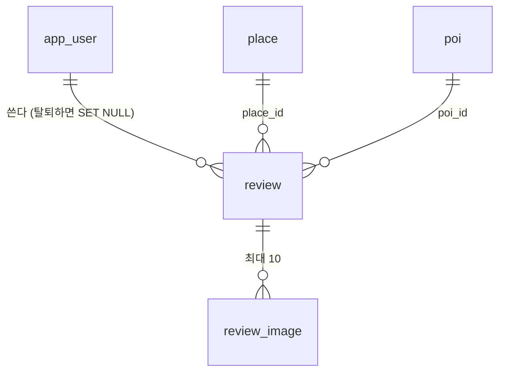

# 리뷰와 별점 — 촬영지·편의시설 상세

상태: 계약 확정 (2026-10-07, MZ2AZ-362, scene-api 1.4.0 — §12). 선행: [place-key-seed.md](./place-key-seed.md)(MZ2AZ-361, PR #142) — 촬영지 적재가 더는
`TRUNCATE ... CASCADE` 로 지우지 않아야 리뷰가 적재 때 사라지지 않는다. 함께 쓰는 것: 사진 업로드(MZ2AZ-352
커뮤니티 여행후기와 같은 창구).

## 1. 무엇을 만드나

촬영지(`place`)와 편의시설(`poi`) 상세 화면에서 사용자가 **별점·글·사진**으로 리뷰를 남기고, 상세 화면은
**평균 별점·리뷰 수·리뷰 목록**을 보여 준다. 상세의 사진첩에는 우리가 넣은 사진 뒤에 **리뷰어가 올린 사진**도
이어서 넘겨 볼 수 있게 한다.

네이버 별점·리뷰 수는 비공식 데이터라 쓰지 않는다(ADR 0011, MZ2AZ-355). 우리 리뷰만으로 0 에서 시작한다.

## 2. 결정 (2026-10-07)

| 항목 | 결정 | 이유 |
| --- | --- | --- |
| 별점 | 1~5 정수 | 반 개는 입력이 번거롭고 차이가 미미하다 |
| 한 사람당 | 대상 하나에 리뷰 **1 개**, 수정 가능 | 한 사람이 여러 번 써서 별점을 올리는 것을 막는다 |
| 쓸 수 있는 사람 | **가입 사용자만** | 스팸·신고 처리, 탈퇴 처리가 분명하다 |
| 글 | 선택 — 별점만 남겨도 된다 | 쓰는 부담이 낮아야 리뷰가 쌓인다 |
| 사진 | 리뷰당 최대 **10 장**, 순서 있음 | 업로드 크기·비용 상한 |
| 촬영지 ↔ 편의시설 | **따로 받는다** — 같은 곳이어도 합치지 않는다 | 실측: 촬영지 93 곳 중 POI 와 같은 곳은 약 15 곳(대부분 관광지). 연결표를 관리할 만큼 많지 않고, 촬영지 리뷰는 「그 장면」 이야기라 성격도 다르다. 나중에 합치려면 연결표를 더하면 된다 |
| 저장 | **한 테이블**(`review`) — 줄마다 `place_id` 나 `poi_id` 중 하나만 | 대상만 다르고 별점·글·사진·수정·신고·탈퇴 처리가 같다. 코드·API 가 한 벌이고 「내가 쓴 리뷰」 가 한 곳에서 나온다 |
| 탈퇴하면 | 리뷰는 **남긴다** — 작성자 연결만 끊고 「탈퇴한 사용자」 로 보인다 | 리뷰는 다른 사용자를 위한 장소 정보다. 탈퇴 때마다 별점이 흔들리지 않고, 쓰고 탈퇴해 기록을 지우는 남용을 막는다 |
| 폐업한 POI · 숨긴 촬영지 | 리뷰를 남긴다 | POI 는 분기 갱신(`--update`)이, 촬영지는 키 적재(MZ2AZ-361)가 id 를 지키고 숨김만 한다 |
| 화면의 별점 | **단순 평균**(소수 한 자리) + 리뷰 수 | 사용자는 실제 리뷰의 평균을 기대한다 |
| 정렬·추천의 별점 | **보정 평균**(§4) | 리뷰 1 개짜리 ★5.0 이 1 등 하는 것을 막는다 |
| 사진첩 | 우리 사진 먼저, 그 뒤 리뷰 사진 최신순 | 첫 장이 썸네일이라 품질이 일정해야 한다 |

> **「촬영지 ↔ 편의시설」 뒤집힘 (2026-10-09, MZ2AZ-371):** 같은 곳이면 연결하고 리뷰는 촬영지 쪽 한 벌을 함께 쓴다 — [place-poi-link.md](./place-poi-link.md).

## 3. 표



### 3-1. `review`

| 칸 | 타입 | 뜻 |
| --- | --- | --- |
| `id` | BIGSERIAL | |
| `place_id` | BIGINT NULL → `place(id)` | 촬영지 리뷰면 찬다 |
| `poi_id` | BIGINT NULL → `poi(id)` | 편의시설 리뷰면 찬다 |
| `user_id` | UUID NULL → `app_user(id)` **ON DELETE SET NULL** | 탈퇴하면 비워진다 — 「탈퇴한 사용자」 |
| `rating` | SMALLINT NOT NULL, CHECK 1~5 | |
| `body` | TEXT NULL, 2,000 자 이하 | 글. 없어도 된다 |
| `lang` | lang_code NULL | 쓴 언어(앱 언어). 번역은 하지 않는다 — 나중에 「원문 / 번역」 을 붙일 자리 |
| `created_at` · `updated_at` | TIMESTAMPTZ | 수정하면 `updated_at` 만 바뀐다 |
| `removed_at` | TIMESTAMPTZ NULL | 운영자가 내린 때. 찬 리뷰는 어디에도 나오지 않고 평균에서 빠진다 |

제약:

- **대상은 정확히 하나** — `CHECK ((place_id IS NULL) <> (poi_id IS NULL))`. 둘 다 차거나 둘 다 빈 줄은 DB 가 거부한다.
- **한 사람 한 개** — `UNIQUE (user_id, place_id)` · `UNIQUE (user_id, poi_id)`. 탈퇴로 `user_id` 가 빈 줄끼리는 겹쳐도 된다(NULL).
- `place_id` · `poi_id` 의 FK 는 `ON DELETE CASCADE` 로 두지만, 둘 다 지워지지 않는다 — 촬영지는 숨기고 POI 는 폐업 표시만 한다. 지워지는 것은 `--prune`(출처를 통째로 바꿀 때)뿐이다.
- 색인: `(place_id, created_at DESC) WHERE removed_at IS NULL`, `(poi_id, created_at DESC) WHERE removed_at IS NULL`, `(user_id)`.

### 3-2. `review_image`

| 칸 | 타입 | 뜻 |
| --- | --- | --- |
| `id` | BIGSERIAL | |
| `review_id` | BIGINT → `review(id)` ON DELETE CASCADE | 리뷰를 지우면 사진도 |
| `url` | TEXT NOT NULL | 업로드한 파일의 주소(§6) |
| `sort_order` | SMALLINT NOT NULL, CHECK 0~9 | 리뷰 안의 순서. 10 장 상한을 DB 도 지킨다 |

`UNIQUE (review_id, sort_order)`. 「대표」 칸은 두지 않는다 — `place_image` · `poi_image` 와 같이 첫 장이 대표다.

### 3-3. 기존 표는 그대로

`place_image` · `poi_image`(우리가 넣은 사진)는 바꾸지 않는다. 사진첩은 둘을 **보여 줄 때 합친다**(§5).

## 4. 별점 계산

**화면에 보이는 값 — 단순 평균.** `round(avg(rating), 1)` 과 `count(*)`, 그리고 1~5 점 분포. `removed_at` 이 찬 리뷰는 뺀다.
탈퇴한 사용자의 리뷰는 넣는다(남기기로 했다).

**정렬·추천에 쓰는 값 — 보정 평균(베이지안 평균).**

```
보정 평균 = (m × C + 별점 합) ÷ (C + 리뷰 수)
  m = 같은 종류 대상 전체의 평균 별점 (촬영지끼리, POI 끼리 따로)
  C = 5  — 「모든 대상이 m 점짜리 가상 리뷰 5 개를 갖고 시작한다」
```

리뷰가 적으면 m 쪽으로 당겨지고, 많으면 자기 평균에 가까워진다. 예) m = 4.0 일 때 ★5 하나 → 4.17, 평균 4.6 짜리
200 개 → 4.59. C 는 리뷰가 쌓인 뒤 다시 정한다. 화면에는 보정 평균을 보이지 않는다.

**언제 계산하나 — 요청 때 바로.** 리뷰 수가 적을 동안은 `review` 를 대상별로 모아도 빠르고, 합계 표를 두면 생기는
「합계와 원본이 어긋나는」 문제가 없다. 지도처럼 여러 대상의 별점을 한 번에 그려야 하거나 느려지면 그때 대상별 합계 표
(`review_summary`)를 둔다 — 그때도 원본은 `review` 다.

이번 범위에서 보정 평균을 쓰는 곳은 없다. 「별점순」 정렬(`sort=rating`)이 생길 때 쓴다 — 계산식만 여기 정해 둔다.

## 5. 사진첩 — 우리 사진 + 리뷰 사진

상세 응답에 사진 칸을 **새로 더한다.** 기존 칸은 앱이 쓰고 있어 그대로 둔다(편의시설 `displayName` 때와 같은 방식,
poi-i18n-image.md §13-4).

```yaml
photos:            # 새 칸 — PlaceDetail · PoiDetail
  - url: https://…   source: official                     # place_image · poi_image
  - url: https://…   source: review     reviewId: 81      # review_image, 최신 리뷰부터
photoCount: 57     # 전체 수 — 「사진 전체 보기 (57)」
```

- 순서: 우리 사진(`sort_order`) → 리뷰 사진(리뷰 `created_at` 최신순, 리뷰 안에서는 `sort_order`).
- 상세에는 **앞 20 장**만 싣는다. 나머지는 `GET /v1/places/{id}/photos?offset=` 로 넘겨 받는다(POI 도 같다).
- 리뷰를 지우거나 운영자가 내리면 그 사진도 빠진다. 작성자가 탈퇴해도 남는다.
- 앱은 `source: review` 사진에 작게 「방문자 사진」 을 붙이고, 누르면 `reviewId` 의 리뷰로 간다.
- 기존 칸: 촬영지 `imageUrls`(우리 사진만) · 편의시설 `images`(우리 사진만)는 그대로 둔다. 앱이 `photos` 로 옮기면 뺀다.

## 6. 사진 올리기

앱이 서버를 거치지 않고 저장소(S3)에 바로 올린다 — 서버는 **미리 서명한 주소(presigned PUT)** 만 준다.

```
1. 앱 → POST /v1/uploads {purpose: review, contentType, bytes}   서버가 크기·형식 확인
2. 서버 → {uploadUrl, url, expiresAt}                          10 분짜리 서명 주소
3. 앱 → PUT uploadUrl (사진 파일)                              S3 에 바로
4. 앱 → PUT /v1/places/{id}/reviews/me {rating, body, photos: [url…]}
5. 서버: url 이 우리 버킷·이 사용자 앞으로 발급한 것인지 확인하고 review_image 에 넣는다
```

- 한 장 10 MB 이하, `image/jpeg` · `image/png` · `image/heic` · `image/webp`. 앱이 올리기 전에 줄인다(긴 변 2,048 px 권장).
- 올리고 리뷰에 쓰지 않은 파일은 하루 뒤 지운다(버킷 수명 규칙).
- **MZ2AZ-352(커뮤니티 여행후기)와 같은 창구다.** `purpose` 로 나눈다. 둘 중 먼저 하는 쪽이 만든다.
- **로컬(kind)에는 S3 가 없다** — 정할 것 §10-1.

## 7. API 초안

모두 `/v1`. 읽기는 비회원도, 쓰기는 가입 사용자만 — 토큰이 반드시 있어야 하는 `/me` 창구와 같은 규칙이다(토큰이 없으면
401 `ACCESS_TOKEN_INVALID`, `CurrentAccount`). `{target}` 은 `places/{placeId}` 또는 `pois/{poiId}` 다 — 같은 모양을 두 벌 둔다.

| 메서드 · 경로 | 하는 일 |
| --- | --- |
| `GET /{target}/reviews?sort=recent\|rating_high\|rating_low&limit&offset` | 리뷰 목록 + 요약(`average` · `count` · `distribution[1..5]`) |
| `GET /{target}/reviews/me` | 내 리뷰(없으면 404) — 쓰기 화면을 채운다 |
| `PUT /{target}/reviews/me` | 내 리뷰 쓰기·고치기(있으면 고친다). 사진은 목록 통째로 바꾼다 |
| `DELETE /{target}/reviews/me` | 내 리뷰 지우기(사진도) |
| `GET /me/reviews` | 내가 쓴 리뷰 전부(촬영지·편의시설 섞어서, 최신순) |
| `GET /{target}/photos?offset&limit` | 사진첩 전체(§5) |
| `POST /uploads` | 올릴 주소 받기(§6) |

상세 응답(`PlaceDetail` · `PoiDetail`)에 더하는 칸: `rating: {average, count}`(리뷰가 없으면 `count: 0`, `average: null`),
`photos`, `photoCount`. 목록·지도 응답에는 이번에 넣지 않는다 — 필요해지면 그때(§4 의 합계 표와 함께).

리뷰 한 줄: `id` · `rating` · `body` · `photos[]` · `createdAt` · `updatedAt` · `author: {displayName} | null`(탈퇴면 null —
앱이 「탈퇴한 사용자」) · `isMine`. 작성자 이름은 지금 계정에 닉네임이 없어 정해야 한다(§10-2).

## 8. 탈퇴·합치기와의 관계

- **탈퇴(`DELETE /v1/me`)** — 지금은 「계정과 그 계정의 모든 것을 지운다」 다. 리뷰만 예외가 된다: `user_id` 가 비워지고
  글·별점·사진은 남는다. **계약 설명을 고친다**: 「작성한 리뷰는 작성자 표시 없이 남는다. 지우려면 탈퇴 전에 지운다」.
  앱의 탈퇴 확인 화면과 **개인정보처리방침·이용약관**에도 같은 문장이 있어야 한다(출시 전 법률 멘토 확인).
- **리뷰 사진을 사진첩에 보이는 것**은 이용약관에 「올린 사진을 서비스 안에서 보여 줄 수 있다」 가 필요하다.
- **합치기**(비회원 → 로그인, social-login.md) — 리뷰는 가입 사용자만 쓰므로 비회원 쪽에는 리뷰가 없다. 가입 계정끼리
  합쳐지는 길이 생기면 그때 리뷰를 옮기고, 같은 대상에 둘이면 최근 것을 남긴다.
- **탈퇴한 사람의 리뷰는 아무도 고칠 수 없다** — 운영자 내림(`removed_at`)이 유일한 길이다.

## 9. 운영자 내림·신고

이번 범위는 **운영자 내림만**: `removed_at` 을 채우는 운영 창구(또는 운영 대시보드 MZ2AZ-357 에서 SQL). 사용자 신고
(`review_report`)는 리뷰가 쌓인 뒤 따로 한다 — 표와 API 가 독립이라 나중에 더해도 이 설계를 바꾸지 않는다.

## 10. 정할 것

1. **로컬 저장소** — kind 에는 S3 가 없다. (가) 클러스터에 MinIO 를 띄워 S3 와 같은 API 로 쓴다, (나) 로컬만 서버가 직접
   받아 파일로 둔다. (가)가 운영과 같은 코드 경로라 낫다.
2. **작성자 표시 이름** — `app_user` 에 닉네임이 없다. 소셜 로그인 이름을 쓰면 실명이 드러날 수 있다. 닉네임 칸을 더할지,
   「여행자 #1234」 처럼 만들지.
3. **리뷰 목록의 언어** — 모든 언어의 리뷰를 섞어 보일지, 앱 언어의 리뷰를 먼저 보일지. 처음엔 섞고 최신순을 제안한다.

## 11. 순서

```
0. MZ2AZ-361 머지                — 적재가 리뷰를 지우지 않게 (선행)
1. 계약(contracts/openapi)        — 리뷰 창구, 상세의 rating·photos, 업로드, 탈퇴 설명
2. V21 마이그레이션               — review · review_image
3. 서버 — 리뷰 읽기·쓰기, 상세의 별점·사진첩
4. 업로드 창구 + 저장소(§10-1)    — MZ2AZ-352 와 함께
5. 앱 티켓(iOS 먼저)              — 상세의 별점·리뷰 목록·쓰기, 사진첩의 「방문자 사진」, 탈퇴 안내 문구
```

## 12. 덧붙임 (2026-10-07) — 정한 것과 계약 1.4.0

§10 의 셋을 정했다.

1. **저장소 — 사용자 사진 전용 버킷을 새로 만든다:** `scenetrip-user-media-dev` · `scenetrip-user-media-prod`.
   성지 사진 버킷(`scene-media-prod`)은 쓰지 않는다 — 운영 버킷에 개발 시험 사진이 섞이고, 우리가 고른 사진과
   누가 올릴지 모르는 사진에 같은 삭제·공개 규칙을 걸 수 없어서다. 둘 다 비공개이고, 키 앞부분으로 규칙을 건다:
   `uploads/tmp/` 는 하루 뒤 지운다, `reviews/` 는 남긴다(커뮤니티는 `community/`). 키 끝은 UUID 다. 버킷은
   Terraform 에 적어 만든다. **로컬(kind)도 MinIO 를 띄우지 않고 dev 버킷을 쓴다** — 팀원은 dev 버킷 전용 키를 둔다.
   보여 줄 때는 서버가 **한 시간짜리 서명된 주소**를 준다(앱은 저장하지 않는다).
2. **작성자 이름 — 닉네임:** `app_user.nickname` 을 더한다. 가입할 때 서버가 `여행자12345` 꼴로 자동으로
   붙이고(`nickname_confirmed = false`), **앱은 로그인 직후 `nicknameConfirmed` 가 `false` 면 닉네임 정하기
   화면을 띄운다**(건너뛸 수 있다). `PUT /me/nickname` — 2~16 자, 한글·영문·숫자·`_`, 대소문자 무시 유일.
   소셜 이름(`displayName`)은 실명일 수 있어 남에게 보이지 않는다. 커뮤니티(MZ2AZ-352)도 이 닉네임을 쓴다.
3. **리뷰 언어 — 섞는다**, 최신순. 번역하지 않는다.

**계약(scene-api 1.4.0)** — 다 더하기만 했다. 이미 나가 있는 앱은 그대로 돈다.

| 무엇 | 계약 |
| --- | --- |
| 닉네임 | `Me.nickname` · `Me.nicknameConfirmed`, `PUT /me/nickname`(`NICKNAME_INVALID` 400 · `NICKNAME_TAKEN` 409) |
| 리뷰 | `GET /{places,pois}/{id}/reviews`(목록 + `summary`) · `GET·PUT·DELETE …/reviews/me` · `GET /me/reviews` |
| 상세 | `PlaceDetail` · `PoiDetail` 에 `rating`(단순 평균·수·분포) · `photos`(앞 20) · `photoCount` |
| 사진첩 | `GET /{places,pois}/{id}/photos` — 우리 사진 먼저, 리뷰 사진 최신순 |
| 올리기 | `POST /uploads` → `key` · `uploadUrl`(10 분) · `requiredHeaders`, 리뷰는 `photoKeys` 로 붙인다 |
| 탈퇴 | `DELETE /me` 설명: 리뷰는 작성자 표시 없이 남는다 |

§7 초안과 다른 점: 리뷰 사진은 주소가 아니라 **키**(`photoKeys`)로 붙인다 — 보여 줄 주소가 한 시간마다 바뀌어
고칠 때 남길 사진을 주소로는 가리킬 수 없어서다.

## 13. 덧붙임 (2026-10-08) — 사진 올리기와 버킷의 자리

**버킷은 bootstrap 에 둔다(항상 떠 있다).** dev 는 비용 때문에 내릴 때 `platform/terraform/aws` 를 통째로 지운다
(RDS 도 지우고 최종 스냅샷만 남긴다). 버킷을 거기 두면 내릴 때마다 사진이 사라지고, **그 dev 버킷을 쓰는 로컬
kind 의 리뷰 사진까지 깨진다**(로컬 DB 는 남으므로). 그래서 state 버킷처럼 bootstrap(`DeletionPolicy: Retain`)에
둔다. 비용은 사진 몇 GB 에 월 수백 원 — 아끼려는 EKS·NAT·RDS 와 단위가 다르다. dev·prd 는 버킷이 따로다.
기존 성지 사진 버킷 `scene-media-prod` 는 손대지 않는다(코드로 관리하는 일은 MZ2AZ-364).

| 자리 | 무엇 |
| --- | --- |
| bootstrap | `UserMediaBucket`(비공개·TLS·`uploads/tmp/` 하루 뒤 삭제) · `MediaRole`(`scenetrip-<env>-media`, Pod Identity 신뢰, 두 접두사만) · 배포 역할에 Pod Identity 연결·역할 전달 권한 |
| Terraform | `aws_eks_pod_identity_association` — 서비스 계정 `scene-api` ↔ `-media` 역할. 버킷 이름 출력 |
| Helm | 서비스 계정 `scene-api`, ConfigMap `SCENETRIP_MEDIA_BUCKET` |
| 로컬 | `.env` 의 `SCENETRIP_MEDIA_*`(dev 버킷 전용 IAM 사용자) → `just secrets-apply` |
| 서버 | `POST /uploads` → `uploads/tmp/<uuid>.<확장자>` 10 분 서명 PUT(형식·크기 서명). 리뷰에 붙일 때 `reviews/` 로 옮긴다(수명 규칙을 피한다). 기록은 `photo_upload`(V22) |

배포 역할의 인라인 정책은 IAM 한도(10,240 자)에 거의 찼다(9,703 → 10,057). bootstrap 역할은 관리형 정책·IAM
사용자를 만들 수 없어, 권한은 기존 문장에 자원·동작을 더하는 식으로 넣었다. 로컬용 IAM 사용자와 bootstrap 역할의
버킷 권한은 계정 관리자가 한 번 만든다(`docs/ops/aws-deployment.md` §12).

계약 1.4.0 을 고쳤다(앱이 아직 붙기 전): `UploadCreate.contentType` 을 enum 이 아닌 문자열로, `bytes` 의 최댓값을
설명으로 — 형식·크기 위반도 `UPLOAD_TYPE_UNSUPPORTED`·`UPLOAD_TOO_LARGE` 로 답하려고(제약을 계약에 두면 생성 코드가
먼저 `INVALID_PARAMETER` 로 막는다). 저장소가 없는 서버는 `503 UPLOAD_UNAVAILABLE`.

## 14. 덧붙임 (2026-10-07) — 로컬은 MinIO

§13 은 로컬 kind 도 dev 버킷을 쓰고, 이 버킷 전용 IAM 사용자 키를 팀원에게 나눠 주기로 했다. **이 AWS 계정은 조직
정책(SCP `p-31hler8p`)이 IAM 사용자 생성을 막는다** — 관리자 사용자로도, 9 월에 사용자를 만들었던 SSO 로그인으로도
`iam:CreateUser` 가 explicit deny 다(2026-10-07 실측. 9 월의 세 사용자는 그 전에 만들어졌다). 샌드박스(Innovation
Sandbox) 계정이라 정책이 바뀐 것으로 보이며 우리 쪽에서는 볼 수 없다.

그래서 **로컬은 클러스터 안의 MinIO(S3 와 같은 API 를 내는 저장소)를 쓴다.** 팀원은 따로 설치하지 않는다 — postgres 처럼
`just stack-up` 이 띄우고 버킷도 만든다. DEV·PRD 는 바뀌지 않는다(진짜 S3 + Pod Identity, IAM 사용자가 필요 없다).

| | 로컬 | DEV · PRD |
| --- | --- | --- |
| 저장소 | MinIO (`platform/kubernetes/minio`, 이미지 `chainguard/minio`) | S3 `scenetrip-user-media-…-<env>` |
| 서버가 부르는 주소 | `http://minio:9000` (클러스터 안 이름) | S3 기본 |
| 앱에 주는 서명된 주소 | `http://<앱이 서버를 부른 호스트>:9000` | S3 주소 |
| 자격 증명 | MinIO 로컬 고정값(ConfigMap) | Pod Identity |

**앱용 주소가 따로인 이유.** 서명된 주소에는 호스트가 서명돼 들어가 앱이 고칠 수 없다. 서버에게 MinIO 는 `minio:9000`
이지만 그 이름은 클러스터 밖(시뮬레이터·폰)에서 보이지 않는다. kind 가 호스트 9000 을 MinIO 의 NodePort 30090 에 잇고
(`platform/kind/cluster.yaml` — 클러스터를 만들 때만 정할 수 있어 기존 클러스터는 한 번 새로 만든다), 서버는 앱이 자신을
부른 호스트에 9000 을 붙여 서명한다 — iOS 시뮬레이터 `localhost`, 안드로이드 에뮬레이터 `10.0.2.2`, 같은 와이파이의 폰은
맥의 IP. 설정: `scenetrip.media.endpoint` · `public-port` · `access-key` · `secret-key`(로컬 ConfigMap 만).

**MinIO 공식 이미지를 못 쓴다.** `minio/minio`·`quay.io/minio/minio` 를 더 받을 수 없어(2026-10-07) Chainguard 가 같은
소스로 빌드한 멀티아키텍처 이미지를 다이제스트로 고정했다.

IAM 사용자를 다시 만들 수 있게 되면 로컬도 dev 버킷을 쓸 수 있다 — 서버 코드는 그대로이고 로컬 ConfigMap 의 endpoint ·
public-port 를 비우고 키를 바꾸면 된다. 그때 키를 나눠 줄지는 그때 정한다.
