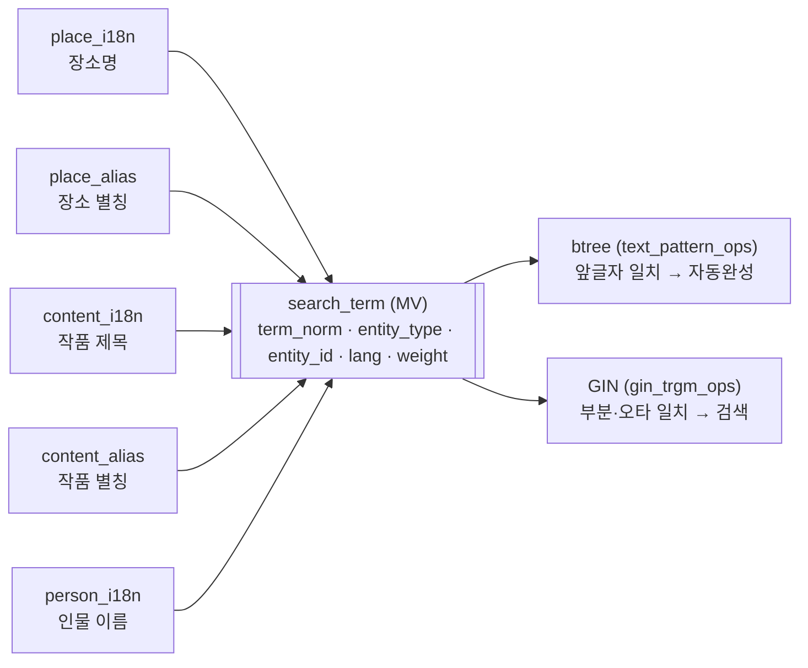

# 검색·지도 백엔드 API 구현 계획 (MZ2AZ-149)

- **티켓**: [MZ2AZ-149](https://mz2az.atlassian.net/browse/MZ2AZ-149) — 에픽 MZ2AZ-106 "검색·지도"
- **브랜치**: `MZ2AZ-149-검색지도-백엔드-api`
- **작성일**: 2026-08-04
- **상태**: 진행 중

---

## 1. 무엇을 만드는가

앱의 **작품검색 탭**을 받치는 서버 API. 목업([MZ2AZ-116](https://mz2az.atlassian.net/browse/MZ2AZ-116))이
그리는 `작품 → 촬영지 → 장면` 3단 드릴다운과 지도 핀을 데이터로 채운다.

하위 티켓과 산출물의 대응:

| 티켓 | 내용 | 산출물 |
| --- | --- | --- |
| MZ2AZ-165 | API 명세서 작성 | `contracts/openapi/scene-api-v1.yaml` |
| MZ2AZ-166 | 작품 검색 — 자동완성 포함 | `GET /search/suggestions`, `GET /contents` |
| MZ2AZ-167 | 지도 뷰포트 기준 장소 조회 | `GET /places?bbox=` |
| MZ2AZ-168 | 작품별 조회 / 장소 조회 | `GET /contents/{id}/places`, `GET /places` |
| MZ2AZ-169 | 작품·장소 상세 정보 조회 | `GET /contents/{id}`, `GET /places/{id}` |
| MZ2AZ-170 | 장바구니 담기 | `GET/POST/DELETE /cart` |
| MZ2AZ-171 | 인기도 기반 상위 N개 핀 | 모든 목록의 기본 정렬 + `limit` + `total` |

**순서는 165 가 먼저다.** [AGENTS.md §6](../../../AGENTS.md) 이 "통신 형식이 바뀌면
`contracts/` 를 먼저 고치고 그 스텁에 맞춰 구현한다" 고 규정하고, 티켓 165 도
"프론트에 우선 전달" 이라고 같은 말을 한다. 명세가 프론트(정승길)와 서버가 공유하는
유일한 합의점이므로 이것이 늦으면 양쪽이 동시에 막힌다.

## 2. 이 티켓의 범위 밖

| 항목 | 어디로 갔나 |
| --- | --- |
| `services/scene-api/` 모듈 생성, Bazel `rules_java` 연결, 클러스터 배포 | [MZ2AZ-181](https://mz2az.atlassian.net/browse/MZ2AZ-181) (MZ2AZ-157 하위) |
| OpenTelemetry 연결, SigNoz 확인 | [MZ2AZ-182](https://mz2az.atlassian.net/browse/MZ2AZ-182) |
| 루트(코스) 만들기 | 스프린트 결정 — 장바구니는 담기까지만 |
| 개인 맞춤 추천, 로그인 | 사용자 테이블이 없어 보류 (스프린트 §3-4) |
| 커뮤니티, 마이페이지, AI 가이드 채팅 | 별도 에픽 |

## 3. 확정된 전제

스프린트 회의(2026-08-03)에서 정해진 것:

- 자동완성을 넣는다. DB 조회는 **단순 단어 매칭** — RAG 는 AI 기능 단계에서 쓴다.
- 전체 화면 검색은 핀이 너무 많으므로 **인기도 순 상위 N개만** 표시한다.
- 장바구니는 **담아 두는 것까지만**.
- 이미지는 전부 **링크 방식** — 최종적으로 S3 로 가되 지금부터 흐름을 맞춰 둔다.
- DBML 문서([MZ2AZ-111](https://mz2az.atlassian.net/browse/MZ2AZ-111))를 기준으로 삼는다.

이 계획을 세우면서 추가로 정한 것:

| 결정 | 내용 | 이유 |
| --- | --- | --- |
| 프로토콜 | OpenAPI (REST) | `contracts/openapi/README.md` — iOS·Android 클라이언트가 이 파일로부터 생성된다. proto 는 서버 간 통신용이라 여기 해당 없음 |
| 서비스 이름 | `scene-api` | `justfile` 예시와 SigNoz 기본 서비스명(`scenetrip-scene-api`)이 이미 이 이름을 쓴다 |
| 장면 모델 | `place_content` 그대로 (장소 ↔ 작품 N:M, 쌍 하나에 장면 설명 하나) | 스키마 v1 을 건드리지 않는다. [MZ2AZ-116 §5.3 논점1](https://mz2az.atlassian.net/browse/MZ2AZ-116) 의 (A) |
| 응답 언어 | `Accept-Language` 헤더, 없거나 데이터가 없으면 `ko` 로 폴백 | HTTP 표준. 모든 엔드포인트에 일관되게 걸린다 |
| 장바구니 주체 | `X-Device-Id` 헤더의 기기 UUID | 사용자 테이블이 없다. 로그인이 생기면 이 UUID 를 실제 `user_id` 에 이어 붙인다 |
| 카테고리 | **장소 / 작품 둘로만** 나눈다 | 수집 데이터의 `place_type` 이 37종 자유 문자열이고 아직 정제 전이다. 목업의 칩 6개로 묶는 매핑은 정제 후에 정한다 |
| 필드 선택 | 데이터가 실제로 있는 것만 명세에 넣는다 | 명세가 거짓말을 하지 않게 한다. 없는 필드는 §6 에 목록으로 남긴다 |
| 인기도 | v1 은 **적재 시 임의로 고정한 값**. 점수는 응답에 넣지 않고 정렬에만 쓴다 | 사용자 행동 기반 계산은 로그가 쌓인 뒤의 일이다. 의미 없는 숫자를 계약에 넣으면 프론트가 그 값에 기대게 되고, 나중에 진짜 계산이 붙을 때 계약을 고쳐야 한다 |

## 4. 데이터의 실체

V6 CSV(`촬영지_TOP_v6_정예4작품.csv`) 실측 — **작품 4편 · 촬영지 164행**.

| 컬럼 | 상태 |
| --- | --- |
| `title`, `title_aliases` | 채워짐. 별칭에 영어 표기가 있다 — `Queen of Tears`, `Goblin`, `Itaewon Class`, `케데헌` |
| `title_year`, `title_genre` | 채워짐 — 2016/2020/2024/2025, `로맨스`·`판타지;멜로` 등 |
| `title_network`, `title_category` | 채워짐 — tvN/JTBC/넷플릭스, drama 153 · movie 11 |
| `title_cast`, `director` | 채워짐 |
| `place_name`, `place_address`, `place_latitude`, `place_longitude` | 채워짐. **전부 한국어 표기뿐** |
| `place_type` | 채워짐이나 **37종 자유 문자열** (음식점 24 · 거리 15 · 명소 14 …) |
| `place_image_url`, `place_naver_url`, `poster_url` | 채워짐 |
| `scene_description` | 채워짐 |
| `famous_rank` | 164행 중 11행 빔 |
| `recent_rank`, `audience_acc` | **전량 빔** |
| `award` | 164행 중 153행 빔 |

두 가지가 여기서 직접 결정을 강제했다.

**작품은 영어로 검색되지만 장소는 안 된다.** 작품에는 영어 별칭이 있고 장소명에는
없다. "자동완성 입력 언어는 영어" 라는 확정 사항이 절반만 성립한다. v1 은 이 한계를
명세에 적어 두고, 장소 영문명 확보는 별도 작업으로 넘긴다(§7).

**데이터는 아직 정제 전이다.** 초기 적재는 V6 전량이 아니라 **소수 샘플만** 넣어
API 동작 확인용으로 쓴다. 전량 적재는 정제 완료 후.

## 5. 검색이 동작하는 원리

검색 하나로 **장소 · 작품 · 인물 · 별칭**이 전부 걸려야 한다. 스키마가 이미 이걸
하도록 설계돼 있다 — `search_term` 은 테이블이 아니라 **MATERIALIZED VIEW** 이고,
다섯 곳을 `UNION ALL` 로 합쳐 놓은 것이다.



조회 한 번이면 네 종류가 다 나온다. 각 행이 `entity_type`(place/content/person)과
`entity_id` 를 들고 있으므로, 자동완성 항목을 누르면 어디로 보낼지가 응답 안에 이미 있다.

### 자동완성과 목록 검색은 범위가 다르다

**설명·줄거리는 `search_term` 에 넣지 않는다.** 두 가지 이유가 있다.

`term_norm` 은 "소문자 + 공백·특수문자 제거" 로 정규화한다. 짧은 이름을 앞글자
btree 로 찾기 위한 형태다(`Queen of Tears` → `queenoftears`). 46 자짜리 문장을
같은 규칙으로 넣으면 공백 없는 덩어리가 되어 앞글자 매칭이 의미를 잃는다.

더 근본적으로, 자동완성은 한 줄짜리 제안이다. "이 작품 줄거리 어딘가에 그 낱말이
있습니다" 를 드롭다운에 표시할 방법이 없다.

그래서 이렇게 나눈다.

| | 검색 대상 |
| --- | --- |
| `GET /search/suggestions` | 이름 · 별칭만 (`search_term`) |
| `GET /contents?q=` | 작품 제목·별칭 · 인물 이름 · **작품 설명**(`content_i18n.description`) |
| `GET /places?q=` | 장소명·별칭 · **장소 설명**(`place_i18n.description`) · 등장 작품 제목 |

목록 검색의 설명 부분은 `search_term` 이 아니라 원본 테이블의 텍스트 컬럼을
직접 훑는다. 한국어는 조사가 붙어("한강**에서**") PostgreSQL 기본 전문검색이
잘 잡지 못하므로, 스키마가 이미 쓰는 `pg_trgm` 의 부분 문자열 매칭을 쓴다 —
형태소와 무관하게 걸린다.

### 장면 설명은 검색 대상이 아니다

`place_content_i18n.relation_description`(장면 설명)은 넣지 않는다. 장면은 장소와
작품 **사이**에 붙은 값이라, 어느 한쪽 탭의 검색 대상으로 삼으면 경계가 흐려진다.
각 탭은 자기 엔티티의 이름과 설명만 본다.

검색어 하나로 두 탭이 동시에 채워지는 구조다 — 사용자가 탭을 먼저 고르지 않는다.
`도깨비` 를 치면 작품 탭에는 작품이, 장소 탭에는 그 작품의 촬영지가 나온다.
그래서 `GET /places?q=` 는 등장 작품의 제목·별칭에도 걸린다. 이것이 없으면
장소 탭이 빈 화면이 된다.

**노이즈는 정렬과 페이지네이션으로 흡수한다.** 설명까지 뒤지면 흔한 낱말은 결과가
많아진다. 결과를 줄이려 애쓰지 않고 인기도 내림차순으로 정렬한 뒤 `limit`·`offset`
으로 나눠 보낸다. 프론트는 위에서부터 필요한 만큼만 받아 무한 스크롤로 잇는다.

### 데이터 편차 — 설명 검색은 당분간 걸리지 않는다

검색 대상으로 정한 두 컬럼의 실제 상태다.

| 텍스트 | 상태 |
| --- | --- |
| 작품 설명 (`content_i18n.description`) | MVP 4 작품 중 1 개만 (작품마스터 전체로도 476 중 12) |
| 장소 설명 (`place_i18n.description`) | 스키마에는 있으나 **수집 컬럼 자체가 없음** |

**그래도 명세에 적는다.** 데이터가 채워질 때 계약을 바꾸지 않기 위해서다. 다만
지금 상태에서 설명 검색은 사실상 아무것도 잡지 못하고, **검색은 이름·별칭·인물
매칭으로만 동작한다.** 프론트가 "설명으로 검색되는데 결과가 안 나온다" 고 볼 수
있으므로 전달할 때 함께 알린다.

두 설명을 채우는 것이 검색 품질의 실질적 선결 조건이다 — 별도 작업(§7).

참고로 장면 설명(`scene_description`)은 164/164 채워져 있고 `감자탕`, `데이트 장소`
처럼 검색어로서 값어치가 높은 낱말을 담고 있다. 검색 대상에서 뺀 것은 데이터가
없어서가 아니라 **소속이 애매해서**다. 나중에 검색 품질이 문제가 되면 다시 논의할
소재다.

`lang` 컬럼은 라틴 문자 별칭에 `NULL` 이 들어간다(스키마 주석: 한글 ko / 가나 ja /
한자 zh-Hant / 라틴 NULL — 문자 범위로 자동 판별). 그래서 `Accept-Language: en` 인
요청은 `lang = 'en' OR lang IS NULL` 로 걸러야 영어 별칭이 잡힌다. 이 규칙을 놓치면
`Queen of Tears` 가 검색되지 않는다.

적재나 인기도 재계산 후에는 `REFRESH MATERIALIZED VIEW CONCURRENTLY` 가 필요하다.

**인물 검색의 착지점** — 인물은 자동완성 제안에는 뜨지만 목록 카테고리는 아니다
(카테고리는 장소·작품 둘뿐). 인물을 검색하면 **그 인물의 작품 목록**이 나온다.

경로가 둘이고 **둘 다 열어 둬야 한다.** 하나만 열면 절반이 빈 화면이 된다.

| 사용자 행동 | 호출 | 비고 |
| --- | --- | --- |
| 자동완성 제안에서 인물을 누름 | `GET /contents?personId=7` | 인물을 정확히 지목. 동명이인에 안전 |
| 이름을 다 입력하고 검색 | `GET /contents?q=공유` | `q` 가 인물 이름에도 걸려야 한다 |

두 번째를 처음에 빠뜨렸다. 자동완성만 생각했는데, 이름을 끝까지 치고 엔터를 누르는
것이 더 흔한 행동이고 목업의 검색창 안내도 `작품, 배우, 장면 검색` 이다.

그래서 `GET /contents` 의 `q` 는 **작품 제목 · 작품 별칭 · 인물 이름** 셋에 걸린다.
`search_term` 에서 `q` 로 걸린 행 중 `entity_type='person'` 인 것은 `content_cast`
를 타고 작품으로 바꾼 뒤, `entity_type='content'` 결과와 합쳐 중복을 제거하고
인기도순으로 정렬한다.

## 6. 명세에 넣지 않은 필드

목업에는 있으나 데이터 소스가 없어 v1 에서 뺀 것들. [MZ2AZ-116 §5.2](https://mz2az.atlassian.net/browse/MZ2AZ-116) 의 갭 목록과 대응한다.

| 목업 요소 | 뺀 이유 |
| --- | --- |
| 신뢰도 % · 검수 완료 배지 · 제보 N건 | 대응 테이블도, 수집 데이터도 없다 |
| 루트 N개 · 루트 마켓 | `route` 테이블이 없고 루트는 범위 밖 |
| 회차 · 타임코드 (`2화 34분`) | CSV 에 컬럼이 없다 |
| 명대사 | CSV 에 없고 저작권 논점이 미결(§5.3-4) |
| 장면 스틸 | `scene_image_url` 은 CSV 에 있으나 저작권 미결로 스키마에 미도입 |
| 운영 시간 · 가는 방법 | 수집 소스가 없다 |
| 촬영 앵글 팁 | 수집 소스가 없다 |
| 촬영 순서 번호 | `place_content` 에 순서 컬럼이 없다. 목록은 인기도순으로 내려주고 번호는 프론트가 배열 순서로 매긴다 |
| 장소 카테고리 칩 6종 | `place_type` 37종의 정제·매핑 전 |

**프론트에 전달할 때 이 표를 같이 준다.** 목업에 그려져 있으나 v1 응답에 없는
필드이므로, 화면에서 빼든 자리를 비우든 프론트가 판단할 수 있어야 한다.

반대로 `title_year`·`title_genre` 는 데이터가 실제로 있으므로 **명세에 넣는다.**
다만 DB 스키마 v1 의 `content` 에는 대응 컬럼이 없다 — `release_year INT` 와
`genre` 두 컬럼 추가가 필요하다(§7).

## 7. 후속 결정 사항

이 계획을 세우며 드러난, 아직 답이 없는 것들.

| # | 항목 | 성격 |
| --- | --- | --- |
| 1 | `content.release_year` · `content.genre` 컬럼 추가 | 스키마 v1 변경. 데이터가 있고 목업이 요구하므로 실행 대상이나, MZ2AZ-111 확정본을 건드리므로 별도 티켓 |
| 2 | 장소 영문명 확보 | 로마자 자동 변환 vs 네이버·구글에서 실제 영문명 수집. 후자가 낫지만 수집 작업 |
| 3 | `place_type` 37종 → 카테고리 매핑 | 데이터 정제 완료 후 |
| 4 | ~~OpenAPI 명세 검증기~~ | **해결됨(§9).** Node 도구가 필요하다고 적었던 것은 오판이었다 — 생성기 JAR 에 검증이 내장돼 있다. 생성 타깃이 곧 검사기다 |
| 5 | 앱 클라이언트 생성 (`swift5` · `kotlin`) | 서버 인터페이스(`spring`)는 붙였다(§9). 앱 타깃은 `apps/` 에 모듈이 생길 때 추가한다 — 지금 붙이면 컴파일해 볼 대상이 없다 |
| 6 | 오류 응답 형식 문서 | `docs/api/errors.md` 가 아직 없다. 명세의 `Error` 스키마를 정본으로 삼고 문서를 뒤따라 쓴다 |
| 7 | 인기도 실제 계산 | v1 은 고정값이다. `user_event` 에 조회·검색·저장 로그가 쌓인 뒤 배치로 계산한다. 스키마 주석대로 `impression` 과 `position` 은 **소급 수집이 불가능**하므로 이벤트 적재는 처음부터 포함해야 한다 |

## 8. 작업 순서

```
[완료] 계획 문서 (이 파일)
  ↓
[완료] just new-contract 스캐폴딩 구현 — 스텁 해제
  ↓
[완료] contracts/openapi/scene-api-v1.yaml          ← MZ2AZ-165, 프론트 전달
  ↓
[완료] 생성·검증 타깃 연결 (spring)                  ← 명세가 게이트에 걸리게 됨
  ↓
      services/scene-api/ 모듈 + DB 적재            ← MZ2AZ-181 완료가 전제
  ↓
      엔드포인트 구현 (테스트 먼저)                    ← MZ2AZ-166 ~ 171
  ↓
      just check → PR
```

각 엔드포인트는 실패하는 테스트를 먼저 쓴다(AGENTS.md §6-4). 컨테이너나 DB 가 필요한
테스트는 `integration` 태그를 붙여 `just test-integration` 레인으로 보낸다 —
`:unit_test` 에 넣으면 빠른 레인이 느려지고 CI 에서 격리가 깨진다.

## 9. 클라이언트 생성 — 조사와 실측 결과

저장소 골격은 "클라이언트는 `contracts/` 로부터 생성한다"는 **정책만** 정하고 도구는
비워 뒀다. 원본 커밋(`8987ecf`)까지 거슬러 확인했으나 도구 이름은 어디에도 없다 —
BUILD 파일 생성기(Gazelle)는 `bazel_dep` 까지 박혀 있었던 것과 대조된다. 언어가
ADR 0002 로 방금 확정됐으니 이제 고를 수 있다.

### 도구

**`openapi_tools_generator_bazel`** — OpenAPI Generator 팀의 공식 Bazel 플러그인.

- Bazel Central Registry 에 있다. 최신 `0.2.3`, 의존성은 `rules_pkg` 와 `rules_java` 뿐
  (`rules_pkg` 는 이미 우리 `MODULE.bazel` 에 있다). Bazel 8·9, macOS 포함 테스트됨.
- `0.1.8` 부터 **bzlmod 전용** — WORKSPACE 를 쓰지 않는 우리와 맞는다.
- CLI JAR 의 버전과 SHA256 을 고정할 수 있어 **헤르메틱하다**(AGENTS.md §4.3).
- `generator` 속성만 바꾸면 언어가 바뀐다 — 명세 하나에서 iOS·Android·서버가 나온다.

**위험** — 저장소가 유지보수자를 구하고 있고 BCR 의존 모듈이 0 개다. 다만 하는 일이
"JAR 을 받아 실행"으로 단순해서, 필요하면 `tools/bazel/defs/` 에 직접 써도 부담이 작다.

대안이던 애플의 `swift-openapi-generator` 는 3.1 을 제대로 지원하지만 **SwiftPM 빌드
플러그인이라 Bazel 규칙이 없다.** 다리를 놓는 일이 ADR 0001 의 제1법칙과 싸운다.

### 명세를 3.0.3 으로 내린 이유

`openapi-generator` 의 OpenAPI 3.1 지원 추적 이슈(#14943)가 2023-03 개설 이후 **아직
열려 있다.** 반면 3.0.3 은 후보 도구 전부가 완전히 읽는다 — 3.0.3 을 고르는 것은
도구를 미리 정하는 것이 아니라 **선택지를 열어 두는 쪽**이다.

바뀐 것은 표기뿐이고 내용은 동일하다: `type: [string, "null"]` → `nullable: true`
22 군데, `examples: [...]` → `example: ...` 10 군데, 버전 선언 1 군데.

### 실측 (2026-08-04, openapi-generator-cli 7.2.0)

명세를 실제로 통과시켜 확인했다. `swift5` · `kotlin` · `spring` **세 생성기 모두 성공**.

- 필수 필드는 non-optional, `nullable` 은 Swift 옵셔널(`String?`)로 정확히 매핑됐다.
- 한글 `description` 이 생성 코드의 doc 주석으로 그대로 넘어간다.
- `spring` 은 `SearchApi` · `ContentsApi` · `PlacesApi` · `CartApi` 인터페이스를 만든다.
  컨트롤러가 이것을 구현하면 계약 위반이 **컴파일 오류**가 된다.

**이 실측이 명세를 한 군데 바꿨다.** 스키마 이름 `Error` 가 Swift 예약어라 생성기가
`ModelError` 로 강제 개명하며 경고 63 건을 냈다. `ApiError` 로 바꿔 경고가 1 건
(우리 명세와 무관한 기본 옵션 메시지)으로 줄었다. 도구를 돌려보지 않았으면 앱을 만들
때까지 몰랐을 문제다.

### 붙인 것 — `spring` 타깃 하나

`contracts/openapi/BUILD.bazel` 에 `:scene_api_spring` 을 두고 `MODULE.bazel` 에
플러그인을 선언했다. `bazel_skylib` 과 `platforms` 는 전이 의존성이 올린 버전에
맞춰 각각 `1.8.1` · `1.0.0` 으로 직접 선언을 갱신했다 — 안 맞추면 모든 빌드에
버전 불일치 경고가 붙는다.

**이 타깃이 곧 명세 검사기다.** 생성기는 코드를 뽑기 전에 명세를 파싱·검증하므로,
명세가 깨지면 생성이 실패하고 빌드가 실패한다. `just check` 가 `bazel build //...`
를 돌리므로 게이트에 자동으로 들어간다. 별도의 린트 도구도, Node 툴체인도 필요 없다.

실측으로 확인했다 — `$ref` 를 한 글자 틀리게 바꾸자 빌드가 `Build did NOT complete
successfully` 로 죽고 누락된 참조를 정확히 짚었다. 되돌리자 다시 통과했다.

### 아직 안 붙인 것 — `swift5` · `kotlin`

앱 모듈이 `apps/` 에 없다. 생성해도 컴파일해 볼 대상이 없어 "동작한다" 를 빌드로
확인할 수 없다. 첫 앱 모듈이 들어올 때 `generator` 만 바꾼 타깃을 추가한다.

그 시점에 **도구 선택을 ADR 로 승격**한다 — 오래 영향을 남기는 결정이고, 위의
위험(유지보수자 부재)을 기록으로 남겨야 한다.
