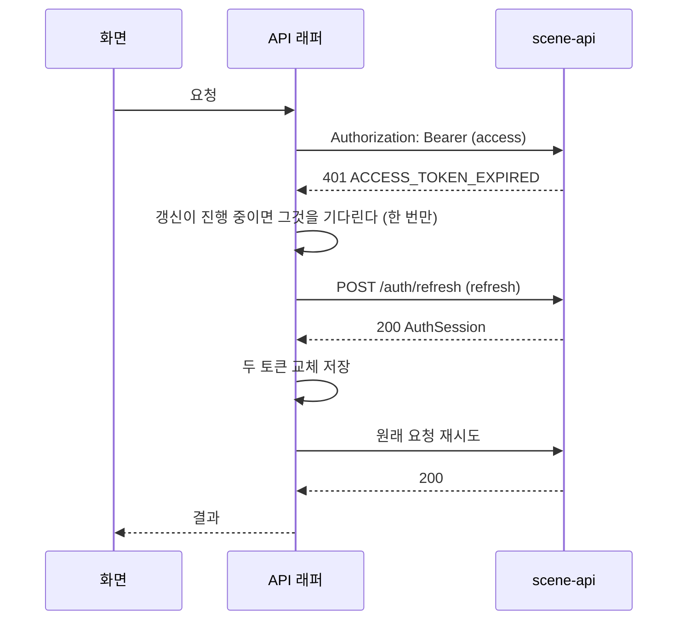

# 구글·애플 소셜 로그인 (MZ2AZ-329)

- **티켓**: 스토리 [MZ2AZ-329](https://mz2az.atlassian.net/browse/MZ2AZ-329) — 하위 [MZ2AZ-330](https://mz2az.atlassian.net/browse/MZ2AZ-330) 계약 · [MZ2AZ-331](https://mz2az.atlassian.net/browse/MZ2AZ-331) 서버. 병합은 [MZ2AZ-256](https://mz2az.atlassian.net/browse/MZ2AZ-256). 에픽 [MZ2AZ-185](https://mz2az.atlassian.net/browse/MZ2AZ-185) "계정"
- **작성일**: 2026-09-30
- **상태**: 계약(MZ2AZ-330, #111) 머지. 서버 — 구글 로그인·갱신·로그아웃·`/me`·탈퇴·합치기 구현(MZ2AZ-331 · 256). 남은 것: 애플 로그인, DEV·PRD 서명 키 경로(`tools/aws`)
- **선행**: [MZ2AZ-328](https://mz2az.atlassian.net/browse/MZ2AZ-328) `X-Device-Id` → `X-Install-Id` (#110, 머지됨)
- **ADR**: [0018 로그인은 구글·애플 소셜 로그인과 JWT 로 한다](../../architecture/adr/0018-social-login-with-jwt.md)
- **계약**: `contracts/openapi/scene-api-v1.yaml` 1.3.0 — `auth` 태그, `security`, `bearerAuth`

---

## 1. 한눈에

```
앱 ── 구글/애플 SDK ──> ID 토큰
앱 ── POST /auth/google | /auth/apple  (X-Install-Id + ID 토큰 + nonce) ──> scene-api
      scene-api: ID 토큰 검증 → (provider, sub) 로 계정 찾기 → 승격 | 병합 → 토큰 발급
앱 <── AuthSession { accessToken(JWT, 30분), refreshToken(난수, 60일, 일회용), user, isNewUser, merged }
앱 ── 모든 요청: X-Install-Id + Authorization: Bearer <accessToken> ──>
```

비밀번호는 없다. 구글·애플만. 사람의 구분은 `(provider, sub)` 이지 이메일이 아니다.

## 2. 계약 (프론트가 먼저 보는 곳)

| 창구 | 토큰 | 요청 | 응답 |
| --- | --- | --- | --- |
| `POST /auth/google` | 없음 | `X-Install-Id` + `{ idToken, nonce }` | `AuthSession` |
| `POST /auth/apple` | 없음 | `X-Install-Id` + `{ identityToken, authorizationCode, nonce, givenName?, familyName? }` | `AuthSession` |
| `POST /auth/refresh` | 없음 | `{ refreshToken }` | `AuthSession` (새 두 토큰) |
| `POST /auth/sign-out` | 없음 | `X-Install-Id` + `{ refreshToken }` | `204` |
| `GET /me` | **필수** | — | `Me` |
| `DELETE /me` | **필수** | — | `204` (탈퇴) |
| 그 밖의 모든 API | 선택 | 지금처럼 `X-Install-Id` | 지금과 같다 |

새 오류 코드 — 전부 `401` 이고 `code` 로 가른다.

| `code` | 어디서 | 앱이 할 일 |
| --- | --- | --- |
| `ACCESS_TOKEN_EXPIRED` | 토큰을 받는 모든 API | refresh 후 원래 요청 재시도 |
| `ACCESS_TOKEN_INVALID` | 〃 | 토큰 지우고 로그인 화면 |
| `SESSION_REQUIRED` | 〃 (토큰 없이 가입 계정의 설치 UUID) | 토큰 지우고 로그인 화면 |
| `REFRESH_TOKEN_INVALID` | `/auth/refresh` | 토큰 지우고 로그인 화면 |
| `SOCIAL_TOKEN_INVALID` | `/auth/google` · `/auth/apple` | 로그인 실패 안내, 다시 시도 |

`AUTH_PROVIDER_UNAVAILABLE`(`503`) 는 구글·애플에 닿지 못한 것 — 잠시 뒤 재시도.

**계약에서 일부러 고정하지 않은 것**: 토큰 수명(응답의 `*ExpiresIn` 으로 준다), JWT 안의
클레임(앱은 토큰 안을 읽지 않는다).

## 3. 서버가 요청의 계정을 정하는 규칙

```
Authorization 있음 ─> 서명·만료 확인 ─> 토큰의 계정
                      ├ 만료        ─> 401 ACCESS_TOKEN_EXPIRED
                      └ 깨짐·위조·계정 없음(탈퇴) ─> 401 ACCESS_TOKEN_INVALID
Authorization 없음 ─> X-Install-Id ─> user_device ─> 계정 (없으면 비회원 계정 생성 — 지금과 같다)
                      └ 그 계정이 가입 계정이면 ─> 401 SESSION_REQUIRED
```

**가입 계정은 설치 UUID 만으로 열리지 않는다.** 지금은 `X-Install-Id` 만 알면 그 계정의
장바구니·코스를 읽고 고칠 수 있다(`docs/api/auth.md` 「무엇을 보장하지 않는가」). 비회원은
그대로 두지만, 가입 계정까지 헤더 하나로 열리면 로그인이 무의미하다.

토큰과 `X-Install-Id` 가 둘 다 오면 **토큰이 이긴다.** 이 경로에서 설치 UUID 는 쓰지 않는다 — 방문 기록(`last_seen_at`)은 토큰의 계정 행에만 남긴다.

## 4. 표 (V15)

> [poi.md](./poi.md) 가 V15 를 「코스 담기」 에 잡아 두었으나 시작 전이라 로그인이 가져왔다.
> 번호를 비워 두면 뒤늦게 들어온 낮은 번호를 Flyway 가 거부하기 때문이다.

```sql
CREATE TABLE user_identity (
    provider     TEXT NOT NULL CHECK (provider IN ('google', 'apple')),
    subject      TEXT NOT NULL,                 -- 구글·애플의 sub
    user_id      UUID NOT NULL REFERENCES app_user (id) ON DELETE CASCADE,
    email        TEXT,                          -- 참고용. 사람을 가르지 않는다
    display_name TEXT,
    created_at   TIMESTAMPTZ NOT NULL DEFAULT now(),
    PRIMARY KEY (provider, subject)             -- 같은 구글 계정이 두 계정에 붙는 것을 DB 가 막는다
);
CREATE INDEX user_identity_user_idx ON user_identity (user_id);

CREATE TABLE refresh_token (
    id           UUID PRIMARY KEY,
    token_hash   BYTEA NOT NULL UNIQUE,         -- SHA-256. 원문은 저장하지 않는다
    user_id      UUID NOT NULL REFERENCES app_user (id) ON DELETE CASCADE,
    install_uuid UUID,                          -- 어느 설치본의 로그인인가 — 설치본별 로그아웃
    family_id    UUID NOT NULL,                 -- 한 번의 로그인에서 이어진 교체 사슬
    expires_at   TIMESTAMPTZ NOT NULL,
    used_at      TIMESTAMPTZ,                   -- 교체되면 채워진다. 채워진 것이 다시 오면 재사용
    revoked_at   TIMESTAMPTZ,
    created_at   TIMESTAMPTZ NOT NULL DEFAULT now()
);
CREATE INDEX refresh_token_user_idx ON refresh_token (user_id);
CREATE INDEX refresh_token_family_idx ON refresh_token (family_id);

COMMENT ON COLUMN user_device.install_uuid IS
    '앱이 최초 실행에 만들어 보관하는 값. X-Install-Id 헤더로 온다';  -- V8 의 옛 이름 바로잡기 (MZ2AZ-328)
```

`app_user` 는 그대로다. `registered_at` · `merged_into` 가 이미 있다(V8).

애플 refresh token 칸(탈퇴 때 revoke 용)은 **애플 로그인과 함께** 더한다 — 암호화 방식을 정하지 않은 채
칸만 만들지 않는다.

## 5. 로그인 한 번에 일어나는 일

1. ID 토큰 검증 — 구글·애플 JWKS(캐시), `iss`·`aud`·`exp`·`nonce`.
   애플 `nonce` 는 토큰 안에 SHA-256 으로 들어 있다 → 받은 원문을 해시해 비교. 구글은 원문 그대로.
2. 애플이면 `authorizationCode` 를 애플 `/auth/token` 과 교환해 애플 refresh token 을 받아
   암호화해 둔다(탈퇴 때 revoke). 실패하면 `503 AUTH_PROVIDER_UNAVAILABLE`.
3. `X-Install-Id` 로 이 설치본의 계정 G 를 찾는다(없으면 만든다).
4. `(provider, sub)` 로 `user_identity` 를 찾는다 — **셋 중 하나**.

| 경우 | 처리 | `isNewUser` | `merged` |
| --- | --- | --- | --- |
| 처음 보는 소셜 계정 | G 에 신분을 붙이고 `registered_at` 을 채운다. **데이터는 한 줄도 안 움직인다** | `true` | `false` |
| 이미 G 에 붙어 있음 | 아무것도 안 한다 | `false` | `false` |
| 다른 계정 X 에 붙어 있음 | **G 를 X 로 합친다**(MZ2AZ-256), 이 설치본을 X 로 | `false` | `true` |

G 가 이미 **가입 계정**인데 다른 소셜 계정으로 로그인하는 경우(로그아웃 없이 계정 전환)는
생기지 않는다 — 로그아웃하면 이 설치본은 새 비회원 계정으로 바뀌므로(§6) 로그인 시점의 G 는
언제나 비회원이다. 서버는 그 전제가 깨지면 합치지 않고 G 를 새 비회원 계정으로 바꾼 뒤
진행한다(가입 계정끼리는 절대 합치지 않는다).

5. 리프레시 토큰을 새 `family_id` 로 발급, 액세스 토큰 서명, 응답.

### 합치기 (MZ2AZ-256 의 설계를 따른다)

옮기는 표는 넷 — `course`(아이템·핀이 따라온다), `saved_place`·`saved_content`(겹치면 건너뛴다),
`user_device`. 비운 G 는 지우지 않고 `merged_into = X`. **묻지 않고 자동으로 합친다**(8/11 회의).

진행 중 여행: X 에 이미 `status = active` 코스가 있으면 G 쪽 `active` 는 `upcoming` 으로 내린다
— 앱은 진행 중 여행이 하나라고 가정한다.

### 트랜잭션과 동시성

> 구현: `auth/SignInService` 가 트랜잭션을 열고 `user/AccountLinkStore` 가 그 안에서 SQL 을 돈다.
> 마켓(`market_course` · `market_like`)은 옮기지 않는다 — 비회원은 둘을 만들 수 없고, 좋아요를 옮기며
> 겹친 것을 지우면 `like_count` 가 실제와 어긋난다.

- 3~5 전부 **트랜잭션 하나**. `TransactionTemplate` 으로 쓴다(`@Transactional` 이 아니다 —
  통합 테스트가 스프링 없이 Store 를 만든다. `CourseStore.java` 의 주석 참고).
- **같은 소셜 계정으로 두 설치본이 동시에 첫 로그인**: 둘 다 「처음 본다」 로 판단할 수 있다.
  `user_identity` 기본키가 늦은 쪽을 막는다 → 그 위반을 잡아 **합치기 경로로 다시** 처리한다.
  `UserStore.create` 가 동시 생성을 다루는 방식과 같다.
- **합치는 중에 같은 설치본의 다른 요청이 G 에 쓴다 — 알려진 틈 (2026-10-01 결정)**

  ```
  요청 A (장바구니 담기)            요청 B (로그인 → 합치기)
  설치 UUID → 계정 G 로 정함
                                   G 의 데이터를 X 로 옮김, 설치본 G → X, G.merged_into = X, 커밋
  INSERT saved_place(G, …) 성공    ← 빈 껍데기 G 에 떨어진다. X 의 장바구니에 안 보인다
  ```

  A 가 계정을 정한 뒤 쓰기 전까지의 사이에 B 가 통째로 끝나야 생긴다(서버가 바빠 A 가 커넥션을 기다리는 등).
  **합치기 때 G 를 잠그는 것만으로는 닫히지 않는다** — A 의 INSERT 는 잠금이 풀리길 기다렸다가 결국 G 에
  들어간다. 데이터가 사라지지는 않는다(G 에 남는다). 기존 코스 수정·방문 체크는 코스가 이미 X 로 넘어가
  `404` 로 드러난다.

  **택한 것 — 앱이 막고 서버가 복구한다.**
  1. 앱은 `/auth/google` · `/auth/apple` 을 부르기 전에 진행 중인 쓰기를 기다린다(계약에 적었다).
     틈은 같은 앱의 동시 요청에서만 생기므로 사실상 닫힌다.
  2. 서버는 `/auth/refresh` 때마다 그 계정으로 합쳐진 빈 행을 다시 쓸어 온다(`AccountLinkStore.sweepInto`).
     합치기가 여러 번 돌려도 같은 결과라 그대로 다시 부른다. **쓸어 온 것이 있으면 경고 로그**를 남긴다 —
     틈이 실제로 생겼다는 신호다.

  **택하지 않은 것 — 쓰기 경로마다 잠금.** 쓰기 트랜잭션 안에서 `SELECT … FROM app_user WHERE id = G
  FOR SHARE` 로 G 를 공유 잠금하면 합치기의 `FOR UPDATE` 와 서로 기다리게 되어 어느 순서든 X 로 간다
  — 틈이 완전히 닫힌다. 기본키 한 행이라 쿼리 비용은 작다(로컬 실측 0.24 ms, 16 행 표). 비용은 장바구니·
  찜·코스·방문 체크 등 쓰기 경로 8~10 곳을 트랜잭션으로 감싸는 손질이다. 위 경고 로그가 잦으면 이쪽으로
  옮긴다.

## 6. 토큰

| | 액세스 토큰 | 리프레시 토큰 |
| --- | --- | --- |
| 모양 | JWT (HS256 또는 ES256, 구현 때 확정) | 32 바이트 난수, base64url |
| 수명 | 30 분 (설정) | 60 일 (설정), 쓸 때마다 새로 |
| 서버 저장 | 없음 | SHA-256 해시 |
| 클레임 | `sub`=app_user.id, `iat`, `exp`, `jti` | — |

**재사용 감지**: `/auth/refresh` 에 `used_at` 이 채워진 토큰이 오면 그 `family_id` 가 아니라 **그
계정의 리프레시 토큰 전부**를 폐기한다. 도둑과 주인 중 누가 먼저 썼는지 서버는 모른다.

**판정 순서**(`/auth/refresh`): 폐기됨 → 이미 씀 → 만료. 이미 쓴 토큰이라도 그 사슬이 로그아웃·탈퇴로 **이미 끊겼으면 재사용이 아니라
「폐기됨」** 이다 — 끊긴 것을 다시 재사용으로 판정해 다른 설치본의 로그인까지 끊을 이유가 없다. 거절 이유(UNKNOWN·EXPIRED·
REVOKED·REUSED)는 응답에서는 모두 `401 REFRESH_TOKEN_INVALID` 하나이고 로그·지표용이다.

**토큰 거절 이유는 응답에 싣지 않는다.** `ACCESS_TOKEN_INVALID` 의 `message` 는 언제나 같은 문구다. 「서명이 틀렸다」
「발급자가 다르다」 「서명 키가 없다」 를 알려 주면 위조하는 쪽이 한 단계씩 맞춰 갈 수 있고, 마지막 것은 서버 설정을 드러낸다.
이유는 서버 로그(debug)에만 남긴다.

**로그아웃**(`/auth/sign-out`): 그 토큰의 family 폐기 → 이 설치본의 `user_device.user_id` 를 새
비회원 계정으로. 이미 폐기된 토큰이어도 `204`.

**탈퇴**(`DELETE /me`): 애플이면 저장한 애플 refresh token 으로 `/auth/revoke`(실패해도 진행) →
`DELETE FROM app_user` (CASCADE 로 전부). 발급된 액세스 토큰은 계정 행이 없으므로 다음 요청에서
`ACCESS_TOKEN_INVALID`.

## 7. 앱이 할 일 (프론트)

### 토큰을 붙이는 자리 — 생성 클라이언트에 이미 있다

- iOS: `SceneApiClientAPI.customHeaders["Authorization"] = "Bearer \(accessToken)"`. 로그아웃하면 지운다.
- Android: `ApiClient.accessToken` 또는 `accessTokenProvider`. 계약의 `security` 덕에 생성 코드가
  토큰을 받는 API 에 자동으로 싣는다.

### 저장

두 토큰 모두 **iOS 키체인 / Android Keystore 기반 저장소**. UserDefaults · SharedPreferences 에
두지 않는다.

### nonce

로그인 시도마다 새 난수(32 바이트 이상)를 만든다.

- 구글: SDK 에 원문을 넘기고, 서버에도 **원문**을 보낸다.
- 애플: `ASAuthorizationAppleIDRequest.nonce` 에 **SHA-256(원문) 16진 소문자**를 넣고, 서버에는 **원문**.

### 401 처리 — 생성기가 만들어 주지 않는다



- **갱신은 동시에 하나만.** 둘이 같은 리프레시 토큰으로 갱신하면 두 번째가 재사용으로 판정돼
  사용자가 로그아웃된다.
- 재시도는 한 번. 갱신 뒤에도 401 이면 로그인 화면.
- `REFRESH_TOKEN_INVALID` · `ACCESS_TOKEN_INVALID` · `SESSION_REQUIRED` → 토큰 지우고 로그인 화면.

### 로그인 부르기 전

진행 중인 쓰기 요청(장바구니 담기·찜·코스 만들기 등)이 끝나기를 기다린 뒤 `/auth/google` · `/auth/apple` 을
부른다 — §5 「알려진 틈」.

### 로그인 뒤

`merged: true` 면 장바구니·코스·찜을 다시 불러온다. `isNewUser: true` 면 환영 화면(있다면).

### 애플 이름

애플은 **처음 로그인에만** `fullName` 을 준다. 그때 `givenName`·`familyName` 을 보내야 한다.
개발 중에 한 번 로그인해 버리면 다시 받으려면 기기 설정 → Apple ID → 암호 및 보안 → Apple 로 로그인
에서 앱을 지워야 한다.

## 8. Android 가 따라올 것 (계약에 드러나지 않는 것)

Android 는 담당이 따로 있다. 계약만 봐서는 알 수 없는 것을 적어 둔다.

1. 설치 UUID 가 `data/CartStore.kt` 안에 있다 — iOS 처럼 `InstallIdentity` 로 꺼낸다(MZ2AZ-261 참고).
   **저장 키 `deviceId` 는 그대로 읽어야** 깔린 앱의 값이 이어진다.
2. 작품 찜이 기기에만 있다(`data/LikeStore.kt`). 서버 API(`/favorites/contents`)가 이미 있다 —
   로그인 전에 옮겨야 찜이 계정에 붙는다.
3. `AndroidManifest.xml` 의 `usesCleartextTraffic="true"` 가 모든 주소에 평문 HTTP 를 허용한다.
   토큰이 오가므로 `10.0.2.2` 만 허용하도록 network security config 로 좁힌다.
4. 로그인은 Credential Manager 의 `GetGoogleIdOption`(nonce 지원). 애플 로그인은 Android 에서
   웹 흐름이 필요해 **이번 범위에서 Android 는 구글만**으로 시작해도 된다 — 계약은 그대로다.

## 9. 비밀값과 준비물 (사람이 할 일)

| 무엇 | 어디서 | 비밀인가 | 어디에 둔다 |
| --- | --- | --- | --- |
| 구글 OAuth 클라이언트 ID — **웹 애플리케이션** · iOS | Google Cloud Console | 아니다 | 서버 설정(`aud` 허용 목록) |
| 구글 OAuth 클라이언트 — Android (패키지 + 서명 키 SHA-1) | Google Cloud Console | 아니다 | 서버는 쓰지 않는다 — 등록만 |
| 애플 Team ID · Key ID · 번들 ID | Apple Developer | 아니다 | 서버 설정 |
| 애플 `.p8` 키 | Apple Developer (한 번만 내려받는다) | **비밀** | Secrets Manager |
| JWT 서명 키 | 서버가 쓸 난수·키쌍 | **비밀** | Secrets Manager |
| 애플 refresh token 암호화 키 | 난수 | **비밀** | Secrets Manager |
| 개인정보처리방침 URL | — | 아니다 | 구글 동의 화면, App Store |

저장소·대화·로그에 비밀값을 남기지 않는다.

### 구글 클라이언트가 셋인 이유

- **Android 의 ID 토큰은 `aud` 가 웹 클라이언트 ID 다.** Credential Manager 가 로그인할 때
  `serverClientId` 로 웹 클라이언트 ID 를 넘기기 때문이다. Android 클라이언트는 「이 패키지에 이
  서명 지문이 찍힌 앱만 우리 앱이다」 를 구글에 등록하는 용도뿐이다 — 패키지 이름은 누구나 베낄 수
  있지만 서명은 못 베낀다.
- iOS 의 ID 토큰은 `aud` 가 iOS 클라이언트 ID 다. 그래서 서버의 허용 목록은 **웹 · iOS 둘**이다.
- 클라이언트는 서버 환경이 아니라 **앱**에 묶인다. 로컬·DEV·PRD 서버가 같은 목록을 쓴다.

### 등록된 구글 클라이언트 (2026-09-30)

같은 Cloud 프로젝트(`700188854872`)에 셋. 클라이언트 ID 는 비밀이 아니다 — 웹 클라이언트의
**보안 비밀은 쓰지 않으며 저장소·설정에 두지 않는다.**

| 종류 | 클라이언트 ID (`….apps.googleusercontent.com`) | 쓰는 곳 |
| --- | --- | --- |
| 웹 | `700188854872-3dl36cm33ndb2m1e8j04svnrnjpjleep` | 서버 `aud` 허용 목록 · Android 앱의 `serverClientId` |
| iOS | `700188854872-7v9hphkb4phavae7stepil7q6vp7lbig` | 서버 `aud` 허용 목록 · iOS 앱의 `GIDClientID` |
| Android | `700188854872-a36b6471q8h03lvkdilnubtmeu658ocd` | 어디에도 넣지 않는다 — 패키지 + SHA-1 등록용 |

iOS 앱은 로그인 뒤 돌아올 URL scheme 으로 iOS 클라이언트 ID 를 뒤집은
`com.googleusercontent.apps.700188854872-7v9hphkb4phavae7stepil7q6vp7lbig` 를 `Info.plist` 에 등록한다.

### Android 서명 지문

Android 클라이언트 하나에 SHA-1 하나다. 지문이 늘면 **같은 패키지로 클라이언트를 더 만든다**
(서버 설정은 그대로 — `aud` 는 웹 클라이언트 ID 이므로).

| 언제 | 키 | SHA-1 |
| --- | --- | --- |
| 지금 (개발) | Bazel 기본 디버그 키(`CN=Android Debug`) — 누가 빌드해도 같다 | `44:6E:AC:7B:FC:8A:1D:3A:B6:82:9E:D9:61:E1:7E:0E:68:19:9D:B2` |
| 출시 | Play App Signing 의 **앱 서명 키** — 사용자 기기에 깔리는 앱의 지문 | Play Console 「앱 무결성」 에서 |
| 필요하면 | 업로드 키 — Play 를 거치지 않은 APK 로 시험할 때 | 업로드 키에서 |

지문은 `keytool -printcert -jarfile bazel-bin/apps/scenetrip-android/bin.apk` 로 확인한다.

동의 화면이 「테스트」 인 동안은 **테스트 사용자로 등록한 구글 계정만** 로그인된다(최대 100 명).

## 10. 서버 구현 순서 (MZ2AZ-331)

1. 마이그레이션(§4) + `UserStore` 확장 + 통합 테스트
2. 토큰: JWT 서명·검증, 리프레시 발급·교체·재사용 감지 — `MODULE.bazel` 에 JOSE 라이브러리 추가(확인 받는다)
3. 요청 계정 결정(§3) — 인자 해석기 하나로 컨트롤러 22 곳이 같은 규칙을 쓴다
4. `/auth/google` · `/auth/apple` — 공개키 검증, 애플 코드 교환
5. 합치기(MZ2AZ-256) + 동시성 테스트 둘(§5)
6. `/auth/refresh` · `/auth/sign-out` · `/me`
7. 정리: `scenetrip.auth.require-registration` 우회와 `navigation-smoke.sh` 의 직접 SQL 을 실제 로그인으로
8. 로컬 배포 후 실제 토큰으로 로그인 → 보호 API → refresh → 로그아웃 → 탈퇴를 curl 로

### 실제로 한 것 (2026-10-01)

순서는 1 → 2 → 3 → 6 → 4·5(구글) 였다. 단계마다 구현과 분리된 에이전트가 계약·이 문서만 보고 테스트를
썼고, 실패하면 코드를 고쳤다 — 구글 토큰에 `iss` 가 없을 때 500 이 나던 것을 그렇게 잡았다(`Set.of` 는
`contains(null)` 에 예외를 던진다).

- 3 은 「인자 해석기」 가 아니라 `web/CurrentAccount` 컴포넌트다. 컨트롤러가 생성된 인터페이스를 구현해
  메서드 모양을 바꿀 수 없어서, 헤더를 요청에서 직접 읽는다. 바꾼 곳은 18 곳이다.
- **7 은 하지 않았다.** 앱에 로그인 버튼이 생기기 전까지는 로컬에서 가입할 길이 없어, 우회 설정과 스모크
  스크립트의 직접 SQL 이 여전히 유일한 검증 경로다. 버튼이 생기면 그때 지운다.
- 8 은 진짜 구글 토큰 없이 했다. 구글 경로는 처음 보는 kid 의 위조 토큰을 보내 `401` 을 받았다 —
  `503` 이 아니므로 클러스터에서 구글 공개키를 실제로 받아 온 것이다. 그 뒤의 흐름(갱신·`/me`·
  재사용 감지·로그아웃·탈퇴)은 가입 상태를 DB 에 직접 만든 뒤 실제 요청으로 확인했다. 진짜 구글 계정으로
  처음부터 끝까지는 앱 버튼 뒤다.
- 애플(4 의 절반)은 애플 개발자 설정 뒤다. DEV·PRD 에 서명 키를 넣는 경로(`tools/aws` 의 `SECRET_KEYS`)도
  아직이다 — 그 전까지 원격 서버는 로그인을 끈 채 뜬다.

## 11. 열린 질문

- 한 계정에 구글과 애플을 **둘 다** 붙이기(계정 연결) — 표는 받을 수 있게 했지만 창구는 없다.
  같은 사람이 구글로 가입하고 나중에 애플로 로그인하면 **다른 계정**이 된다.
- **서명 키 교체.** 지금은 키 하나라 바꾸는 순간 모두 로그아웃된다(옛 키 토큰 → `ACCESS_TOKEN_INVALID` → 앱이 토큰을
  지운다). 유출 같은 비상 교체에는 그게 맞다. 평시 무중단 교체가 필요해지면 헤더에 `kid` 를 달고, 새 키로 발급하되
  옛 키 토큰도 액세스 수명(30 분) 동안 검증해 준다. 배포는 키를 **환경당 한 번** 만들어 Secrets Manager 에 두고
  이후 배포는 그것을 다시 쓴다(DB 비밀번호와 같은 방식) — 배포마다 만들면 배포마다 전원이 로그아웃된다.
- JWT 서명 알고리즘 — 서버 하나라 HS256 으로 충분하다. 다른 서비스가 검증하게 되면 ES256(공개키)로.
